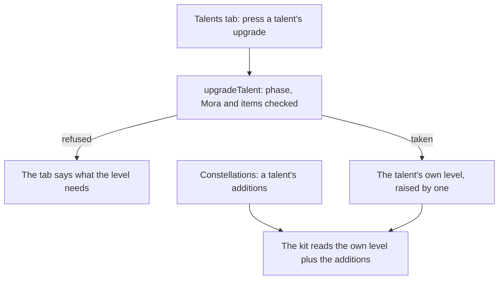

# Talents

The levelling is built: each combat talent rises from 1 to 10 by its phase, Mora and materials, and a character's passives open by phase, as the [talents](/docs/genshin/talents) page describes. The constellations' additions to a talent's level are built too, as the [constellations](/docs/genshin/constellations) page describes. One part is left: the Talents tab presses the upgrade on the character screen. The [character kits](/docs/proposals/genshin/character-kits) page plays a talent at the level it reads, so this page waits on it as well.

## Decisions

- **The level a kit reads is the talent's own plus what its constellations add.** The kit reads the level the character holds, plus `getConstellationTalentAdditions` for that talent, and nothing else. Materials never pay for a level past 10, so a level past it is a constellation's alone.
- **The Talents tab presses the upgrade.** It lists each combat talent with its level, the phase its next level needs, and its cost, and presses `upgradeTalent`. Its look is the [character screen](/docs/proposals/genshin/character-screen)'s.

## How it works

## Scope and order

**Today:** the levelling, its costs, the passives and the constellations' additions are built, and nothing presses an upgrade or reads the additions.

**This adds:** the Talents tab's upgrade, once the [character screen](/docs/proposals/genshin/character-screen) draws the tab. The kit's read of the additions comes with the [character kits](/docs/proposals/genshin/character-kits).

## Data and measures

- **Read from the game's tables:** the rows past 10 of `ProudSkillExcelConfigData`, which a kit reads for a level a constellation adds. The raises themselves are read from the constellation table.
- **Measured:** nothing; the Talents tab's look is the character screen's.

## Key files

| File                                                                               | Role after the change                                       |
| :--------------------------------------------------------------------------------- | :---------------------------------------------------------- |
| `packages/genshin-world/src/services/character/upgradeTalent.ts`                   | Its caller is the Talents tab, which presses the upgrade    |
| `packages/genshin-world/src/services/character/getConstellationTalentAdditions.ts` | Its caller is the kit, which reads a talent at these levels |

## Sources

- [Talent](https://genshin-impact.fandom.com/wiki/Talent), Genshin Impact Wiki: the constellations' three levels to a combat talent, as the constellations page reads them.
