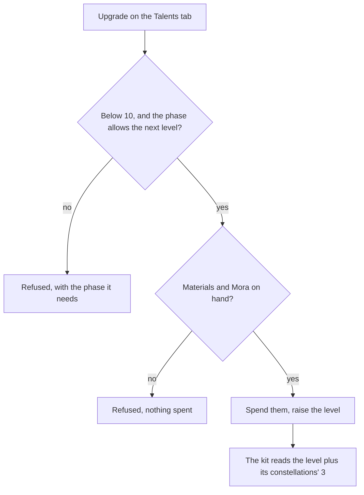

# Talents

Every character carries three combat talents, the normal attack, the Elemental Skill and the Elemental Burst, and a few passives. The [character kits](/docs/proposals/genshin/character-kits) page plays them at a level; this page is how that level rises and when each passive opens, so it waits on the kits. The upgrade itself is pressed on the character screen's Talents tab, whose panel the [character screen](/docs/proposals/genshin/character-screen) proposal draws.

## Decisions

- **Combat talents start at 1 and rise to 10.** Each is raised a level at a time with its level's materials and Mora, and a talent's current maximum is set by the character's ascension phase. Both are read per level from `ProudSkillExcelConfigData`: its `costItems` and `coinCost` are what a level spends, and its `breakLevel` the phase it needs, so no requirement is typed by hand.
- **Constellations add three, past ten.** A constellation that raises a talent adds 3 to its level, which also raises its cap to 15, though materials never take it past its own 10. The level a kit reads is the talent's own plus what its constellations add, and the multipliers at 11 to 15 are the game's own rows of the same table.
- **The passives open by phase.** Of a character's passives, the utility passive comes with the character, and the first and fourth ascension passives open at the first and fourth phases. The skill depot's `inherentProudSkillOpens` names each one and the phase that opens it. A passive has no level.
- **Spending is checked whole before anything is taken.** An upgrade checks every material and the Mora before taking any, so a refused upgrade leaves the bag and the wallet as they were.
- **The alternate sprint is not levelled**, as the wiki says, since it is a talent with no levels.

## How it works

## Scope and order

**Today:** a character is its level, phase, weapon and artifacts; nothing records a talent's level.

**This adds, in order:**

1. **A character's talent levels**, each at 1, and the level a kit reads.
2. **The upgrade's rule and costs**, read from the proud skill table by the stats run.
3. **The passives opened by phase.**
4. **The Talents tab's upgrade**, once the character screen draws the tab.

## Data and measures

- **Read from the game's tables:** `ProudSkillExcelConfigData`'s costs, Mora and phase per level, and `AvatarSkillDepotExcelConfigData`'s passives with the phase each needs, in the run that writes the kits.
- **Measured:** nothing; the Talents tab's look is the character screen's.

## Key files

| File                                                                | Role after the change                                     |
| :------------------------------------------------------------------ | :-------------------------------------------------------- |
| `packages/genshin-world/src/models/character/Character.ts`          | Gains each combat talent's level                          |
| `packages/genshin-world/src/services/character/createCharacter.ts`  | Starts every talent at level 1                            |
| `packages/genshin-world/src/models/inventory/Wallet.ts`             | The Mora an upgrade spends                                |
| `packages/genshin-world/src/services/inventory/addInventoryItem.ts` | The bag an upgrade takes its materials from               |
| `scripts/src/services/genshinAssets/stats/writeStatTables.ts`       | Writes each level's costs and phase with the kits' tables |

## Sources

- [Talent](https://genshin-impact.fandom.com/wiki/Talent), Genshin Impact Wiki: combat talents from level 1 to 10 by Character Talent Materials capped by the ascension phase, constellations' three levels and the cap of 15, materials never past 13 with them, and the passives opened at the first and fourth phases.
- [Combat Talents](https://genshin-impact.fandom.com/wiki/Combat_Talents), Genshin Impact Wiki: talents upgraded with Character Talent Materials and the weekly bosses' materials, and the alternate sprint never levelled.
- [Talent: Leveling](https://genshin-impact.fandom.com/wiki/Talent/Leveling), Genshin Impact Wiki: each character's talent materials, which the run's table reproduces.
- [AnimeGameData](https://gitlab.com/Dimbreath/AnimeGameData), the community's per-patch dump: the proud skill table's costs, Mora and phase per level.
