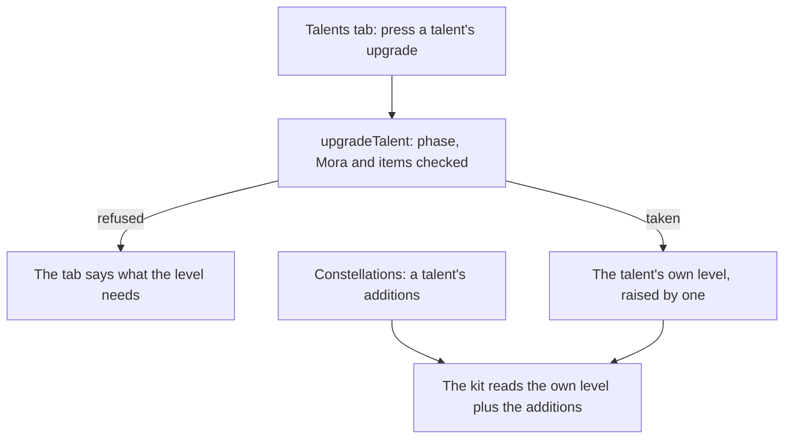

# Talents

The levelling is built: each combat talent rises from 1 to 10 by its phase, Mora and materials, and a character's passives open by phase, as the [talents](/docs/genshin/talents) page describes. The constellations' additions to a talent's level are built too, as the [constellations](/docs/genshin/constellations) page describes. One part is left: the Talents tab presses the upgrade on the character screen. The [character kits](/docs/proposals/genshin/character-kits) page plays a talent at the level it reads, so this page waits on it as well.

## Decisions

- **The level a kit reads is the talent's own plus what its constellations add.** The kit reads the level the character holds, plus `getConstellationTalentAdditions` for that talent, and nothing else. Materials never pay for a level past 10, so a level past it is a constellation's alone.
- **The Talents tab presses the upgrade.** It lists each combat talent with its level, the phase its next level needs, and its cost, and presses `upgradeTalent`. Its look is the [character screen](/docs/proposals/genshin/character-screen)'s.
- **A refusal is read before the press, never caught after it.** `upgradeTalent` throws on a refusal, and try/catch is banned, so the tab asks first: one function names why a level cannot be taken now, and `upgradeTalent` throws on that same answer, so the tab and the rule never disagree.
- **The screen takes the bag and the wallet as the wish screen does.** `CharacterScreen` gains `v-model:characters`, `v-model:wallet` and `inventory` with `update:inventory`, wired in `World/Session` exactly as `WishScreen` is, so a raised level is saved with the rest of the world.

## How it works

## Scope and order

**Today:** the levelling, its costs, the passives and the constellations' additions are built, and nothing presses an upgrade or reads the additions.

**Still to build, in order:**

1. **The Talents tab's upgrade, on the tab the character screen already draws.**
   - **The rule.** A new `packages/genshin-world/src/services/character/getTalentUpgradeRefusal.ts` returns why a combat talent cannot rise now, a `TalentUpgradeRefusal` (`models/character/TalentUpgradeRefusal.ts`: `LastLevel`, `Phase`, `Mora`, `Materials`), or `undefined` when it can, counting the bag with `countInventoryItem`. `upgradeTalent` throws on its answer in place of its own checks. `getTalentUpgradeRefusal.test.ts` asserts each refusal and none when all is met; `upgradeTalent.test.ts` keeps passing unchanged.
   - **The tables.** `World/Session` loads `readTalentTables()`, which nothing calls yet, beside the stat tables, and hands `CharacterScreen` its `talentUpgradeMap` and `characterTalentKits`; a talent's upgrades are `talentUpgradeMap[kit.talentGroupIds[talent]]`.
   - **The tab.** `CharacterMenuTalents` (`packages/genshin-interface/src/components/CharacterMenuTalents/Index.vue`) gains `isUpgradeDisabled: boolean[]` and emits `upgrade: [index]` from an Upgrade button on each row, labelled by the `GameTextKey` `pnpm -C scripts genshin:text find "^Upgrade$"` finds and `genshin:text write` writes. `Character/Screen` disables a row whose refusal is set, and on `upgrade` calls `upgradeTalent` and emits the character, the bag and the wallet it returns. Its fixture gains a variant with one talent at 10, and the button's place, provisional in the row, is queued for the user's eyes against `character-talents`.
2. **The kit's read of the additions**, which comes with the [character kits](/docs/proposals/genshin/character-kits).

## Data and measures

- **Read from the game's tables:** the rows past 10 of `ProudSkillExcelConfigData`, which a kit reads for a level a constellation adds. The raises themselves are read from the constellation table.
- **Measured:** nothing; the Talents tab's look is the character screen's.

## Key files

| File                                                                               | Role after the change                                       |
| :--------------------------------------------------------------------------------- | :---------------------------------------------------------- |
| `packages/genshin-world/src/services/character/upgradeTalent.ts`                   | Its caller is the Talents tab, which presses the upgrade    |
| `packages/genshin-world/src/services/character/getConstellationTalentAdditions.ts` | Its caller is the kit, which reads a talent at these levels |

## Sources

- [Talent](https://genshin-impact.fandom.com/wiki/Talent), Genshin Impact Wiki: the constellations' three levels to a combat talent, as the constellations page reads them.
