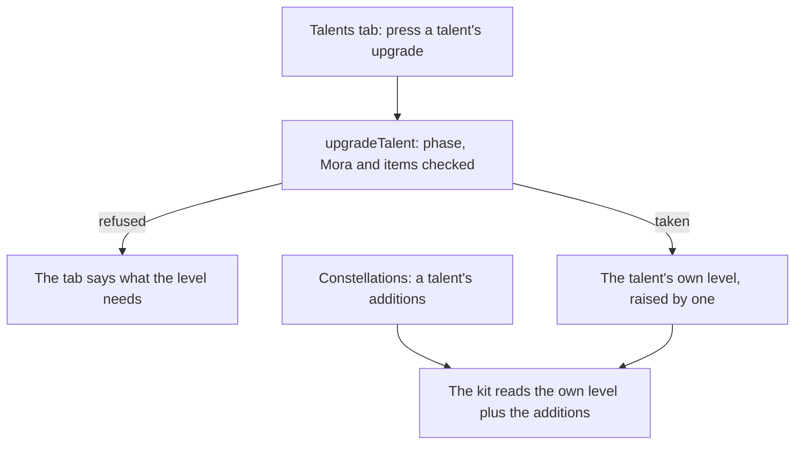

# Talents

The levelling is built: each combat talent rises from 1 to 10 by its phase, Mora and materials, and a character's passives open by phase, as the [talents](/docs/genshin/talents) page describes. Two parts are left. A constellation adds to a talent's level past the materials' 10, and the Talents tab presses the upgrade on the character screen. The [character kits](/docs/proposals/genshin/character-kits) page plays a talent at the level it reads, so this page waits on the constellations and the character screen.

## Decisions

- **A constellation adds to its talent's level.** A constellation that raises a talent adds three to its level. Materials never pay for a level past 10, so the levels past it are a constellation's alone, read from the same table's rows past 10. The [constellations](/docs/proposals/genshin/constellations) page settles which constellation raises which talent, and the highest level a talent reaches, since the table's rows run to 15 and one constellation's three alone reach 13.
- **The level a kit reads is the talent's own plus what its constellations add.** The kit reads the level the character holds, plus the constellations' additions for that talent, and nothing else.
- **The Talents tab presses the upgrade.** It lists each combat talent with its level, the phase its next level needs, and its cost, and presses `upgradeTalent`. Its look is the [character screen](/docs/proposals/genshin/character-screen)'s.

## How it works

## Scope and order

**Today:** the levelling, its costs and the passives are built, and nothing presses an upgrade.

**This adds, in order:**

1. **The constellations' levels**, once the [constellations](/docs/proposals/genshin/constellations) page reads which talent each raises: the kit's level becomes the talent's own plus its additions.
2. **The Talents tab's upgrade**, once the [character screen](/docs/proposals/genshin/character-screen) draws the tab.

## Data and measures

- **Read from the game's tables:** the rows past 10 of `ProudSkillExcelConfigData`, which the constellations' run reads beside the kits' multipliers.
- **Measured:** nothing; the Talents tab's look is the character screen's.

## Key files

| File                                                                | Role after the change                                             |
| :------------------------------------------------------------------ | :---------------------------------------------------------------- |
| `packages/genshin-world/src/models/character/CharacterTalentKit.ts` | Gains the constellations' additions to each combat talent's level |
| `packages/genshin-world/src/services/character/upgradeTalent.ts`    | Its caller is the Talents tab, which presses the upgrade          |

## Sources

- [Talent](https://genshin-impact.fandom.com/wiki/Talent), Genshin Impact Wiki: the constellations' three levels to a combat talent, as the constellations page reads them.
