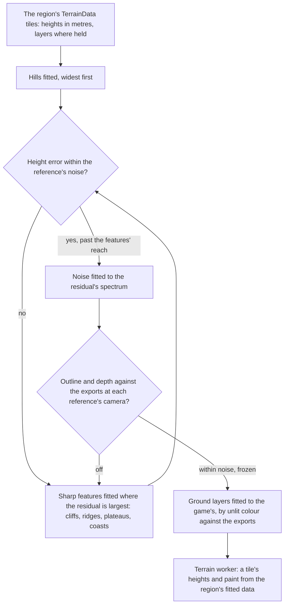

# Terrain shapes

This page builds on the [terrain](/docs/genshin/terrain), whose quadtree, workers and floating origin already stream the ground, and is the ground's part of the [scene derivation](/docs/genshin/scene-derivation): its heights answer the layout and shape passes, its paint the surface pass. Today Windrise's heights are several thousand Gaussian hills fitted to the game's terrain tiles round the oak's foot, under a metre of error there and a few metres at the valley's edge, and nothing past the kilometre it is fitted over. The continent is one connected land on the game's own tiles, so every region's ground is fitted the same way, and the fit grows only where its error says hills are not enough.

## Decisions

- **The ground is fitted, never drawn.** Each 1024-metre tile's TerrainData holds its heights in metres on the game's own coordinates ([game data formats](/docs/genshin/game-data-formats)), so a region's ground is a fit to those tiles: `fitRegionGround` already fits each region's hills, and features and the residual are what this proposal adds. The game's coordinates are the world's, so no transform from a map's pixels is needed. What ships is the fit's parameters, the region's data, never the heights themselves.
- **The least representation that holds, in order.** Hills come first, as Windrise's are. Where their error stands above the gate, the fit adds the sharp features hills smear: cliff bands with a step height, ridge lines with a profile, plateau outlines and coastlines, each found where the residual is largest and fitted to it, blended in by its signed distance with its own falloff. What is left below the features' reach is filled by noise whose amplitude and scale are fitted to the residual's own spectrum, judged by its statistics as anything random is, never by its heights point for point.
- **Gated by the shape pass's measure.** A tile's fit is done when its height error over the tile, and its outline and depth against the exports drawn by the witness at each reference's camera, stand within the reference's noise; the fit prints both, and a test freezes the fitted parameters' error once the gate holds.
- **The ground's layers are fitted to the game's own.** The ground is painted in layers whose weights are solved per vertex by rules of the slope, the height and a path's distance ([ground paint](/docs/genshin/ground-paint)). The inventory reads what each TerrainData holds past its heights, its layers and their weights where it holds them, and a fit replaces the rules' weights with them, while the surface pass fits the layers' colours to the game's by comparing their unlit colour with the exports'. Where the tile holds no weights, the rules' bands are fitted against the same exports.
- **What a heightfield cannot hold is a placed object.** Overhangs, arches, stone pillars, sea stacks, caves and the floating rocks of Liyue and Inazuma are objects the game places, so they stand where their StreamGen records set them in the region's layout pass and are rebuilt in object passes, never forced into the heights.
- **The same heights serve collision.** The worker keeps each tile's heights for the `collision` module's height query, which [exploring](/docs/proposals/genshin/exploring) adds, so the camera and later the character stand on the surface that is drawn.
- **The fit's data follows reach.** A region's fitted parameters load with its region data, so the ground's data grows with what is in reach, never with the continent.
- **The first slice's calls.** Plateaus come first, placed greedily: each round takes the disc, of 96, 48 or 24 metres' radius on a centre every half radius, whose mean residual takes the most squared error off, its falloff a quarter of its radius; a disc counts only where every sample is fitted ground, and the fit stops at 16 plateaus or when the next takes under 1% of what is left. The residual's noise takes the scale among 8 to 256 metres whose own correlation length is nearest the residual's, and the amplitude that makes its root-mean-square over the same grid the residual's, with three octaves and a fixed seed.
- **Cliffs and ridges are placed as the plateaus are, their direction tried rather than solved.** After the plateaus, each round tries a segment 96, 48 or 24 metres long, centred every half its length, at sixteen headings 22.5 degrees apart round the full turn, so the side its left normal raises covers both sides of every line. A cliff's band reaches half its length across the line, its falloff a quarter of that, and its height is the band's mean residual where every sample is fitted ground. The round takes the segment that takes the most squared error off and subtracts it before the next, under the plateaus' limits: 16 at most, and none taking under 1% of what is left. Ridges follow the cliffs the same way through `getRidgeHeight`, their width a quarter of their length. A heading tried at 22.5 degrees is as fine as a 24 metre segment can tell at the 6 metre grid.

## How it works



## Scope

**Today:** the terrain's tiles are generated from a region's height function and painted by its layers' rules, in vertex colours ([ground paint](/docs/genshin/ground-paint)). Windrise's is Gaussian hills fitted to the game's own terrain tiles, painted as a temperate meadow by provisional bands and colours. The layers the composition sums (hills, cliff, ridge and plateau features, and the residual's noise) are built as [terrain shape height](/docs/genshin/terrain-shape-height); the fit now places each region's plateaus and residual noise, and the Windrise run that writes them is queued.

**This adds:**

1. **The cliffs, fitted next.** A new `fitTerrainCliffs.ts` places them on the grid `fitTerrainPlateaus` leaves, as the Decisions set out, returning the cliffs and the residual they leave. `fitRegionGround` runs it after the plateaus and before `fitTerrainResidual`, writes the cliffs into `features` beside the plateaus, and reports their count. Its test, `fitTerrainCliffs.test.ts`, draws one 48 metre cliff 10 metres high with `getCliffHeight` on a grid and reads back one cliff within 22.5 degrees of its heading and a metre of its height, and a flat grid back with none. The region runs queued on the roadmap write it.
2. **Then ridges and coastlines**: ridges as the Decisions set out, in `fitTerrainRidges.ts` after the cliffs, then coastlines where the residual after both is largest, and the gate each region is held to once its features are run. The plateaus, the residual's noise and the fit for any set of tiles are built in `fitRegionGround`.
3. **The ground layers fitted**: the weights the game's tiles hold read by the inventory and written in place of the rules', each layer's colours fitted to the game's, and the paths read from its path layer.
4. **The heights kept for collision**, when exploring's camera asks for them.
5. **Each area's outline** in the [world map](/docs/genshin/world-map)'s catalogue, read from the game's own area data where the inventory finds it and otherwise drawn round the tiles its placements stand on, in place of Galesong Hill's provisional one.

## Key files

| File                                                           | Role after the change                                                             |
| :------------------------------------------------------------- | :-------------------------------------------------------------------------------- |
| `scripts/src/services/genshinAssets/fit/fitRegionGround.ts`    | Each region's hills, plateaus and residual, built; cliffs and ridges still to fit |
| `scripts/src/services/genshinAssets/fit/fitTerrainPlateaus.ts` | The plateaus placed greedily where the residual after the hills is largest        |
| `scripts/src/services/genshinAssets/fit/fitTerrainResidual.ts` | The residual's noise, its scale and amplitude matched to its statistics           |
| `scripts/src/services/genshinAssets/fit/fitGaussianHills.ts`   | The first rung of the fit, its error deciding whether features follow             |
| `packages/genshin-engine/src/terrain/computeTerrainTile.ts`    | The tile generator, which samples the fitted features and noise                   |
| `packages/genshin-world/src/workers/terrainTile.worker.ts`     | The worker, which reads a region's fitted data in place of its code               |

New files:

```text
scripts/src/services/genshinAssets/fit/fitTerrainCliffs.ts
packages/genshin-engine/src/terrain/   ← the features' and the residual noise's generators
```

## Sources

- [Making maps with noise functions](https://www.redblobgames.com/maps/terrain-from-noise/), Red Blob Games: noise octaves summed into height, used here only for the residual below the fitted features, its octaves' amplitudes fitted to that residual.
