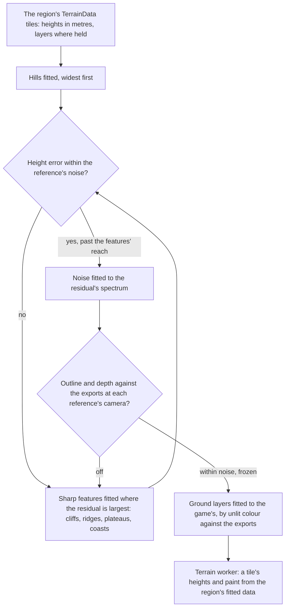

# Terrain shapes

This page builds on the [terrain](/docs/genshin/terrain), whose quadtree, workers and floating origin already stream the ground, and is the ground's part of the [scene derivation](/docs/genshin/scene-derivation): its heights answer the layout and shape passes, its paint the surface pass. Today Windrise's heights are several thousand Gaussian hills fitted to the game's terrain tiles round the oak's foot, under a metre of error there and a few metres at the valley's edge, and nothing past the kilometre it is fitted over. The continent is one connected land on the game's own tiles, so every region's ground is fitted the same way, and the fit grows only where its error says hills are not enough.

## Decisions

- **The ground is fitted, never drawn.** Each 1024-metre tile's TerrainData holds its heights in metres on the game's own coordinates ([game data formats](/docs/genshin/game-data-formats)), so a region's ground is a fit to those tiles, generalising `fitWindriseGround` from one valley to any set of tiles. The game's coordinates are the world's, so no transform from a map's pixels is needed. What ships is the fit's parameters, the region's data, never the heights themselves.
- **The least representation that holds, in order.** Hills come first, as Windrise's are. Where their error stands above the gate, the fit adds the sharp features hills smear: cliff bands with a step height, ridge lines with a profile, plateau outlines and coastlines, each found where the residual is largest and fitted to it, blended in by its signed distance with its own falloff. What is left below the features' reach is filled by noise whose amplitude and scale are fitted to the residual's own spectrum, judged by its statistics as anything random is, never by its heights point for point.
- **Gated by the shape pass's measure.** A tile's fit is done when its height error over the tile, and its outline and depth against the exports drawn by the witness at each reference's camera, stand within the reference's noise; the fit prints both, and a test freezes the fitted parameters' error once the gate holds.
- **The ground is painted by layers fitted to the game's own.** The inventory reads what each TerrainData holds past its heights, its layers and their weights where it holds them, and the ground blends procedural TSL layers (grass, earth, rock, sand, snow and paved path) whose colours and weights are fitted to the game's, judged by their unlit colour against the exports in the surface pass. Where the tile holds no weights, they are solved by biome, slope and height against the same exports. Steep faces are sampled triplanar, so cliffs never stretch.
- **What a heightfield cannot hold is a placed object.** Overhangs, arches, stone pillars, sea stacks, caves and the floating rocks of Liyue and Inazuma are objects the game places, so they stand where their StreamGen records set them in the region's layout pass and are rebuilt in object passes, never forced into the heights.
- **The same heights serve collision.** The worker keeps each tile's heights for the `collision` module's height query, which [exploring](/docs/proposals/genshin/exploring) adds, so the camera and later the character stand on the surface that is drawn.
- **The fit's data follows reach.** A region's fitted parameters load with its region data, so the ground's data grows with what is in reach, never with the continent.

## How it works



## Scope

**Today:** the terrain's tiles are generated from a region's height function and painted by a region's colour function, in vertex colours. Windrise's is Gaussian hills fitted to the game's own terrain tiles; its colours are grass in patches and rock on steep faces.

**This adds:**

1. **The fit for any set of tiles**, its features and its residual's noise, first for the rest of Windrise's tile, then for each region as its page ships.
2. **Ground layers** in the ground material, their colours and weights fitted to the game's.
3. **The heights kept for collision**, when exploring's camera asks for them.
4. **Each area's outline** in the [world map](/docs/genshin/world-map)'s catalogue, read from the game's own area data where the inventory finds it and otherwise drawn round the tiles its placements stand on, in place of Galesong Hill's provisional one.

## Key files

| File                                                           | Role after the change                                                 |
| :------------------------------------------------------------- | :-------------------------------------------------------------------- |
| `scripts/src/services/genshinAssets/fit/fitWindriseGround.ts`  | Generalised to fit any set of tiles, hills, features and residual     |
| `scripts/src/services/genshinAssets/fit/fitGaussianHills.ts`   | The first rung of the fit, its error deciding whether features follow |
| `packages/genshin-engine/src/terrain/computeTerrainTile.ts`    | The tile generator, which samples the fitted features and noise       |
| `packages/genshin-engine/src/terrain/createTerrainMaterial.ts` | The ground material, which gains the fitted layers                    |
| `packages/genshin-world/src/workers/terrainTile.worker.ts`     | The worker, which reads a region's fitted data in place of its code   |

New files:

```text
packages/genshin-engine/src/terrain/   ← the features' and the residual noise's generators
packages/genshin-engine/src/nodes/     ← the ground layers
```

## Sources

- [Making maps with noise functions](https://www.redblobgames.com/maps/terrain-from-noise/), Red Blob Games: noise octaves summed into height, used here only for the residual below the fitted features, its octaves' amplitudes fitted to that residual.
