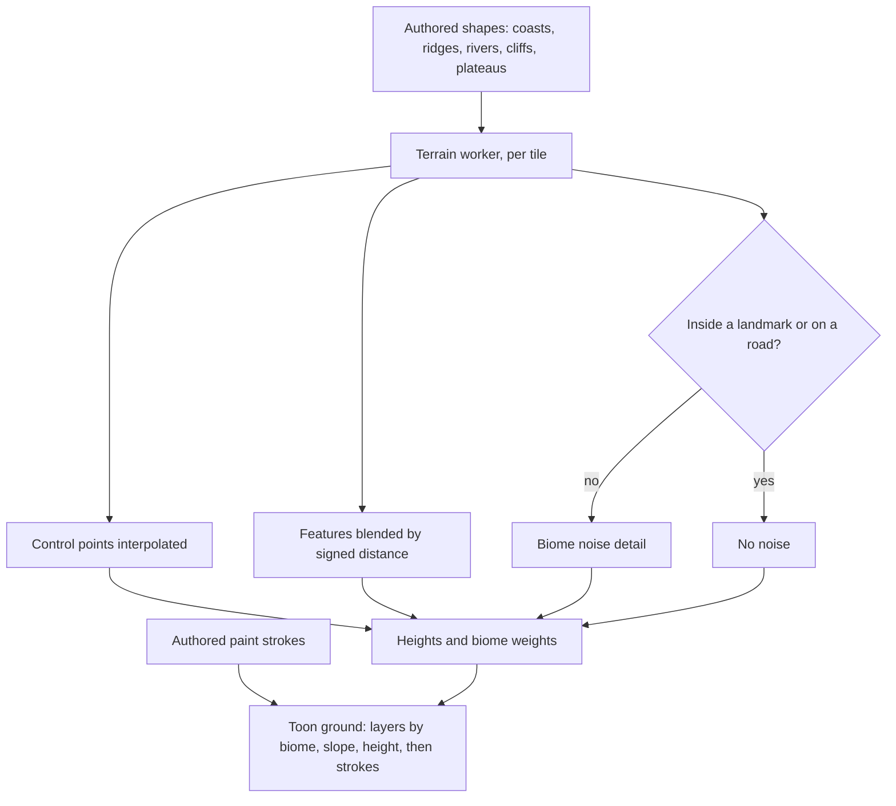

# Terrain shapes

This page builds on the [terrain](/docs/genshin/terrain), whose quadtree, workers and floating origin already stream the ground, and takes its layout from the [world map](/docs/genshin/world-map). Today a region's heights are a function written for it, which suits Windrise's one valley and no more. The continent is one connected land whose every coast, ridge and river is where the game has it, so its heights come from shapes drawn over the official map.

## Decisions

- **Heights are authored shapes plus noise.** A region's layout is vector data drawn over the official map: coastlines, ridge lines with a height profile, height control points, river courses with width and depth, cliff bands with a step height, and plateau outlines. The terrain's worker turns them into a tile's heights. Control points are interpolated smoothly, each feature is blended in by its signed distance with its own falloff, and simplex noise adds the detail each biome asks for. The shapes are where the terrain matches the game. The noise only fills in between them.
- **The ground is painted by rule, then by hand.** Each vertex blends ground layers (grass, earth, rock, sand, snow and paved path) from its biome, its slope and its height. Authored paint strokes then override the rules: paths along roads, sand along shores, flowerbeds and fields. Layers are procedural TSL textures shaded by the toon ramp, and steep faces are sampled triplanar, so cliffs never stretch.
- **What a heightfield cannot hold is a mesh.** Overhangs, arches, stone pillars, sea stacks, caves and the floating rocks of Liyue and Inazuma are meshes from a region's kit, set on the ground by the landmark schema, never forced into the heights.
- **The same heights serve collision.** The worker keeps each tile's heights for the phase-three character controller to stand on, so walking and drawing read one surface.
- **Noise never moves a landmark.** Detail noise fades to zero inside a landmark's footprint and along a road, so a building never sits on a bump that the reference does not show.

## How it works



## Scope

**Today:** the terrain's tiles are generated from a region's height function and painted by a region's colour function, in vertex colours. Windrise's is a knoll, a ring of hills and noise, written in code.

**This adds:**

1. **The shape generator**, fed by the world map's data, first for the Windrise valley, then for each region as its page ships.
2. **Ground layers and paint strokes** in the ground material.
3. **Kit meshes** placed by the landmark schema.
4. **The heights kept for collision**, when the character controller needs them.

## Key files

| File                                                           | Role after the change                                          |
| :------------------------------------------------------------- | :------------------------------------------------------------- |
| `packages/genshin-engine/src/terrain/computeTerrainTile.ts`    | The tile generator, which samples the shapes' heights          |
| `packages/genshin-engine/src/terrain/createTerrainMaterial.ts` | The ground material, which gains the layers                    |
| `apps/web/app/workers/genshin/terrainTile.worker.ts`           | The worker, which reads a region's shapes in place of its code |

New files:

```text
packages/genshin-engine/src/terrain/   ← the shape generator
packages/genshin-engine/src/nodes/     ← the ground layers
```

## Sources

- [Making maps with noise functions](https://www.redblobgames.com/maps/terrain-from-noise/), Red Blob Games: noise octaves summed into height, used here only for detail between authored shapes.
