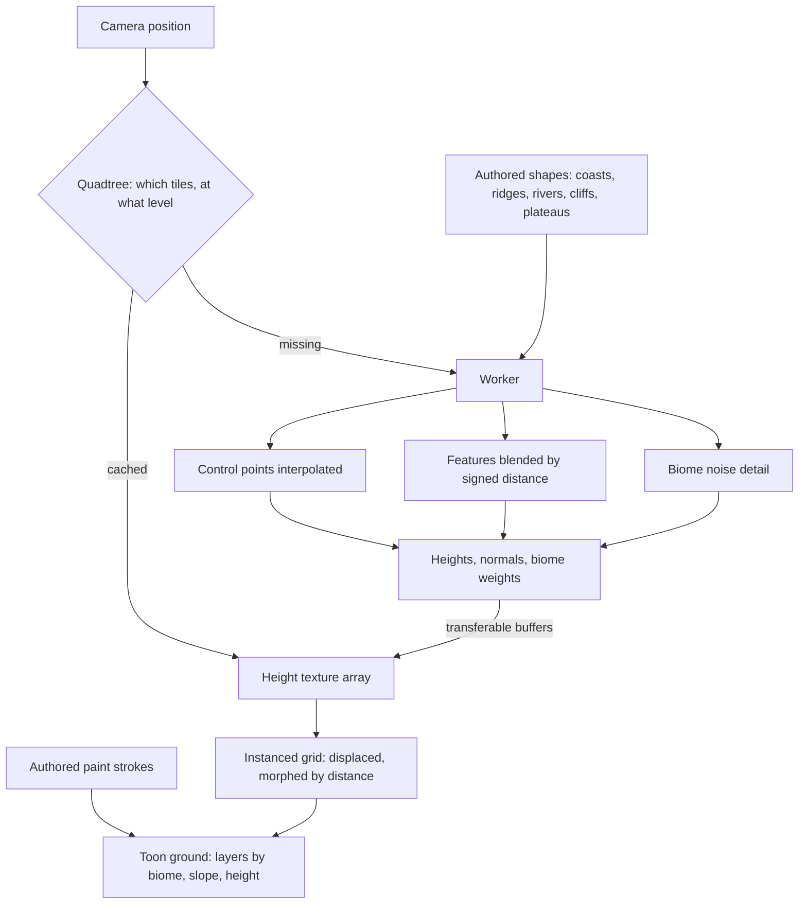

# Terrain

This page builds on [rendering style](/docs/proposals/genshin/rendering-style) and takes its layout from the [world map](/docs/proposals/genshin/world-map). It is the ground of the whole continent. The world is a single connected land, from Mondstadt's meadows across Liyue's karst to the desert and the sea, so it is one heightfield rather than a set of scenes. It is drawn at the detail the camera needs and generated only where the camera can see.

## Decisions

- **One heightfield, drawn on a CDLOD quadtree.** The ground is a quadtree of square tiles. Each tile is the same small grid mesh, displaced in the vertex stage by a height texture. The level of detail is chosen from the true three-dimensional distance to the camera, and each vertex morphs smoothly toward the coarser level before it switches, so detail never pops and no seams need stitching. The whole visible ground is one instanced draw.
- **Heights are authored shapes plus noise.** A region's layout is vector data drawn over the official map: coastlines, ridge lines with a height profile, height control points, river courses with width and depth, cliff bands with a step height, and plateau outlines. A worker turns them into heights. Control points are interpolated smoothly, each feature is blended in by its signed distance with its own falloff, and simplex noise adds the detail each biome asks for. It is the same generator the voxel world uses, with parameters per biome. The shapes are where the terrain matches the game. The noise only fills in between them.
- **Height tiles stream in a worker.** A tile's heights, normals and biome weights are generated off the main thread and handed back as transferable buffers, then written into a texture array the tiles sample. The voxel world streams chunks around the player the same way. Tiles are cached by key, and a tile out of reach is dropped.
- **The ground is painted by rule, then by hand.** Each texel blends ground layers (grass, earth, rock, sand, snow and paved path) from its biome, its slope and its height. Authored paint strokes then override the rules: paths along roads, sand along shores, flowerbeds and fields. Layers are procedural TSL textures shaded by the toon ramp, and steep faces are sampled triplanar, so cliffs never stretch.
- **What a heightfield cannot hold is a mesh.** Overhangs, arches, stone pillars, sea stacks, caves and the floating rocks of Liyue and Inazuma are meshes from a region's kit, set on the ground by the landmark schema, never forced into the heights.
- **The origin floats.** At a continent's scale, single-precision positions tremble far from the origin. The scene is rebased around the camera whenever it moves far enough from the current origin, and tile keys stay in world coordinates.
- **The same heights serve collision.** The worker keeps each tile's heights for the phase-three character controller to stand on, so walking and drawing read one surface.

## How it works



## Scope

**Today:** the Windrise scene is one fixed heightfield (`computeHeightfield`) generated on the main thread at mount. Nothing streams, and the ground has one level of detail.

**This adds:**

1. **The quadtree and the tile mesh**, with morphing, drawn with the toon ground material.
2. **The worker generator** over authored shapes, first for the Windrise scene's valley, then for each region as its page ships.
3. **Ground painting** by rule and by stroke.
4. **The floating origin.**

## Key files

| File                                                        | Role after the change                                                |
| :---------------------------------------------------------- | :------------------------------------------------------------------- |
| `packages/genshin-engine/src/noise/createSimplexNoise.ts`   | The noise the generator's detail is built on, moved to a shared home |
| `packages/genshin-engine/src/terrain/computeHeightfield.ts` | The heightfield a tile's generator grows from                        |

New files:

```text
packages/genshin-engine/src/terrain/      ← quadtree selection, tile keys, the height generator, the worker
packages/genshin-engine/src/nodes/        ← the ground material and its layers
apps/web/app/components/Genshin/Terrain.vue
```

## Notes

- **The generator is benched.** Tile generation and quadtree selection each get a bench under the `bench` skill, at two camera heights. The cost per frame must follow the tiles in view, not the size of the continent.
- **Noise never moves a landmark.** Detail noise fades to zero inside a landmark's footprint and along a road, so a building never sits on a bump that the reference does not show.

## Sources

- [CDLOD: Continuous distance-dependent level of detail for rendering heightmaps](https://github.com/fstrugar/CDLOD), Filip Strugar, 2010: the quadtree of regular grids, a level of detail chosen by true three-dimensional distance, and morphing between levels in place of stitching.
- [Making maps with noise functions](https://www.redblobgames.com/maps/terrain-from-noise/), Red Blob Games: noise octaves summed into height, used here only for detail between authored shapes.
- [Transferable objects](https://developer.mozilla.org/en-US/docs/Web/API/Web_Workers_API/Transferable_objects), MDN: handing tile buffers from the worker without copying.
