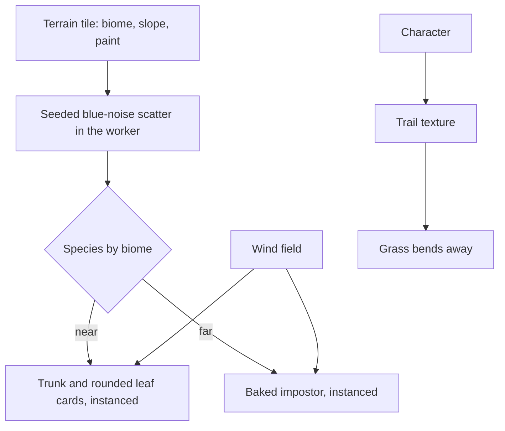

# Trees and scatter

This page builds on the [vegetation](/docs/genshin/vegetation), whose wind field already moves the grass, the great oak's crown and the clouds, and on the [terrain's shapes](/docs/proposals/genshin/terrain-shapes), whose biome weights and paint strokes decide what grows where. Windrise has one hand-built oak and a field of grass. A region needs forests of its own species, the flowers and rocks between them, and plants that part as something walks through.

## Decisions

- **Species are parameters of one generator.** The tree kit's generator already builds a trunk and branches carrying clusters of leaf cards whose normals are bent outward, so a crown lights like a soft sphere. The oak, the pine, the maple, the sakura and the rainforest giants are each a set of its parameters, and a region's page adds its species.
- **Level of detail by impostor.** Beyond the near range, a tree becomes a camera-facing impostor baked from its own mesh once, at startup. Far forests become the terrain's colour. Instancing gives one draw per species per detail level.
- **Scatter is deterministic.** Flowers, bushes, mushrooms, rocks and pickable plants are scattered in each terrain tile by a seeded, blue-noise-spaced placement filtered by biome, slope and paint, in the terrain's worker, so the same spot always grows the same plants. Hand-placed landmark plants, such as Windrise's great oak, come from the landmark schema instead.
- **Plants yield to what passes through.** Grass bends away from the character through a small trail texture around the viewer, written by the character controller.

## How it works



## Scope

**Today:** the [vegetation](/docs/genshin/vegetation) grows grass in two rings on green ground and sways Windrise's one oak on the wind.

**This adds:**

1. **Species** for each region, as parameters.
2. **Impostors** and instancing per species.
3. **Scatter** in the terrain's worker.
4. **The trail**, with the character controller.

## Key files

| File                                                           | Role after the change                              |
| :------------------------------------------------------------- | :------------------------------------------------- |
| `packages/genshin-engine/src/kits/tree/computeTreeSkeleton.ts` | The generator a species is a set of parameters of  |
| `packages/genshin-engine/src/nodes/createLeafMaterial.ts`      | The leaf cards every species' crown is drawn with  |
| `packages/genshin-world/src/workers/terrainTile.worker.ts`     | The worker that scatters a tile's plants beside it |

New files:

```text
packages/genshin-engine/src/vegetation/     ← species parameters, scatter, impostor baking
```

## Sources

- [InstancedMesh](https://threejs.org/docs/pages/InstancedMesh.html), three.js: one draw per species and level of detail.
