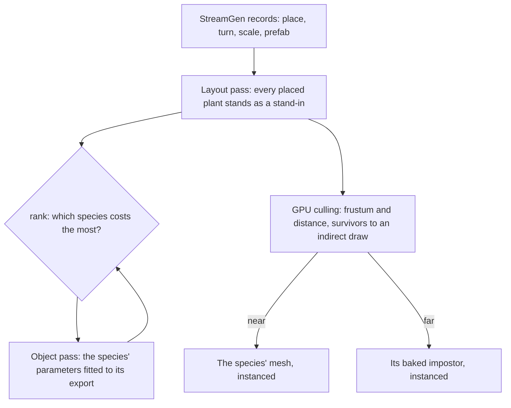

# Trees and scatter

This page builds on the [vegetation](/docs/genshin/vegetation), the [trees](/docs/genshin/trees) and the [scatter](/docs/genshin/scatter), and on the [scene derivation](/docs/genshin/scene-derivation)'s layout pass, which stands every object the game streams at its place. A tree is a species, drawn as its mesh near the eye and its impostor far from it, and each finest tile grows its flowers. What remains is every plant the game places, each species fitted, and the cost of a forest.

## Decisions

- **What the game places stands where it places it.** Trees, bushes, rocks and flowers the game streams are StreamGen records ([game data formats](/docs/genshin/game-data-formats)), so each stands at its record's place, turn and scale in the region's layout pass, drawn by a stand-in until its species is rebuilt. No placement the game holds is regenerated by a scatter of ours.
- **A species is fitted once, in an object pass.** Each species' parameters are fitted against its own export as any object is: its outline, depth and normal in the shape pass, its unlit colour in the surface pass. The next species is the one `rank` prices largest.
- **Instancing per species and detail.** Once a species stands many times, its mesh and its impostor are each one instanced draw for all its copies, the cross-over decided per instance.
- **Instances are culled on the GPU.** A compute pass tests every instance of grass, scatter and trees against the frustum and distance and writes the survivors into an indirect draw, so a field of blades never passes through JavaScript. This is the engine's per-instance culling, added here as its first consumer ([engine architecture](/docs/genshin/engine-architecture)); occlusion against a depth pyramid follows when a city's bench shows the instances it would hide.
- **A plant is named by its prefab, as a building is.** A placement's prefab is named through its path hash (`getPrefabNames` over `readAssetPathNames`), and a plant is a name holding `Tree`, `Bush`, `Shrub`, `Plant`, `Flower` or `Grass` that is not an effect, a decal, a drop or a pot (`^Eff_`, `Effect`, `Decal`, `^Item_`, `pot`), the way `checkIsArchitectureName` tells a building. Until its species is rebuilt, a placed tree's stand-in is our oak's impostor and any other plant's a low dome of the ground's green, each scaled by its placement and drawn as one instanced draw per prefab.
- **Plants yield to what passes through.** Grass bends away from the character through a small trail texture around the viewer, written by the character controller.

## How it works



## Scope

**Today:** Windrise's great oak is a species ([trees](/docs/genshin/trees)), drawn as its mesh and as its impostor past ten of its heights, and each finest tile grows its flowers ([scatter](/docs/genshin/scatter)).

**This adds:**

1. **Windrise's placed plants, as stand-ins, next.** A new `checkIsPlantName.ts` tells a plant's name as the Decisions set out, and its test, `checkIsPlantName.test.ts`, keeps `Stages_Unique_CyTree01_Lod1` and a bush and drops `Eff_` effects, `Item_Drop_Plant` drops and `Area_MdProps_Flowerpot02`. A new `fitWindrisePlants.ts`, a `plants` fit in `DerivedAssetFitMap`, parses every placement of the two streams `DerivedAssetComponentMap` names for Windrise (`parseStreamingPlacements`, as `readWorldPlacements` reads them, but every prefab rather than the listed ones), keeps the plants within `GROUND_RADIUS` of the oak's foot, and writes `plants.json`: each plant prefab's name and its places through `toRegionPlace` with their scale. `World/Landmark/Tree` draws them as the Decisions' stand-ins, and the layout pass (`genshin:parity passes windrise --pass Layout`) is queued as their measure.
2. **Every placed plant's species**, from the layout pass, each fitted to its export, the oak first.
3. **Instancing and GPU culling** per species and detail level.
4. **The trail**, with the character controller.

## Deferred compute

- **The great oak's parameters.** The shape pass fits them to the oak's export, matching its outline and depth (`genshin:parity passes windrise --pass Shape`), once a fit of the tree kit's parameters exists.
- **Where a tree turns impostor.** The distance at which one of the game's own trees changes its detail, measured on a recording that backs away from it.
- **The flowers' look.** Their spacing, sizes and colours matched to the references by their statistics.

## Key files

| File                                                                  | Role after the change                                |
| :-------------------------------------------------------------------- | :--------------------------------------------------- |
| `packages/genshin-world/src/services/world/TreeSpeciesOptionsMap.ts`  | Each species' parameters, fitted                     |
| `packages/genshin-world/src/components/World/Landmark/Tree/Index.vue` | A placed tree, instanced per species once many stand |

New files:

```text
scripts/src/services/genshinAssets/fit/fitWindrisePlants.ts
scripts/src/services/genshinAssets/world/checkIsPlantName.ts
packages/genshin-world/src/data/windrise/plants.json
packages/genshin-engine/src/culling/        ← the per-instance compute pass and its indirect draw
```

## Sources

- [InstancedMesh](https://threejs.org/docs/pages/InstancedMesh.html), three.js: one draw per species and level of detail.
- [GPU-driven: Hi-Z occlusion culling and indirect count](https://daslang.io/doc/reference/tutorials/vulkan/12_gpu_driven.html), daslang: survivors compacted by an atomic counter into an indirect draw, and the depth pyramid the occlusion step adds.
