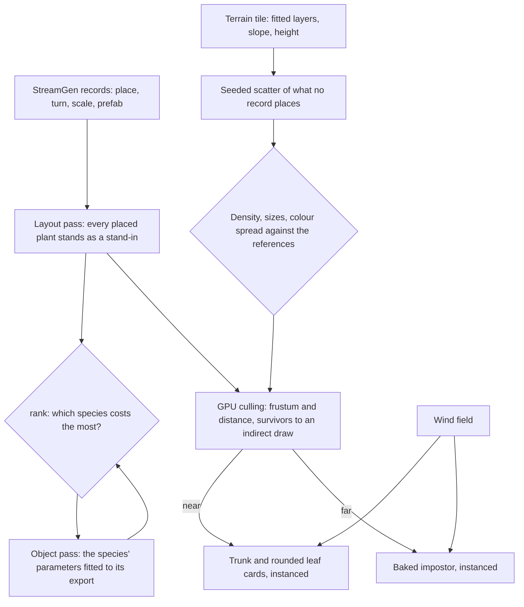

# Trees and scatter

This page builds on the [vegetation](/docs/genshin/vegetation), whose wind field already moves the grass, the great oak's crown and the clouds, and on the [scene derivation](/docs/genshin/scene-derivation)'s layout pass, which stands every object the game streams at its place. Windrise has one oak, placed where the game places it, and a field of grass. A region needs forests of its own species, the flowers and rocks between them, and plants that part as something walks through.

## Decisions

- **What the game places stands where it places it.** Trees, bushes, rocks and flowers the game streams are StreamGen records ([game data formats](/docs/genshin/game-data-formats)), so each stands at its record's place, turn and scale in the region's layout pass, drawn by a stand-in until its species is rebuilt. No placement the game holds is regenerated by a scatter of ours.
- **A species is one object pass.** Each species is a set of parameters of the tree kit's one generator, whose trunk and branches carry clusters of leaf cards with normals bent outward so a crown lights like a soft sphere, fitted against that species' own export as any object is: its outline, depth and normal in the shape pass, its unlit colour in the surface pass. A species placed a thousand times is fitted once, since the layout already places every copy, and the next species is the one `rank` prices largest.
- **Only what no record places is scattered.** Whatever the game draws with no placement the inventory finds, a detail layer of small flowers or pebbles among them, is scattered in each terrain tile by a seeded, blue-noise-spaced placement filtered by the ground's fitted layers, slope and height, in the terrain's worker, so the same spot always grows the same plants. Being random, it is judged by its statistics against the references, its density, its sizes and its colours' spread, never pixel for pixel.
- **Level of detail by impostor.** Beyond the near range, a species becomes a camera-facing impostor baked from its own mesh once, at startup. Far forests become the terrain's colour, or the area's far view where the game draws one. Instancing gives one draw per species per detail level.
- **Instances are culled on the GPU.** A compute pass tests every instance of grass, scatter and trees against the frustum and distance and writes the survivors into an indirect draw, so a field of blades never passes through JavaScript. This is the engine's per-instance culling, added here as its first consumer ([engine architecture](/docs/genshin/engine-architecture)); occlusion against a depth pyramid follows when a city's bench shows the instances it would hide.
- **Plants yield to what passes through.** Grass bends away from the character through a small trail texture around the viewer, written by the character controller.

## How it works



## Scope

**Today:** the [vegetation](/docs/genshin/vegetation) grows grass in two rings on green ground and sways Windrise's one oak on the wind, at the game's place for it and the kit's shape.

**This adds:**

1. **Species** fitted to their exports, as parameters, the oak first.
2. **Impostors**, instancing and **GPU culling** per species.
3. **Scatter** called from the terrain's worker and drawn for what no record places. The seeded generator is built ([scatter](/docs/genshin/scatter)); its sizes, colours and the tile hookup are not.
4. **The trail**, with the character controller.

## Key files

| File                                                           | Role after the change                                       |
| :------------------------------------------------------------- | :---------------------------------------------------------- |
| `packages/genshin-engine/src/kits/tree/computeTreeSkeleton.ts` | The generator a species is a set of fitted parameters of    |
| `packages/genshin-engine/src/nodes/createLeafMaterial.ts`      | The leaf cards every species' crown is drawn with           |
| `packages/genshin-world/src/workers/terrainTile.worker.ts`     | The worker that scatters a tile's unplaced plants beside it |

New files:

```text
packages/genshin-engine/src/vegetation/     ← species parameters, scatter, impostor baking
packages/genshin-engine/src/culling/        ← the per-instance compute pass and its indirect draw
```

## Sources

- [InstancedMesh](https://threejs.org/docs/pages/InstancedMesh.html), three.js: one draw per species and level of detail.
- [GPU-driven: Hi-Z occlusion culling and indirect count](https://daslang.io/doc/reference/tutorials/vulkan/12_gpu_driven.html), daslang: survivors compacted by an atomic counter into an indirect draw, and the depth pyramid the occlusion step adds.
