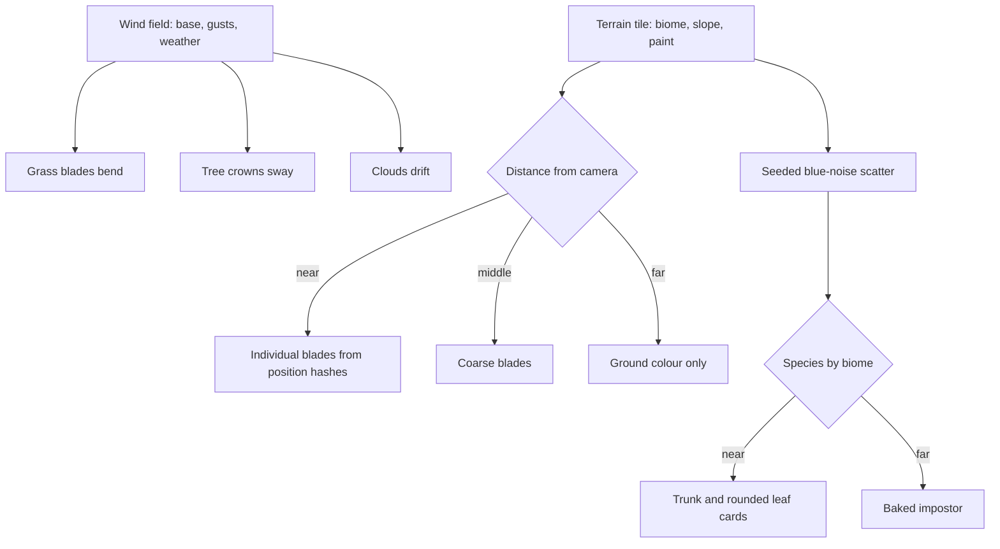

# Vegetation

This page builds on [terrain](/docs/proposals/genshin/terrain), whose biome weights and paint strokes decide what grows where. Wind is what makes Genshin's meadows feel alive. Gusts roll across Mondstadt's grass in visible waves, crowns sway, and petals and leaves drift past. Here plants are drawn at the density the game shows, and one wind field moves all of them together.

## Decisions

- **One wind field for everything.** A scrolling two-dimensional noise field of direction and strength, with gusts travelling across it as bands, is sampled in world space by every plant, by the [sky](/docs/genshin/sky-and-time)'s clouds, and later by cloth and hair. A region sets its base wind, stronger in Mondstadt and near still in the rainforest, and weather raises it.
- **Grass is blades, generated on the GPU.** Near the camera, grass is individual blades: a few vertices each, shaped, placed, coloured and bent in the vertex stage from a hash of their position, so no blade is stored. Density follows the ground's grass weight. Farther out, blades thin into a coarser ring and then into a painted ground colour that matches their average, so a field stays a field to the horizon. This is Ghost of Tsushima's approach, which holds acres of grass inside a frame budget.
- **Grass shades as a field.** Blades take the ground's normal instead of their own and a colour gradient from root to tip, so a meadow toon-shades as one surface with light rolling across it. That is the look of Genshin's grass, as opposed to a noisy carpet of lit and shaded blades.
- **Trees are cards around rounded normals.** A tree is a generated trunk and branch mesh carrying clusters of leaf cards. Each card's normal is bent toward the outward direction from its cluster's centre, so a crown lights like a soft sphere with a toon terminator and a sky rim. Species are parametric, with the oak, the pine, the maple, the sakura and the rainforest giants each a set of parameters. A region's page adds its species.
- **Level of detail by impostor.** Beyond the near range, a tree becomes a camera-facing impostor baked from its own mesh once, at startup. Far forests become the terrain's colour. Instancing gives one draw per species per detail level.
- **Scatter is deterministic.** Flowers, bushes, mushrooms, rocks and pickable plants are scattered in each tile by a seeded, blue-noise-spaced placement filtered by biome, slope and paint, so the same spot always grows the same plants. Hand-placed landmark plants, such as Windrise's great oak, come from the landmark schema instead.
- **Plants yield to what passes through.** Grass bends away from the camera now and from the character later, through a small trail texture around the viewer.

## How it works



## Scope

**Today:** no plant is drawn anywhere in the app.

**This adds:**

1. **The wind field.**
2. **Grass** in its three distance rings.
3. **The tree generator** with the oak first, for Windrise, then the species each region names.
4. **Scatter** and **impostors**.

## Key files

| File                                                      | Role after the change                                  |
| :-------------------------------------------------------- | :----------------------------------------------------- |
| `packages/genshin-engine/src/noise/createSimplexNoise.ts` | The noise the wind field and the placement hashes read |

New files:

```text
packages/genshin-engine/src/nodes/          ← wind, grass, leaf card and impostor node graphs
packages/genshin-engine/src/vegetation/     ← tree generator, species parameters, scatter
apps/web/app/components/Genshin/Vegetation.vue
```

## Notes

- **Grass is where the budget goes first.** Blade density is the first setting the quality steps lower and the last one restored, since the look survives thinner grass better than it survives lost shadows.

## Sources

- [Procedural grass in Ghost of Tsushima](https://gdcvault.com/play/1027214/Advanced-Graphics-Summit-Procedural-Grass), Eric Wohllaib, Sucker Punch Productions, GDC 2021: individual blades generated on the GPU with procedural shape and animation, acres of grass within a memory and frame budget, and wind moving a field as a whole.
- [InstancedMesh](https://threejs.org/docs/pages/InstancedMesh.html), three.js: one draw per species and level of detail.
