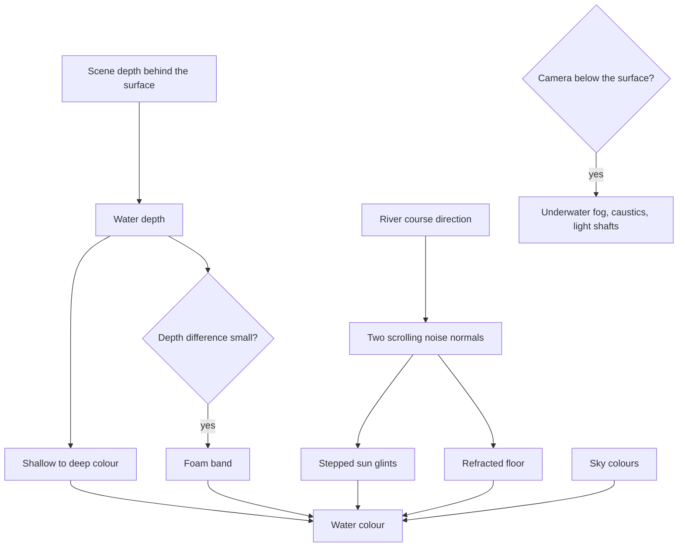

# Water

This page builds on the [terrain](/docs/genshin/terrain) and its [shapes](/docs/proposals/genshin/terrain-shapes), whose authored coastlines and river courses decide where water is. Water is everywhere in the world: Mondstadt's lake, Liyue's harbour and its river valleys, Inazuma's seas between the islands, Sumeru's rainforest rivers, and Fontaine, half of which lies under the surface. The game draws it clear and bright. The floor shows through the shallows, a white band of foam marks every shore, and the sun breaks on the surface into hard glints.

## Decisions

- **One water material, graded by depth.** The surface reads the scene's depth behind it. The difference between the surface and the floor gives the water's depth, and the colour runs from a shallow tint through a mid tint to a deep colour, set per region. Fontaine's water is turquoise, Inazuma's a saturated blue, and the rainforest's rivers green. The floor stays visible through the shallows, refracted by the surface normal.
- **Foam where water meets anything.** A band where the depth difference is small draws animated foam lines along every shore, rock and pillar that breaks the surface, with no foam mesh authored.
- **Motion is noise, glints are stepped.** The surface normal is two scrolling noise layers. The sun's specular goes through a hard step, so the surface breaks into bright shapes rather than a smooth highlight, and bloom lifts them.
- **Caustics on the floor.** The shallow floor, and everything under the surface, is lit by an animated Voronoi caustic pattern that fades with depth.
- **Rivers flow along their courses.** A river's surface is a ribbon mesh built from its authored course, with texture coordinates running downstream. Its noise scrolls along that direction at the course's speed, and foam collects at rocks and bends.
- **Waterfalls are meshes on cliff bands.** Where a river course crosses a cliff band, a sheet mesh with scrolling streaks pours over the edge. At the foot, a mist of particles and a foam pool match the game's waterfalls, which are much wider than they are thick.
- **Reflections are the sky, plus screen space where it is cheap.** The surface reflects the sky dome's colours everywhere. Screen-space reflections through `SSRNode` are added near the camera when the budget allows, and the look never depends on them.
- **The world under water.** When the camera goes below the surface, fog thickens to the region's underwater colour, caustics light every surface, shafts of light fall from above, and the surface seen from below shows the sky through a window and mirrors the depths outside it. Fontaine needs this most. The mechanism is shared by every sea and lake.

## How it works



## Scope

**Today:** the [fluid simulator](/docs/fluid-simulator) draws three's photographic ocean. Nothing draws stylized water.

**This adds:**

1. **The sea and lakes**, with depth colour, foam, glints and caustics.
2. **Rivers and waterfalls** from the authored courses and cliff bands.
3. **The world under water**, before Fontaine is built.

## Key files

| File                                                   | Role after the change                                                             |
| :----------------------------------------------------- | :-------------------------------------------------------------------------------- |
| `apps/web/app/composables/visual/useFluidSimulator.ts` | Its `WaterMesh` stays the fluid simulator's own; this page shares no code with it |

New files:

```text
packages/genshin-engine/src/nodes/        ← water surface, foam, caustics, underwater node graphs
packages/genshin-engine/src/water/        ← river ribbons and waterfall sheets from authored courses
apps/web/app/components/Genshin/Water.vue
```

## Notes

- **Swimming is play.** The surface is drawn here. Moving through it, with its stamina, waits for the phase-three character controller.

## Sources

- [SSRNode](https://threejs.org/docs/pages/SSRNode.html), three.js: the screen-space reflections added near the camera.
- [WaterMesh](https://threejs.org/docs/pages/WaterMesh.html), three.js: the physical ocean the fluid simulator uses, which this stylized water does not build on.
- [Fontaine](https://genshin-impact.fandom.com/wiki/Fontaine), Genshin Impact Wiki: the nation whose explorable underwater areas make the world under the surface part of the engine rather than a special case.
