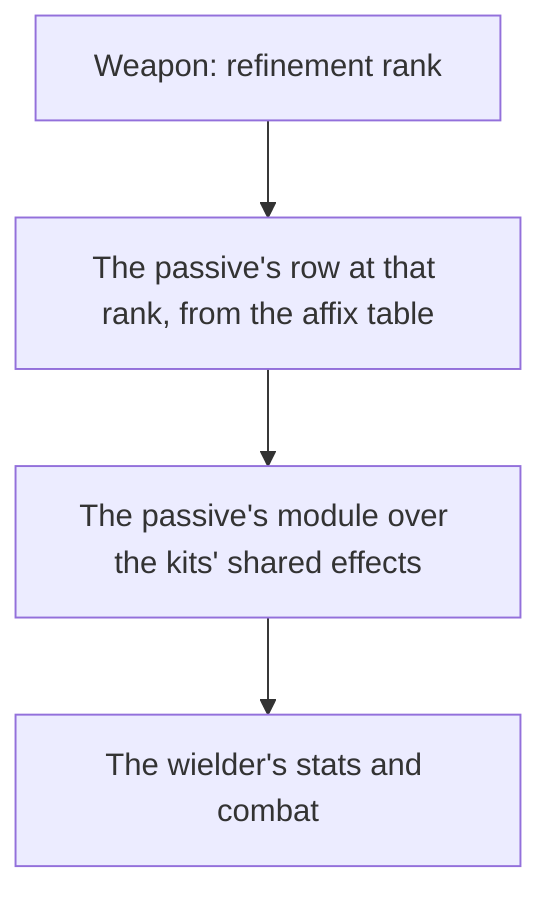

# Weapon enhancement

Levelling, ascension and refinement are built, as the [weapon enhancement](/docs/genshin/weapon-enhancement) page describes. What is left is a weapon's passive: each refinement rank changes it, and it acts through the [character kits](/docs/proposals/genshin/character-kits), so this page waits on them.

## Decisions

- **A passive is its table's numbers and a module.** `EquipAffixExcelConfigData` holds a passive's name, description and numbers at each refinement rank, which the stats run reads. What the passive does is written as a small module over the kits' shared effects, as a character's own module is, since the game's own weapon configs (`BinOutput/Talent/EquipTalents`) are scrambled like its ability configs.
- **A weapon's passive rows are its skill affix's.** A weapon names its passive by its `skillAffix` group, and the rows of that group are its ranks by their `level`, from zero for rank one to four for rank five.
- **The passive reads the weapon's rank.** A weapon at refinement rank R reads the row of level R less one, so the rank kept with the weapon is the only input the module takes.

## How it works

## Scope and order

**Today:** a weapon's refinement rank is kept and paid for; nothing reads it as a passive, and the affix table is not read.

**This adds, in order:**

1. **The affix table**, read by the stats run and grouped by each weapon's skill affix, its names and descriptions kept as text ids.
2. **Each passive as a module**, read at its rank, once the [character kits](/docs/proposals/genshin/character-kits) hold the shared effects a passive acts through.

## Data and measures

- **Read from the game's tables:** `EquipAffixExcelConfigData`, in the stats run, grouped by the weapon's `skillAffix`.
- **Measured:** nothing; the passive's words are the game's own, through [game text](/docs/genshin/game-text) by their text ids once they are keyed.

## Key files

| File                                                         | Role after the change                                 |
| :----------------------------------------------------------- | :---------------------------------------------------- |
| `packages/genshin-world/src/models/weapon/WeaponData.ts`     | Gains its passive's rows, grouped by its skill affix  |
| `scripts/src/services/genshinAssets/stats/getWeaponDatas.ts` | Reads the affix table into each weapon's passive rows |

## Sources

- [AnimeGameData](https://github.com/DimbreathBot/AnimeGameData), the community's per-patch dump: `EquipAffixExcelConfigData`, and the scrambled weapon configs (`BinOutput/Talent/EquipTalents`).
