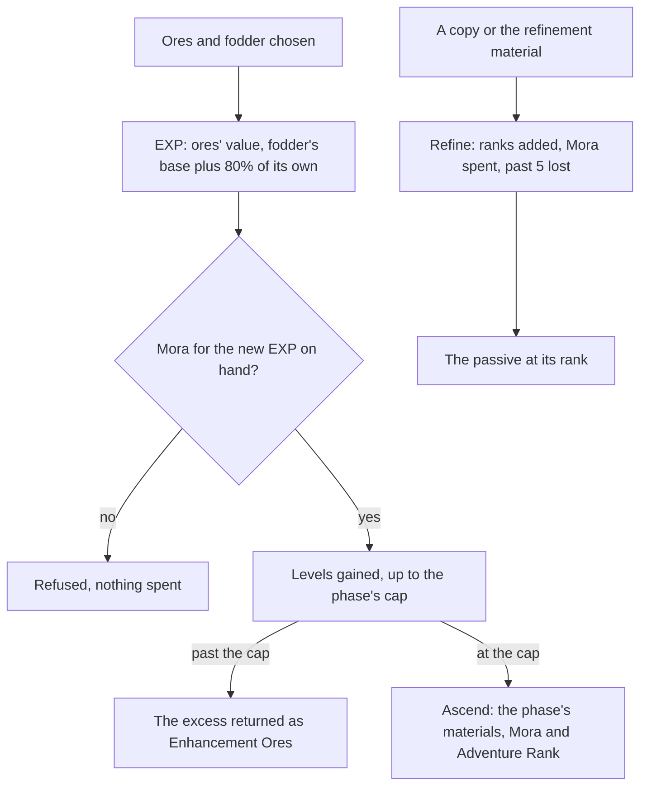

# Weapon enhancement

A weapon's attributes already grow along its curve to its level and phase ([character attributes](/docs/genshin/character-attributes)). What the game also lets a player do is raise that level, ascend the weapon at its caps, and refine it, which strengthens its passive. A passive changes how its wielder fights, so it acts through the [character kits](/docs/proposals/genshin/character-kits), and this page waits on them.

## Decisions

- **Weapon EXP from ores and fodder.** Enhancement Ore gives 400 Weapon EXP, and the finer ores more, each the material table's own value. A fodder weapon gives its rarity's base, 600, 1,200, 1,800, 50,000 or 300,000 from one to five stars, plus 80% of the EXP it was levelled with. Each level's EXP is `WeaponLevelExcelConfigData`'s for the weapon's rarity, and EXP past the phase's cap comes back as Enhancement Ores, as the game returns it.
- **Ten points of EXP cost one Mora**, except the share recovered from an enhanced fodder weapon, which costs nothing, as the wiki gives it.
- **Ascension as the character's.** At its phase's cap a weapon ascends with that phase's materials and Mora, read from `WeaponPromoteExcelConfigData` with the Adventure Rank each phase needs, as the [character screen](/docs/proposals/genshin/character-screen) ascends a character.
- **Refinement from rank 1 to 5.** A weapon of three stars or more is refined with a copy of itself or its refinement material and Mora: 500, 1,000 and 2,000 Mora for a three, four or five-star's second rank, doubling each rank after. A copy carries its own refinements, so refining a rank 2 with a rank 2 reaches rank 4, and what passes rank 5 is lost, as the game warns. A weapon of one or two stars has no passive and cannot be refined.
- **A passive is its table's numbers and a module.** `EquipAffixExcelConfigData` holds a passive's name, description and numbers at each refinement rank, which the stats run reads. What the passive does is written as a small module over the kits' shared effects, as a character's own module is, since the game's own weapon configs (`BinOutput/Talent/EquipTalents`) are scrambled like its ability configs.
- **A fodder or a refinement copy must be free.** A weapon a character wields is never consumed.

## How it works

## Scope and order

**Today:** a weapon is its level and phase, its attributes summed at them; the bag holds weapons one each, and nothing levels them.

**This adds, in order:**

1. **Levelling**, its EXP and Mora, with the material table's enhancement ores.
2. **Ascension**, on the weapon's phases.
3. **Refinement**, a weapon's rank kept with it.
4. **Passives**, each a module, read at its rank, once the kits' shared effects exist.

## Data and measures

- **Read from the game's tables:** `WeaponLevelExcelConfigData`, `WeaponPromoteExcelConfigData`, `EquipAffixExcelConfigData` and `WeaponExcelConfigData`'s refinement costs, in the stats run, and the ores' EXP from the material table.
- **Measured:** nothing; the screen's look is the [character screen](/docs/proposals/genshin/character-screen)'s Weapons tab.

## Key files

| File                                                                | Role after the change                                 |
| :------------------------------------------------------------------ | :---------------------------------------------------- |
| `packages/genshin-world/src/models/weapon/Weapon.ts`                | Gains its EXP and refinement rank                     |
| `packages/genshin-world/src/models/weapon/WeaponData.ts`            | Gains its EXP table, phases' costs and passive's rows |
| `packages/genshin-world/src/services/inventory/addInventoryItem.ts` | The ores returned past a cap                          |
| `packages/genshin-world/src/models/inventory/Wallet.ts`             | The Mora levelling, ascending and refining spend      |
| `scripts/src/services/genshinAssets/stats/writeStatTables.ts`       | Writes the level, promotion and affix tables          |

## Sources

- [Weapon EXP](https://genshin-impact.fandom.com/wiki/Weapon_EXP), Genshin Impact Wiki: Weapon EXP from ores and fodder, each rarity's base, 80% of a fodder's own EXP recovered free, excess returned as ores, and ten points of EXP to the Mora.
- [Weapon](https://genshin-impact.fandom.com/wiki/Weapon), Genshin Impact Wiki: levelling, the six ascensions to level 90 with Weapon Ascension Materials, and the look that changes at the second.
- [Refinement](https://genshin-impact.fandom.com/wiki/Refinement), Genshin Impact Wiki: ranks 1 to 5, a copy's refinements carried over, the excess lost, the Mora per rank and rarity, and one and two-star weapons never refined.
- [Enhancement Ore](https://genshin-impact.fandom.com/wiki/Enhancement_Ore), Genshin Impact Wiki: 400 Weapon EXP an ore.
- [AnimeGameData](https://gitlab.com/Dimbreath/AnimeGameData), the community's per-patch dump: the weapon level, promotion and affix tables, and the scrambled weapon configs.
