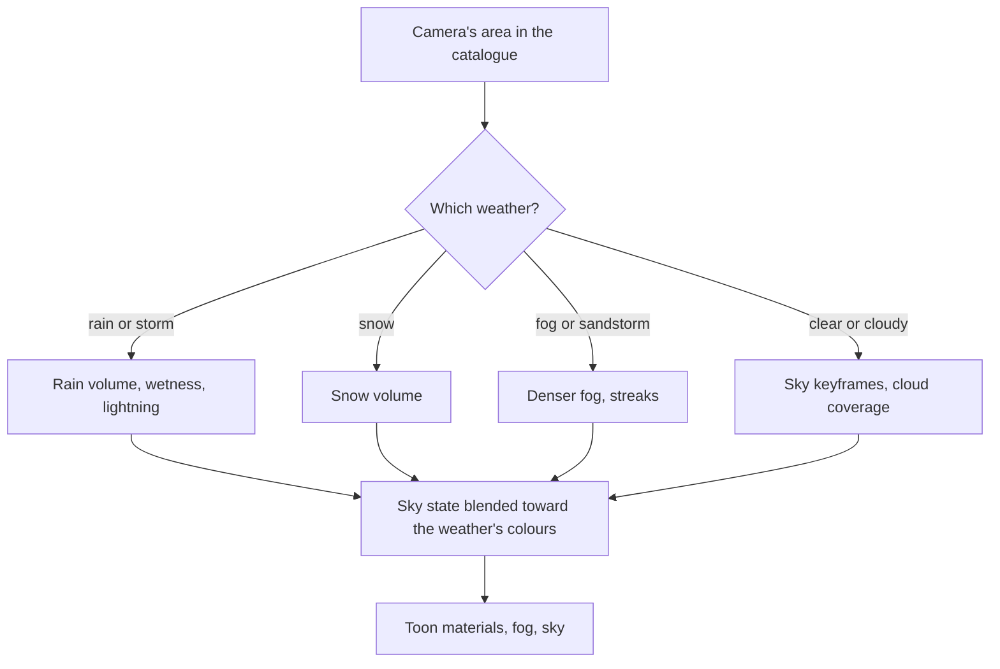

# Weather

This page builds on [sky and time](/docs/genshin/sky-and-time), whose keyframes light the world, and takes each area's weather from the [world map](/docs/genshin/world-map)'s catalogue. It was split out of the sky's proposal when the sky shipped, since weather is set per area and areas only arrive with the world map.

## Decisions

- **Weather belongs to an area, as in the game.** Each area in the catalogue names the weather it can have, read from the game's own area and weather data where the inventory finds it and from the wiki where it does not, and only the weather where the camera stands is drawn:
  - clear, cloudy, rain and thunderstorm for most areas
  - snow and snowstorms on Dragonspine
  - fog on Tsurumi Island
  - sandstorms in the Desert of Hadramaveth
  - no rain in cities or deserts
  - Inazuma's permanent storm available as an area setting
- **Weather is particles, tint and a ramp shift.** Rain is instanced streaks in a volume that follows the camera, with splashes where they meet the ground. Snow uses the same volume with slower, drifting flakes. Wet surfaces darken and gain specular through one wetness uniform. Lightning is a brief flash through the sky and the light, followed by a bolt drawn as a mesh. A sandstorm is a thick fog colour and a streak layer driven by the wind.
- **A weather's settings are the game's.** The game's environment scripts hold each weather's sky, cloud, light and fog colours by the hour beside the clear day's, as the login's `EnviroSky` and `LoginSceneWeather` do, so the inventory names those fields first and each weather's colours are read from them rather than solved off recordings; only what they hold without fields is measured, over a recording of that weather at a known hour.
- **Weather shifts the sky, not a second sky.** A weather writes its own colours into the same sky state, and raises the sky's cloud coverage and the fog's density, so a storm darkens the same dome, light and haze the clear day uses.
- **Particles are judged by their statistics.** Rain, snow, splashes and a sandstorm's streaks are scattered at random, so each is matched to a recording by its density, the length and speed of its streaks and its colour, never pixel for pixel.

## How it works



## Scope

**Today:** the sky is always clear, with a region's fixed cloud coverage.

**This adds:**

1. **Rain and thunderstorms**, since Mondstadt and Liyue need them.
2. **Snow, fog and sandstorms** as their regions arrive.

## What this does not propose

- **Weather's effect on play.** Rain putting out fires or making characters wet is play, and it waits for the phase-three pages that bring a character.

## Key files

| File                                                       | Role after the change                                      |
| :--------------------------------------------------------- | :--------------------------------------------------------- |
| `packages/genshin-engine/src/atmosphere/sampleSkyState.ts` | The day's sky, which a weather blends toward its own       |
| `packages/genshin-engine/src/atmosphere/applySkyState.ts`  | Where the blended sky is written into everything it lights |

New files:

```text
packages/genshin-engine/src/nodes/        ← rain and snow node graphs
packages/genshin-world/src/components/World/Weather/Index.vue
```

## Sources

- [Weather](https://genshin-impact.fandom.com/wiki/Weather), Genshin Impact Wiki: weather tied to areas with only the current location's drawn, rain and thunderstorms, no rain in cities or deserts, snow on Dragonspine, fog on Tsurumi Island, and sandstorms in the Desert of Hadramaveth.
