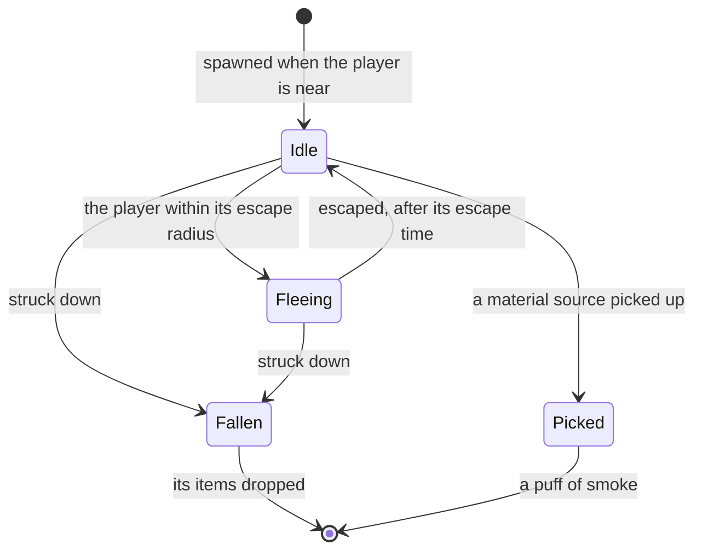

# Wildlife

The game's world is lived in by animals: birds that scatter, boars that charge, crystalflies to catch and cats on the roofs. They give the meat, fowl and materials cooking and crafting spend, and fill in the archive's living beings. They are a kind of [enemies](/docs/genshin/enemies)' camp with an AI of their own, standing where the [spawned places](/docs/proposals/genshin/spawned-places) fit them, so this page waits on those places.

## Decisions

- **Three kinds, by what they give.** Pets, the cats and dogs, cannot be interacted with. Birds and beasts drop their items when struck down. Material sources, crystalflies, butterflies, lizards, frogs, crabs and the like, are picked up as an item through the [interaction](/docs/proposals/genshin/interaction) prompts and vanish in a puff of smoke. A fish in shallow water can be struck or picked up.
- **Each kind's numbers are the game's.** `EnvAnimalGatherExcelConfigData` gives each animal its escape radius and time, how long it lives, the weathers it hides in (rain, thunderstorms and snow for some) and the items it gives; `CaptureExcelConfigData` gives what each beast drops when caught, and the monster table its kind, which the enemies' run already reads.
- **They flee on the enemies' step.** A startled animal runs from the player once within its escape radius, as a stepped state beside the enemies' own, and most come into being only when the player is near. Boars charge and can hurt a player in their way; Sumeru's beasts fight back with health bars and draw the player into combat; Chenyu Vale's flee and vanish when struck.
- **Struck down by a hit, as combat deals it.** A bird or beast falls to the hit [combat](/docs/genshin/combat) prices, one hit for most. A hit on wildlife triggers a weapon's passive but never an artifact set's, as the wiki notes.
- **They come back on the game's refresh**, as gathering points do, by their kind's policy.

## How it works

## Scope and order

**Today:** the world's only creatures are enemies drawn as capsules.

**This adds, in order:**

1. **Birds and beasts that flee and drop**, in Windrise's area, drawn as the enemies' stand-ins until their models.
2. **Material sources**, picked up.
3. **Boars, and the wildlife that fights back.**
4. **Pets**, and each region's own animals when its region lands.

## Data and measures

- **Read from the game's tables:** `EnvAnimalGatherExcelConfigData`, `CaptureExcelConfigData`, `AnimalCodexExcelConfigData` and the animals' monster rows.
- **Placed by the spawned places:** where each kind lives, from the official map's marks.
- **Measured:** how fast each kind flees, timed off recordings of each.

## Key files

| File                                                               | Role after the change                                 |
| :----------------------------------------------------------------- | :---------------------------------------------------- |
| `packages/genshin-world/src/services/enemy/stepEnemy.ts`           | Beside the animals' own fleeing step                  |
| `packages/genshin-world/src/models/enemy/EnemyCamp.ts`             | Animals placed as camps                               |
| `packages/genshin-world/src/components/World/Enemies/Index.vue`    | Steps and draws the animals in reach with the enemies |
| `scripts/src/services/genshinAssets/enemies/writeEnemyKinds.ts`    | Writes the animals' rows beside the enemies'          |
| `packages/genshin-world/src/services/interaction/getHeldPickUp.ts` | Picks up a material source                            |

## Sources

- [Wildlife](https://genshin-impact.fandom.com/wiki/Wildlife), Genshin Impact Wiki: fleeing when approached, boars' charge, Sumeru's that fight back and Chenyu Vale's that vanish, pets, item drops and material sources gone in smoke, fish struck or picked, weapon passives triggered but not artifact sets', and spawning near the player.
- [AnimeGameData](https://github.com/DimbreathBot/AnimeGameData), the community's per-patch dump: the environment animal table with each animal's escape radius, time, weathers and items, and the capture table.
