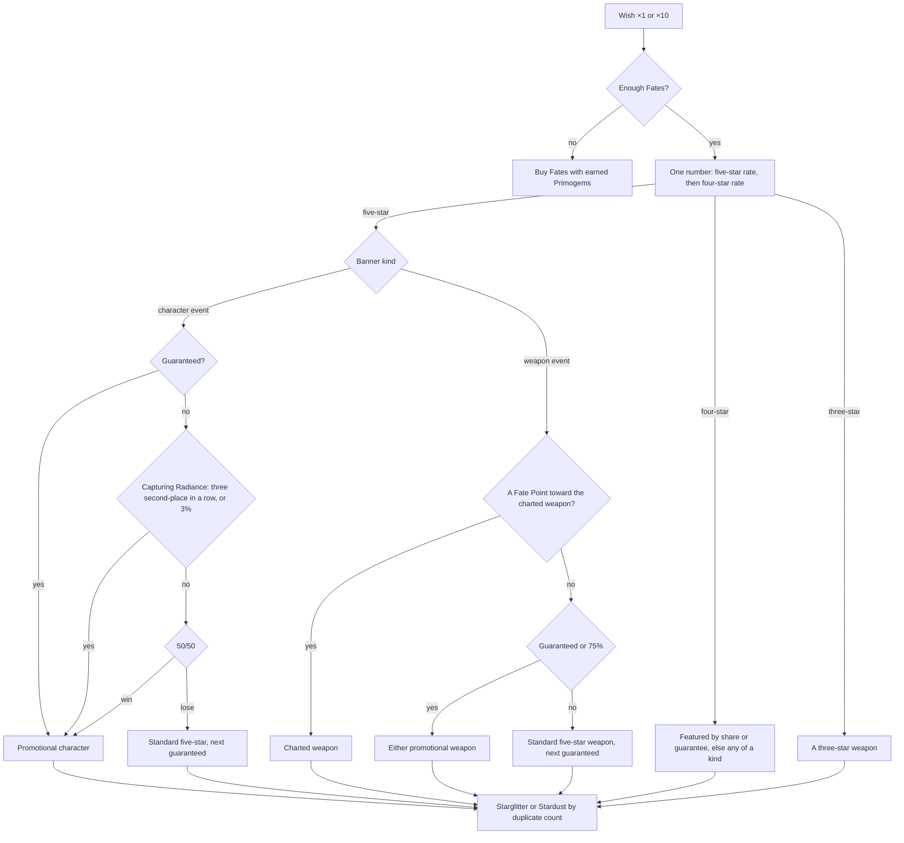

# Wish

This page builds on the [inventory](/docs/proposals/genshin/inventory), whose wallet the wishes spend from. A wish draws one character or weapon from a banner, by rates and guarantees the game publishes in each banner's details. The game opens its wishes on F3.

## Decisions

- **The game's four banner kinds.** The character event wish has one promotional five-star character and three featured four-star characters. The weapon event wish has two promotional five-star weapons, five featured four-star weapons and the Epitomized Path. The standard wish, Wanderlust Invocation, features nothing. The beginners' wish runs for twenty wishes. Character Event Wish-2 is a second character event wish sharing the first's counters, so it is a banner of the same kind. Chronicled Wish waits for its own page.
- **A wish spends a Fate.** Event wishes take Intertwined Fate and the standard and beginners' wishes Acquaint Fate, one a wish. The beginners' wish takes eight for ten. Fates come from the wallet, earned in the world or bought with earned Primogems; nothing is bought with money.
- **The base rates and the pity.** A five-star is 0.6% a wish on the character and standard wishes and 0.7% on the weapon wish. A four-star is 5.1% and 6%. Hard pity is the game's published rule: the 90th wish since the last five-star is one, or the 80th on the weapon wish, and the 10th since the last four-star or better is one. Soft pity follows the community's model from millions of recorded wishes, which the wiki publishes. From the 74th wish the five-star rate rises six points a wish, and on the weapon wish from the 63rd by seven. The four-star rate rises 51 points at the 9th wish, or 60 at the 8th on the weapon wish.
- **One roll a wish.** A wish draws one number. Below the five-star rate it is a five-star. Below that plus the four-star rate it is a four-star, the four-star rate capped so the two fill the whole range at the guarantee. Anything else is a three-star weapon. A five-star leaves the four-star counter running, so the four-star guarantee passes to the next wish, as the details say.
- **The 50/50 and its guarantee.** A character event five-star is the promotional character half the time, and a four-star one of the featured three half the time. A miss guarantees the next one. The weapon wish's shares are 75%.
- **Capturing Radiance as the game publishes it.** On a character event five-star that is not guaranteed, Capturing Radiance may trigger and make it the promotional character. Its published base probability, 0.018% a wish, is a share of the 0.6% five-star rate, so it triggers on 3% of such five-stars and is checked before the 50/50. After the promotional character has come second three times running, it triggers on the next one for certain. It never touches the guarantee. The wiki's consolidated 55% for the promotional character follows from these rules.
- **The Epitomized Path.** With a course charted for one of the two promotional weapons, a five-star that is not that weapon earns a Fate Point. At one Fate Point the next five-star is the charted weapon. Charting another course resets the points. Without a course the wish earns none.
- **What is not featured.** The standard wish's five-stars and four-stars are characters or weapons with equal chance, as its details state, then any one of that kind. A non-featured four-star on an event wish follows the same rule. The beginners' wish holds no four-star or five-star weapon, and its eighth wish is Noelle.
- **Counters shared as the game shares them.** The character event wishes share one set, the weapon wish another and the standard wish a third, each carried over from one banner to the next. The beginners' wish counts on the standard wish's, as the community's wish trackers count it.
- **A duplicate returns Starglitter.** A new character returns nothing. A duplicate returns its Stella Fortuna and 10 Masterless Starglitter at five stars or 2 at four, and 25 or 5 once its constellations are complete. A five-star weapon returns 10 Starglitter, a four-star 2, and a three-star 15 Masterless Stardust.
- **A pure pull with a seeded random source.** The pull takes the banner, the counters and a random source and returns the item and the next counters, so a test replays any sequence from a seed. The engine's `createSeededRandom` is the source.
- **The screen opens on F3.** It is an entry in the screens' screen kinds and shortcut map. It shows the banners, the open banner's Fate cost on Wish ×1 and Wish ×10, the wallet's Primogems and Fates, the Epitomized Path's course and points on the weapon wish, and the results.

## How it works



## Scope and order

**Today:** the world has no wishes.

**This adds, in order:**

1. **The pull.** The rates, the pity, the guarantees, Capturing Radiance and the Epitomized Path in one pure function over a seeded random source, tested against each rule.
2. **The returns and the cost.** Starglitter and Stardust by duplicate count, and a wish ×1 or ×10 spending its Fates from the wallet.
3. **The screen's structure.** A `genshin-interface` screen drawing the banners, the costs, the wallet and the results, its words handed in, opened on F3 through the screens' screen kind.

## What this does not propose

- **The banners' pools.** Which characters and weapons a banner holds comes with the characters and weapons the world can show.
- **The wish animation.** The falling star, its colours and the reveal are measured and traced in the [recreation passes](/docs/proposals/genshin/recreation-passes).
- **Chronicled Wish**, the shop's Starglitter and Stardust exchanges, and the wish history.
- **Buying anything with money.** No Genesis Crystals are sold, and Fates cost earned Primogems only.

## Key files

| File                                                       | Role after the change                    |
| :--------------------------------------------------------- | :--------------------------------------- |
| `packages/genshin-engine/src/random/createSeededRandom.ts` | The random source a wish draws from      |
| `packages/genshin-text/src/models/GameTextKey.ts`          | Gains the banners' names and the buttons |

New files:

```text
packages/genshin-world/src/models/wish/BannerKind.ts
packages/genshin-world/src/models/wish/Banner.ts
packages/genshin-world/src/models/wish/WishPity.ts
packages/genshin-world/src/services/wish/BannerKindRatesMap.ts
packages/genshin-world/src/services/wish/pullWish.ts
packages/genshin-world/src/services/wish/getWishReturn.ts
packages/genshin-interface/src/components/WishScreen/Index.vue
```

## Sources

- [Wish](https://genshin-impact.fandom.com/wiki/Wish), Genshin Impact Wiki: the banner kinds, the Fates and their price, the separate counters carried between banners, and the Starglitter and Stardust each item returns.
- [Character Event Wish](https://genshin-impact.fandom.com/wiki/Character_Event_Wish), Genshin Impact Wiki: the rates, the community's soft pity model, the guarantees, Capturing Radiance's published rules and Character Event Wish-2's shared counters.
- [Weapon Event Wish](https://genshin-impact.fandom.com/wiki/Weapon_Event_Wish), Genshin Impact Wiki: the weapon wish's rates, its soft pity, its 75% shares and the Epitomized Path.
- [Wanderlust Invocation](https://genshin-impact.fandom.com/wiki/Wanderlust_Invocation), Genshin Impact Wiki: the standard wish's rates, and its equal chance of a character or a weapon at each rarity.
- [Beginners' Wish](https://genshin-impact.fandom.com/wiki/Beginners%27_Wish), Genshin Impact Wiki: twenty wishes, eight Acquaint Fates for ten, no four-star or five-star weapons, and Noelle on the eighth wish.
- [Controls](https://genshin-impact.fandom.com/wiki/Controls), Genshin Impact Wiki: the wish screen on F3.
