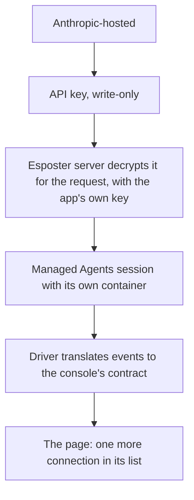

# Anthropic-Hosted Sessions

A sub-spec of the [agent console](/docs/proposals/infra/agent-console), and the later half of [remote connections](/docs/infra/claude-interface/agent-console/remote-connections), whose first half — a machine of the reader's own — has shipped. It is for a reader with no machine to leave running: Anthropic's Managed Agents runs the agent loop and a sandbox per session itself, paid with the reader's own API key ([Managed Agents](https://platform.claude.com/docs/en/managed-agents/overview)). It is added from the sessions tab like any other connection, never from the first screen.

## What it changes

- **Anthropic-hosted, with the reader's API key.** The reader pastes an Anthropic API key once. Each session is a Managed Agents session in a container of its own, working on a public repository the reader names, which the session clones as its first step. A driver on Esposter's server speaks Managed Agents' event stream on one side and the console's contract on the other, so the page draws a hosted session exactly as it draws a local one, as one more connection in its list.
- **The key is write-only.** It crosses to Esposter's server once, over TLS, and never comes back. The page shows only its last four characters, with **Replace** and **Remove**. The server encrypts it with AES-256-GCM under a key held only in the app's own environment, beside the secrets it already keeps, so a database copy alone opens nothing and no paid vault is needed. Managed Agents usage is billed to the reader's key, never to Esposter. It is decrypted only in the request that starts or drives a session. It is never logged, and never sent to the page or into the sandbox.
- **A claude.ai subscription stays with Claude Code.** A subscription signs in through Claude Code, so it runs on this computer or a machine of the reader's own. The hosted option takes an API key, which is what Managed Agents is billed to.

## What is deliberately not in it

- **No private repositories.** Cloning one needs a repository credential beside the API key, stored and scoped as the key is. A private repository runs on this computer or a machine of the reader's own, where the host already has the reader's own access.
- **No team keys.** One reader, one key; an organisation's shared key belongs to an admin surface this proposal does not add.

## Key files

| File                                                        | Role after the change                                                               |
| ----------------------------------------------------------- | ----------------------------------------------------------------------------------- |
| `packages/agent-console-server/src/models/driver/Driver.ts` | the contract the Managed Agents driver implements beside the Agent SDK driver       |
| `apps/web/app/store/agentConsole/connection.ts`             | the hosted connection beside the paired hosts                                       |
| `apps/web/server/trpc/routers/user.ts`                      | the write-only key procedures: set, replace, remove, and read the last four         |
| `packages/db-schema/src/schema/auth/usersInAuth.ts`         | the encrypted key and its last four characters, beside the user they belong to      |
| `apps/web/configuration/runtimeConfig.ts`                   | the key-encryption secret, read from the app's environment beside its other secrets |

## Sources

- [Claude — Managed Agents overview](https://platform.claude.com/docs/en/managed-agents/overview) — agents, environments and sessions, with a container per session in which the agent's tools run.
- [Claude Code — Remote Control](https://code.claude.com/docs/en/remote-control) — "API keys are not supported", which is why the hosted option runs on Managed Agents rather than Remote Control.
