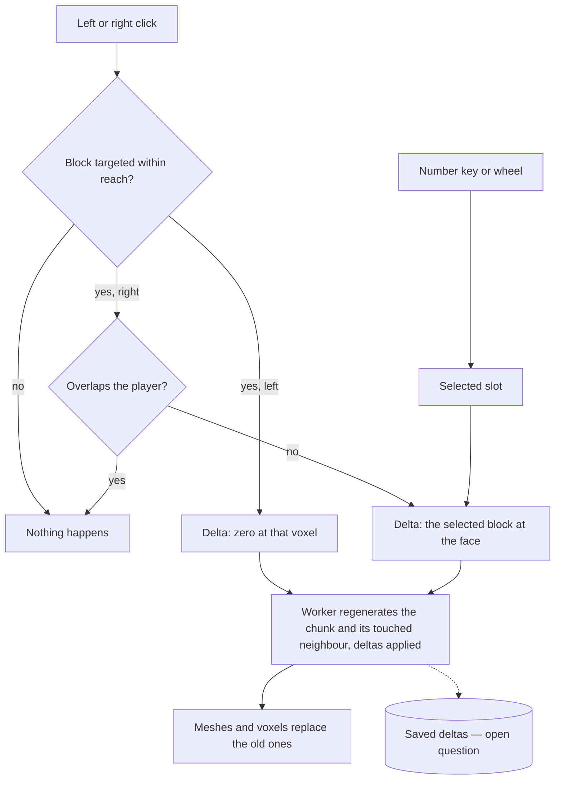

# Building

The [voxel world](/docs/infra/claude-interface/agent-console/voxel-world) is walked but never changed by the player: the terrain comes from a seed and the room is stamped into it, and the one block the player acts on is the door. This proposal lets the player build, the way a Minecraft player does, with a hotbar along the bottom of the screen and the mouse on the block they look at.

## Decisions

- **A hotbar of nine slots, as Minecraft's.** A row of voxel slots sits centred along the bottom of the world, just over the heads-up display's bar and above the touch joystick's layer. Each slot holds one block of the palette the terrain and the room already draw with, and the selected slot is outlined. The number keys one to nine select a slot and the wheel steps through them, both registered commands bound only while the world has the keys, as E and T are. The wheel already zooms the camera, so a hotbar that takes it moves the zoom to a modifier; which one is decided by what Minecraft does, never invented.
- **The targeted block is the one acted on.** A thin outline, as Minecraft draws, marks the block under the cursor within reach, and it is drawn only while the hotbar is out, so walking the room shows the prompts alone. A left click breaks the block and a right click places the selected one against the face it was hit on, both refused where a block would overlap the player. The ray is the one the camera already casts through the grid (`castThroughGrid`), which yields the face as well as the block, so building adds no second way of finding one.
- **An edit is a delta over the seed.** The terrain stays generated, and the player's changes are held as a map from a voxel's position to the block now there, zero for broken. The worker applies a chunk's deltas after generating it, so a chunk streamed back in later has the player's changes, and an edit re-meshes only the chunk it lands in, plus the neighbour whose border it touches. It is the one time a chunk is generated again once it has streamed in.
- **The room is not breakable.** The room is where the prompts stand, so its voxels are left out of breaking; the terrain around it is the player's.
- **Creative, not survival.** Every palette block is always in the hotbar in any number: no mining time, no inventory, no crafting. A game loop would be a second product; building is the part that makes the world the player's own.

## How it works

## Open question: saves

A delta held only in memory is gone when the page reloads, so building needs its edits saved, and where they go is not decided yet. Three places each have a cost:

- **The browser's own storage.** It is free and needs no host, but it is lost with the browser's data and shared by no one.
- **The paired host's disk.** It follows the machine the sessions run on, and it needs a new host message and a file the host owns.
- **The app's database.** It follows the account to any device, and it needs a table, a procedure and a size limit on what one world may hold.

The delta's shape is chosen to suit all three: a flat map keyed by position is small, merges edit by edit, and replays in any order. Choosing the place, and whether a world is shared with anyone, is decided before the save is built. Until then, the hotbar can ship with edits that last the visit.

## Key files

| File                                                          | Role after the change                                                          |
| :------------------------------------------------------------ | :----------------------------------------------------------------------------- |
| `apps/web/app/components/AgentConsole/World/Chunks.vue`       | Streams the chunks, and sends an edited chunk back to the worker to regenerate |
| `apps/web/app/workers/agentConsole/chunk.worker.ts`           | Generates a chunk and applies its deltas before meshing it                     |
| `apps/web/app/services/agentConsole/world/castThroughGrid.ts` | The ray that finds the targeted block and the face it was hit on               |

## Sources

- [Hotbar](https://minecraft.wiki/w/Heads-up_display#Hotbar), Minecraft Wiki: nine slots along the bottom, selected by the number keys or the wheel.
- [Controls](https://minecraft.wiki/w/Controls), Minecraft Wiki: a left click breaks the targeted block and a right click places one against its face.
