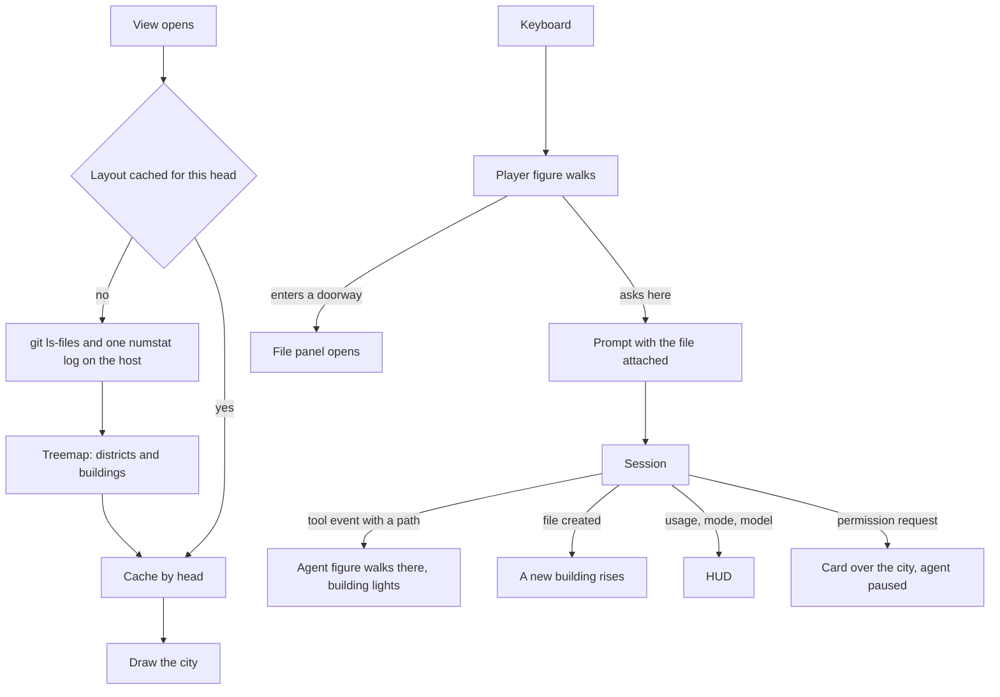

# Codebase city

The [agent console](/docs/proposals/infra/agent-console) accepts being more to maintain than the terminal in exchange for this: the repository as a place. Top-level folders are districts, files are buildings — height their line count, glow their recent churn — and **the person walks their own character through it**. The agent is a second figure in the same city, walking to whatever file its session is touching, so where the work is happening is somewhere you can see and go. It is a game in the sense that it is played, not scored: every interaction is a real action on the session, and the numbers the terminal's status line shows are on a HUD that never leaves the screen.

It is a view, so every theme can show it; the Genshin theme gives the two figures their characters.

## Scope

**This adds:**

1. **The layout.** On opening, the host reads `git ls-files` and one `git log --numstat` over a recent window and lays the tree out as a squarified treemap — districts, then buildings inside them — cached by the head commit so the next open is free.
2. **The player.** A voxel figure moved with the keyboard, the camera following it. Walking into a building's doorway opens that file in a panel beside the city; a district's gate names the folder.
3. **The agent.** A second figure driven by the session: every tool event naming a path walks it to that building, which lights while it reads and flashes when it edits. The buildings it touched stay lit for the session — the city ends as a map of the work.
4. **Interaction.** Standing at a building, the person can ask the agent about it: the prompt editor opens with the file attached, so "talk to the agent here" is a prompt scoped to the place. Selecting several buildings attaches them all. Building is literal: a prompt that creates a file raises a new building as the edit lands.
5. **The HUD.** Model, permission mode, context used as a gauge, cost so far, and the agent's current activity — the [terminal parity](/docs/proposals/infra/agent-console/terminal-parity) header, drawn over the scene. A permission request pauses the agent's figure at the building and raises the permission card over the city.

## How it works



```text
packages/agent-console-server/src/services/
  readCityLayout.ts              ← the git reads, the treemap, the cache keyed by head
apps/web/app/components/AgentConsole/View/City/
  AgentConsoleCity.vue           ← districts and buildings
  AgentConsoleCityPlayer.vue     ← the person's figure and its controls
  AgentConsoleCityAgent.vue      ← the agent's figure, driven by session events
  AgentConsoleCityHud.vue        ← the parity header over the scene
```

**Rendering:** TresJS, with cientos `Instances` for the buildings — one draw per district however many files — `KeyboardControls` for the player, `Billboard` for district names and `Html` for the file panel and HUD; nothing needs raw Three.js.

## Notes

- Every interaction in the city is one the work surface already offers — open a file, attach it to a prompt, answer a permission — reached by walking instead of clicking. Nothing is only possible in the city, so the city can be closed at any moment without losing a capability.
- The git reads run on the host, never in the page: the page never touches the repository, which is what lets the same view work against a remote host.
