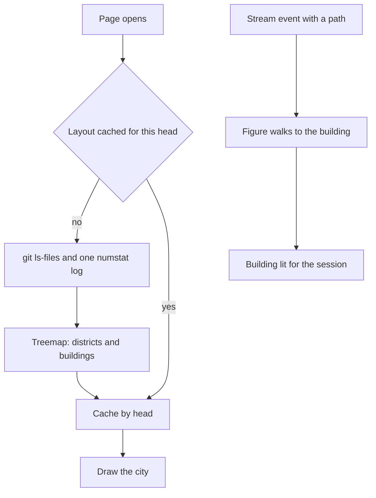

# Codebase city

A session reads and edits files across a tree nobody sees whole. The city draws that tree on the [agent console](/docs/proposals/infra/agent-console): top-level folders as districts, files as buildings whose height is their line count and whose glow is how often git has seen them change lately, and the character's figure walking to the building the session is in right now. It works in any repository the plugin runs in, because everything it reads is git.

## Scope

**Today:** the session's position in the tree is a path in the terminal.

**This adds:**

1. **The layout.** Once per page open, the channel server reads `git ls-files` and one `git log --numstat` over a recent window, and lays the tree out as a squarified treemap: each folder a rectangle, each file a building inside it. The layout is computed once and cached by the head commit, so a second open is free.
2. **The walk.** A stream event naming a path moves the figure to that building; an edit makes the building flash, a read only lights it.
3. **The trail.** The buildings the session has touched stay lit for the session, so the city ends as a map of where the work went.

## How it works



```text
packages/genshin-persona/src/services/agentConsole/
  readCityLayout.ts          ← the two git reads, the treemap, the cache keyed by head
apps/web/app/components/AgentConsole/City/
  AgentConsoleCity.vue               ← districts, buildings, the walk and the trail
```

**Rendering:** TresJS, with cientos `Instances` for the buildings — one draw per district however many files — and `Billboard` for district names; nothing needs raw Three.js.

## Key files

| File                                         | Role                                      |
| :------------------------------------------- | :---------------------------------------- |
| `packages/genshin-persona/scripts/status.ts` | The element colour the lit buildings take |

## Notes

- A repository of tens of thousands of files is still one draw call per district when the buildings are instanced boxes, which is why the city is voxels and not meshes.
- The git reads run in the channel server, never in a hook: a hook sits in the session's path, and the city is nothing the session waits for.
