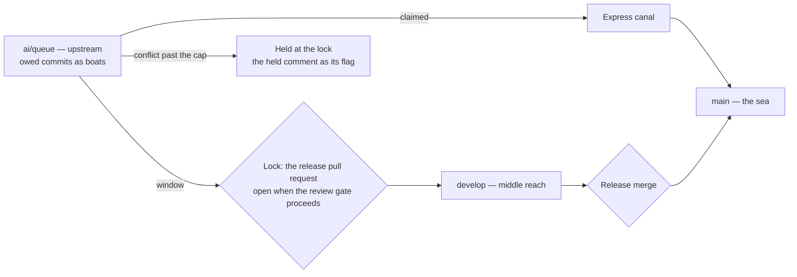

# Collector harbour

The [review collector](/docs/infra/review-collector) is the one part of this repository whose state is spread over three branches, a pull request, commit comments and a workflow's runs, and a stuck collector is found today by reading a red run's log. The harbour draws that state on the [agent console](/docs/proposals/infra/agent-console) as water: `ai/queue` upstream, `develop` in the middle reach, `main` the sea, each commit `ai/queue` owes a boat, the express lane a canal that bypasses the locks, and the release pull request the lock between `develop` and `main`. A held commit is a boat stopped at a lock with the collector's comment as its flag, which is the whole of what a person needs to see.

Unlike the other views this one is Esposter's own: it reads the collector's branches and markers, so it runs only in a checkout whose remote has them.

## Scope

**Today:** the collector's state is the Actions tab, the release pull request and the comments on commits.

**This adds:**

1. **A read.** A repository may declare commands the host runs for a view and returns as JSON; this one declares `pnpm ai:coderabbit:state`, a new script over the reads the collector's own dry run already makes — the branch heads, the owed commits by patch id, the claimed ones, the release pull request's gate, the held marker — through the `gh` login the person already has, run on the view opening and on each push the session makes. No new token and no API beyond the free one.
2. **The picture.** Boats in queue order upstream; claimed boats in the canal; the window as the boats inside the lock; the lock gate open or shut by the review gate's decision; a red `main` as a storm over the sea.
3. **A click.** A boat opens its commit on GitHub; the held boat opens the comment that holds it.

## How it works



```text
scripts/src/coderabbit/state/
  index.ts                   ← `ai:coderabbit:state`: the collector's own reads as JSON
apps/web/app/components/AgentConsole/View/Harbour/
  AgentConsoleHarbour.vue    ← the river, the boats, the lock, the storm
```

**Rendering:** TresJS, with cientos `Ocean` for the water, `Instances` for the boats and `Precipitation` for a red `main`'s storm; nothing needs raw Three.js.

## Key files

| File                                                         | Role                                               |
| :----------------------------------------------------------- | :------------------------------------------------- |
| `scripts/src/services/coderabbit/collect/readCherryShas.ts`  | What the queue owes, the question the boats answer |
| `scripts/src/services/coderabbit/collect/readClaimedShas.ts` | Which boats take the canal                         |
| `scripts/src/services/coderabbit/collect/getGateDecision.ts` | Whether the lock is open                           |

## Notes

- The reads belong to the collector, so the harbour imports them rather than copying them: a view that reimplemented "what is owed" would draw a harbour the collector disagrees with.
- The host is published and the collector is not, so the view is offered only when the session's repository declares its command; everywhere else the page never shows it.
