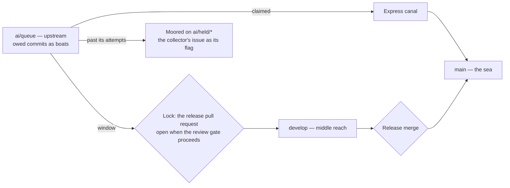

# Collector harbour

The [review collector](/docs/infra/review-collector) is the one part of this repository whose state is spread over three branches, a pull request, commit comments and a workflow's runs, and a stuck collector is found today by reading a red run's log. The harbour draws that state on the [agent console](/docs/proposals/infra/agent-console) as water: `ai/queue` upstream, `develop` in the middle reach, `main` the sea, each commit `ai/queue` owes a boat, the express lane a canal that bypasses the locks, and the release pull request the lock between `develop` and `main`. A held commit is a boat moored off the river on its own `ai/held/*` branch, with the collector's issue as its flag, which is the whole of what a person needs to see.

Unlike the other views this one is Esposter's own: it reads the collector's branches and markers, so it runs only in a checkout whose remote has them.

## Scope

**Built:** the read. `pnpm ai:coderabbit:state` prints the collector's state as JSON, through the same reads a pass makes: the branch heads, the commits `ai/queue` owes `develop`, the claimed ones, the held ones (`heldShas`, the tips of the `ai/held/*` branches) and the open release pull request's gate. See the [review collector](/docs/infra/review-collector) index for where it sits among the collector's parts.

**Left:**

1. **The host's declared command.** A repository declares the command the host runs for a view and reads back as JSON, run on the view opening and on each push the session makes. Waits on the console's view registry ([extensions](/docs/proposals/infra/agent-console/extensions), the Views tier), which is not built.
2. **The picture.** Boats in queue order upstream; claimed boats in the canal; the window as the boats inside the lock; the lock gate open or shut by the review gate's decision; a red `main` as a storm over the sea. The window's own boats need the stacked windows read too, which the read does not yet do: it reads only the release pull request.
3. **A click.** A boat opens its commit on GitHub; a held boat opens the issue that parked it.

## How it works


```mermaid
flowchart LR
  Q[ai/queue — upstream<br/>owed commits as boats] -->|claimed| X[Express canal] --> M[main — the sea]
  Q -->|window| L{Lock: the release pull request<br/>open when the review gate proceeds}
  L --> D[develop — middle reach] --> R{Release merge} --> M
  Q -->|past its attempts| H[Moored on ai/held/*<br/>the collector's issue as its flag]
```

```text
scripts/src/coderabbit/state/
  index.ts                              ← `ai:coderabbit:state`: the collector's state as JSON
scripts/src/services/coderabbit/state/
  readHarbourState.ts                   ← gathers the collector's own reads into one state
scripts/src/models/coderabbit/state/
  HarbourState.ts                       ← the state the view reads
apps/web/app/components/AgentConsole/View/Harbour/   ← not built
  AgentConsoleHarbour.vue               ← the river, the boats, the lock, the storm
```

**Rendering:** TresJS, with cientos `Ocean` for the water, `Instances` for the boats and `Precipitation` for a red `main`'s storm; nothing needs raw Three.js.

## Key files

| File                                                         | Role                                                   |
| :----------------------------------------------------------- | :----------------------------------------------------- |
| `scripts/src/services/coderabbit/state/readHarbourState.ts`  | Gathers the collector's reads into the harbour's state |
| `scripts/src/services/coderabbit/collect/readCherryShas.ts`  | What the queue owes, the question the boats answer     |
| `scripts/src/services/coderabbit/collect/readClaimedShas.ts` | Which boats take the canal                             |
| `scripts/src/services/coderabbit/collect/getGateDecision.ts` | Whether the lock is open                               |

## Notes

- The reads belong to the collector, so the harbour imports them rather than copying them: a view that reimplemented "what is owed" would draw a harbour the collector disagrees with.
- The host is published and the collector is not, so the view is offered only when the session's repository declares its command; everywhere else the page never shows it.
- A declared command is the repository's code run on the host, not a read the host vouches for, so it runs only in a repository the person has trusted — the same trust Claude Code asks before a project's hooks and plugins run — and never on a clone the person has not. It runs with the person's `gh` login because the read it makes is exactly what that login is for; a repository trusted to run its hooks is already trusted with it.
