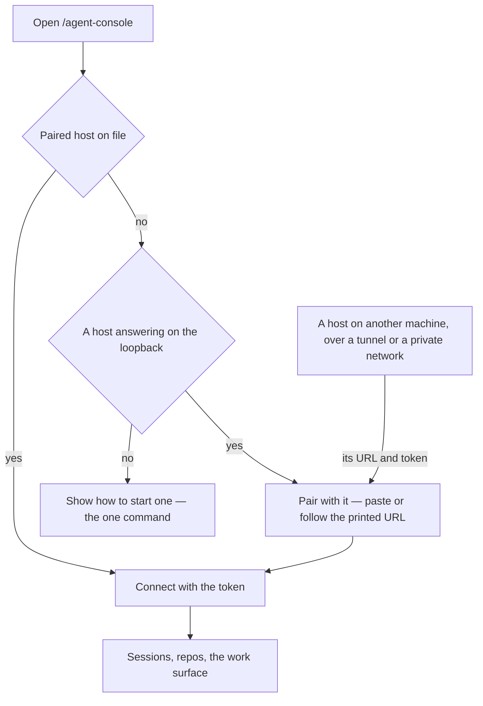

# Connection

The [agent console](/docs/proposals/infra/agent-console) page is served by the app, but an agent must run where the code is. So there are two halves: **the page**, one route in `apps/web` that every visitor reaches, and **the host**, a package the user runs on the machine with their repositories and their agent login. The page knows nothing about where it was served from; it only knows which host it is paired with.

## The host

`agent-console-server`, a published package run with one command. It serves one WebSocket and nothing else: the wire every message crosses is typed by Zod schemas in the package's `contracts` subpath, which the page imports, so a change to the wire fails typecheck on both sides — the pattern T3 Code keeps in its own contracts package. On start it prints a URL carrying a random token; the token gates every connection, and the host listens on the loopback unless told otherwise.

The host holds everything sensitive: the agent's login (the user's own Claude Code sign-in, or an API key in its environment if they prefer), the repositories, the sessions. The page holds only the host's address and token, kept in the browser's storage as a per-browser convenience.

## Local and remote

- **Local.** The page, on the deployed site or on `pnpm dev`, connects to a host on the same machine. This is the whole case for a person at their own computer.
- **Remote.** A host on another machine — a workstation reached from a laptop, a server — is the same host started to listen beyond the loopback, reached over whatever the person already uses to reach that machine. The page does not care; it has a URL and a token. There is no relay run by Esposter. The token and every message cross that path, so a remote host is reached over `wss://` or an encrypted tunnel — an SSH forward to the page's own loopback is the simplest — and never plain `ws://`, which a page on `https` refuses beyond the loopback anyway.

## Notes

- A page on `https` reaching the loopback is a local network request, which current Chrome gates on its Local Network Access permission — a prompt the person answers once per site — rather than on the private-network preflight it replaced, so the host has no preflight to answer. The permission is the person's one click. If a browser refuses outright, the local dev server is loopback to loopback and needs neither.
- The "agent key" a remote setup needs is the host's, set where the host runs. It is never typed into the page, because a key in the page is a key in the browser of whoever has the tab.
