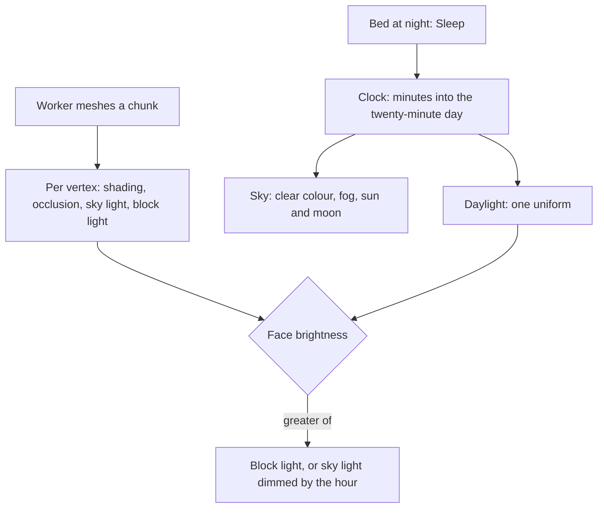

# Day and night

The [voxel world](/docs/infra/claude-interface/agent-console/voxel-world) stands at one hour for ever: one clear colour, the fog in it, and every face shaded as it faces. Nothing in it says time passes, and the torches on the room's walls light nothing. Minecraft's day is most of what makes its world read as a place rather than a model, so this proposal gives the console's world one.

## Decisions

- **Minecraft's day, from morning on every load.** A day lasts twenty minutes, as Minecraft's does, and a load starts at morning, as a new Minecraft world does, so nothing about the time is saved. It follows no clock of the person's: a person working late would otherwise only ever see the room at night.
- **The sky turns with it.** The clear colour and the fog in it move from day to dusk to night and back, and a sun and a moon, flat squares as Minecraft draws them, cross the sky opposite each other. The fog and the far plane are the ones the view distance already sets, so the sky adds no draw distance.
- **Light is two channels baked per vertex, as Minecraft's is.** Beside the shading and ambient occlusion `greedyMesh` already bakes, each vertex carries a sky light — how open to the sky the voxel in front of its face is — and a block light, spread from the room's torches a level a voxel. The day is one uniform in the chunks' shader: a face is lit by the greater of its block light and its sky light dimmed by the hour. So night darkens the open ground and the room's windows, the torches keep the room warm, and a change of hour rebuilds no mesh.
- **Light stays inside a chunk's own work.** Sky light is read down each column the chunk already walks, and the one block light is the room's torches, which the room's boxes place, so a chunk's light needs nothing but its voxels, its border and the room. Light spread from a torch the player places waits for [building](/docs/proposals/infra/agent-console/building), whose edit already re-meshes a chunk and its neighbour.
- **The bed sleeps through the night.** The bed in the room gets a prompt at night, Sleep, as Minecraft's bed is used only then, and it brings the morning in on a fade. By day it is scenery, as it is today. A world with no one else in it needs no vote on skipping the night.
- **Reduced motion keeps the day.** The hour moves too slowly to be motion, so it still turns; the fade into the morning is a cut.

## How it works

## Scope and order

1. **The day and the sky:** the clock, the clear colour, the fog, the sun and the moon, with every face at its sky light's full strength.
2. **Baked light:** the two channels in the worker and the uniform in the shader, so night falls on the open ground and the torches light the room.
3. **The bed,** once night is dark enough to want to skip.

## What this does not propose

- **Weather.** Rain and snow are the [open world's](/docs/proposals/infra/agent-console/open-world) to add with its biomes, where snow falls on peaks.
- **Real-time lights or a shadow map.** Baked light is what keeps the world at no lights and one draw call a chunk.
- **Hostile mobs at night.** The world is a place to work in, not a survival game.

## Key files

| File                                                          | Role after the change                                                       |
| :------------------------------------------------------------ | :-------------------------------------------------------------------------- |
| `apps/web/app/services/agentConsole/world/greedyMesh.ts`      | Bakes sky light and block light per vertex beside the shading and occlusion |
| `apps/web/app/components/AgentConsole/World/FollowCamera.vue` | Where the fog is set, which the hour now colours                            |
| `apps/web/app/components/AgentConsole/World/Chunks.vue`       | Holds the chunks' material, which gains the daylight uniform                |
| `apps/web/app/services/agentConsole/world/RoomVoxelBoxes.ts`  | Places the torches, the one source of block light                           |

## Sources

- [Daylight cycle](https://minecraft.wiki/w/Daylight_cycle), Minecraft Wiki: the twenty-minute day, and the sun and moon crossing opposite each other.
- [Light](https://minecraft.wiki/w/Light), Minecraft Wiki: sky light and block light kept apart, a level a block, a block lit by the greater.
- [Bed](https://minecraft.wiki/w/Bed), Minecraft Wiki: used only at night, skipping to morning.
