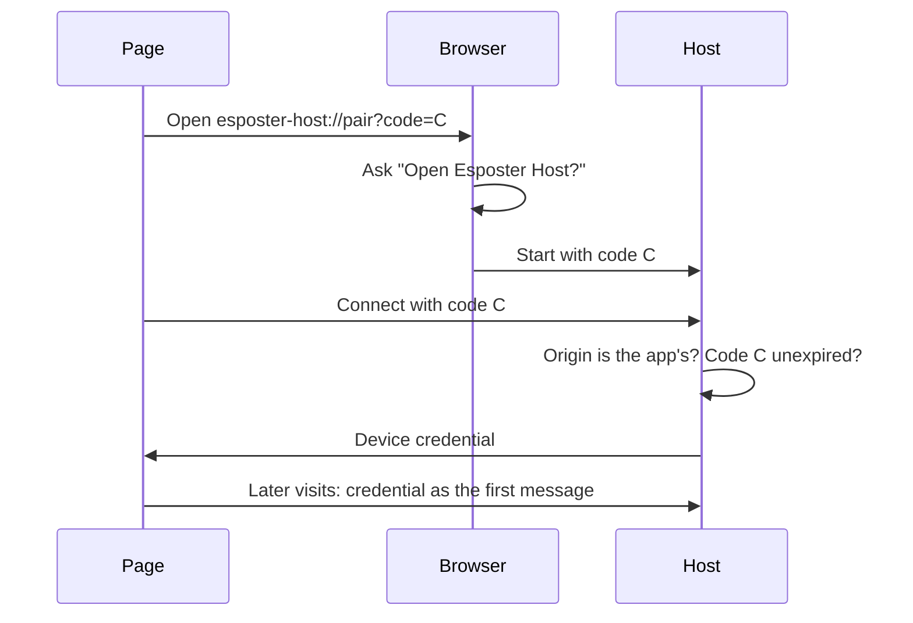

# Device Pairing

A sub-spec of the [agent console](/docs/proposals/infra/agent-console), after the [host installer](/docs/proposals/infra/agent-console/host-installer), which gives the page a host it can start. Pairing today hands the reader the host's plumbing. The page asks for a `ws://127.0.0.1:…/?token=…` URL, and the link the [host](/docs/infra/claude-interface/agent-console/host) prints carries the one long-lived token every page shares, in a URL the browser keeps in its history. T3 Code pairs each device through a one-time link and gives the device its own credential, revoked on its own ([T3 Code remote access](https://github.com/pingdotgg/t3code/blob/main/docs/user/remote-access.md)). Claude Code's Remote Control enrols each browser with a credential of its own that it lists and revokes one at a time ([Remote Control](https://code.claude.com/docs/en/remote-control)). The console takes that core, with the browser's own open-app prompt as the reader's consent.

## What it changes

- **Local or remote comes first.** The pairing screen asks where sessions run: **This computer**, or a remote option from [remote connections](/docs/proposals/infra/agent-console/remote-connections). This computer is the default.
- **One button connects this computer.** **Connect** makes a random one-time code and opens `esposter-host://pair?code=…`. The browser asks _Open Esposter Host?_, the reader allows it, and the host starts if it was not running and holds the code for a minute. The page then opens the host's loopback socket and presents the code. The click is the reader asking, so the [no-probe rule](/docs/infra/claude-interface/agent-console/host) holds.
- **The host trusts only the app's own origin.** The browser sets a WebSocket's `Origin` itself, and a page cannot forge it. The host accepts a pairing only from the deployed app's origin, or the dev server's under `--origin`. Another site can still make the browser raise the open-app prompt, but its socket is refused, so a code it planted pairs nothing.
- **Each device gets its own credential.** For a valid code from an allowed origin, the host mints a random credential and keeps only its hash in `~/.agent-console-server/devices.json`, beside the page's origin, a name from its user agent and the pairing date. The page keeps the credential in local storage in place of the host URL. It travels in the socket's first message rather than in the URL, so it never reaches a history, a log or a referrer.
- **Later visits connect on their own.** A page holding a credential connects on load. When the host is not answering, the page offers **Start the host**, which opens `esposter-host://` again with no code.
- **Devices are listed and revoked one at a time**, from the host's tray menu or `agent-console-server devices`. Revoking one closes its socket at once. The shared token file goes, with the query-string check behind it.
- **The printed link becomes one-time.** A host started from the command still prints a link. Its code is single-use and expires in minutes, where the link used to carry the long-lived token. It pairs a page that cannot open the scheme, such as a page reaching a host over an SSH forward.

## What is deliberately not in it

- **No provider keys for the local host.** This computer's Claude Code login stays with the host, where Claude Code keeps it. A key is asked for only by a remote option that needs one ([remote connections](/docs/proposals/infra/agent-console/remote-connections)).

## Key files

| File                                                                            | Role after the change                                                         |
| ------------------------------------------------------------------------------- | ----------------------------------------------------------------------------- |
| `packages/agent-console-server/src/cli.ts`                                      | the scheme's pairing code, the one-time printed link and the device commands  |
| `packages/agent-console-server/src/services/server/createAgentConsoleServer.ts` | the origin check, the code exchange and the first-message credential gate     |
| `packages/agent-console-server/src/services/server/readToken.ts`                | replaced by the device list and its hashed credentials                        |
| `packages/agent-console-server/src/services/server/checkIsTokenValid.ts`        | compares a credential's hash in constant time, not the shared token           |
| `packages/agent-console-server/src/services/server/constants.ts`                | the credential's first-message type in place of the token query parameter     |
| `apps/web/app/store/agentConsole/connection.ts`                                 | opens the scheme, exchanges the code, keeps the credential and sends it first |
| `apps/web/app/components/AgentConsole/Panel/Pairing.vue`                        | the local or remote choice, Connect and Start the host                        |
| `apps/web/app/services/shared/LocalStorageKey.ts`                               | the device credential in place of the host URL                                |

## Sources

- [T3 Code — remote access](https://github.com/pingdotgg/t3code/blob/main/docs/user/remote-access.md) — a fresh one-time pairing link per device, device sessions revoked one at a time, and provider credentials that stay on the machine running the agent.
- [Claude Code — Remote Control](https://code.claude.com/docs/en/remote-control) — a credential enrolled per browser and device, listed as trusted devices and revoked one at a time.
