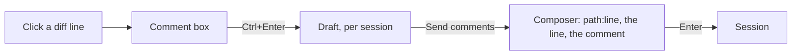

# Diff Comments

A sub-spec of the [agent console](/docs/proposals/infra/agent-console). The changes tab merges every edit to a file into one diff ([terminal parity](/docs/infra/claude-interface/agent-console/terminal-parity)), which is where a person reviews the turn — and then has to retype, in the composer, which line of which file they mean. The Code tab's diff view closes that loop: "to comment on specific lines, click any line in the diff to open a comment box".

## What it changes

- **A click on a diff line opens a comment box under it**, on either side of the diff. `Ctrl+Enter` saves it, and a saved comment stays drawn under its line with an edit and a remove.
- **The comments are a draft, not a message.** They collect across files until the person sends them: a **Send comments** button on the changes tab, with their count, puts them into the composer as one prompt, each as `path:line` followed by the quoted line and the comment, so the person can add to it before Enter sends it as any prompt is sent.
- **A draft is per session**, kept in the session store's per-session view beside the session's other page state and cleared once sent, so switching sessions never mixes one review into another.

No command is added: sending is an ordinary prompt through the composer.

## What is deliberately not in it

- **No review by the agent into the diff.** The Code tab's **Review code** has the model leave comments in the diff; here the same review is a slash command the palette already offers, answered in the conversation.

## Key files

| File                                                      | Role after the change                                |
| --------------------------------------------------------- | ---------------------------------------------------- |
| `apps/web/app/components/AgentConsole/Panel/Diff.vue`     | the comment box under a line, and the saved comments |
| `apps/web/app/components/AgentConsole/Panel/Changes.vue`  | Send comments, with their count                      |
| `apps/web/app/components/AgentConsole/Panel/Composer.vue` | takes the comments as the prompt to send             |
| `apps/web/app/store/agentConsole/session.ts`              | holds each session's draft in its per-session view   |

## Sources

- [Claude Code desktop — diff view](https://code.claude.com/docs/en/desktop) — "To comment on specific lines, click any line in the diff to open a comment box", submitted with `Ctrl+Enter`.
