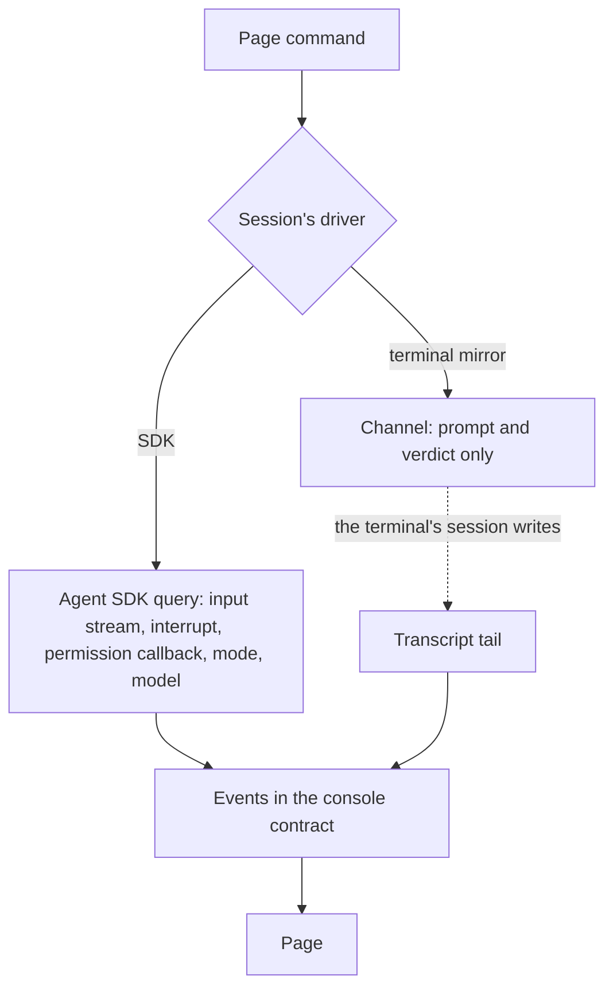

# Drivers

Everything provider-specific in the [agent console](/docs/proposals/infra/agent-console) lives behind one interface in the host, so the page never learns which agent it is talking to. A driver does three things: **lists and opens sessions**, **emits events** — messages, tool calls, usage, permission requests — in the console's own contract, and **takes commands** — a prompt, an interrupt, a permission verdict, a mode or model change. A new agent is a new driver and a new entry in the contract's provider list; the page does not change. T3 Code's adapter layer, one adapter per provider over one orchestration core, is the same shape.

## The Claude Agent SDK driver

The first driver runs Claude Code sessions through `@anthropic-ai/claude-agent-sdk`. Its query takes a streaming input, so one session stays open across turns, and it exposes what [terminal parity](/docs/proposals/infra/agent-console/terminal-parity) needs: interrupt, a permission callback, a permission mode and a model that change mid-session, the session's slash commands, and resume, continue, fork and resume-at-a-message. It loads the user's and the project's settings, so CLAUDE.md, skills, hooks, plugins and output styles apply exactly as in the terminal, and it writes sessions where the terminal writes them — a session started in the console resumes in the terminal and back.

**Why this is not the rejected companion.** The [SDK-driven companion](/docs/infra/rejected/sdk-driven-companion) was rejected for two reasons: its turns come out of the limits the work needs, and a session of its own holds none of the work. Neither applies here. The console's session **is** the work — the one session, not a second beside the terminal's — so its turns are the turns the terminal would have taken, on the same subscription, and it holds every file, diff and message the work has. The rejection stands for a companion; it does not reach a driver.

## The terminal-mirror driver

The second driver attaches to a session a terminal already runs, for the case the SDK driver cannot cover: a session started in a terminal before the host was running, or a moment when SDK use stops being covered by the subscription. It tails the session's transcript for events and pushes prompts and verdicts in through a [channel](/docs/proposals/infra/channel-chat). It is a subset — a channel cannot interrupt, switch modes or run the harness's own commands — and the console shows which controls it greys out.



```text
packages/agent-console-server/src/
  models/Driver.ts                 ← the interface: sessions, events, commands
  services/drivers/
    claudeAgentSdk/                ← the SDK driver
    terminalMirror/                ← transcript tail and channel
```

## Notes

- The SDK's message types are the tool's, and they move with its releases; the driver maps them to the console's contract in one place so the page is insulated, and an unknown message type is passed through as a raw event rather than dropped.
- Whether SDK use stays inside the subscription is the fact this driver's cost rests on. It is re-read at every Claude Code billing change; if it moves, the mirror driver keeps the console free at the price of the controls a channel cannot reach.
