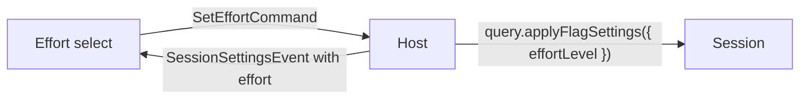

# Effort Level

A sub-spec of the [agent console](/docs/proposals/infra/agent-console). The composer shows and switches the model and the permission mode ([terminal parity](/docs/infra/claude-interface/agent-console/terminal-parity)), but not how hard the model thinks. The terminal sets that with `/effort`, which works headless too, so the console's slash palette can already run it as a typed command. What neither the palette nor anything else on the page does is show the level the session is at, or which levels its model takes. The Code tab answers both with an effort menu on `Ctrl+Shift+E`, the way the console's model select already answers them for the model.

## What it changes

- **An effort select beside the model select**, opened by `Ctrl+Shift+E` as well, listing the levels the session's model supports: `low`, `medium`, `high`, `xhigh` and `max` where it has them. A model with no effort support shows no select.
- **The levels come from the model, not a list of ours.** The SDK's model info carries `supportsEffort` and `supportedEffortLevels`, so `Model` in the capabilities event gains both, and the select reads them for the session's current model. A model switch that drops the current level shows the level the SDK reports next.
- **Choosing a level asks the host**, as the model select does. A new `SetEffortCommand` runs the session query's `applyFlagSettings({ effortLevel })`, which sets it for this session only, never in a settings file. The SDK's typings document the method; the reference page does not list it yet, so the change's test drives it against the recorded session first. The host then reports it back through `SessionSettingsEvent`, which gains `effort`. The select shows what the host last reported, never what was clicked, so a refused change never shows as made.

## What is deliberately not in it

- **No default effort setting.** A new session takes the effort Claude Code's own settings give it; the console never writes those files.
- **No thinking-token budget.** The SDK's older `setMaxThinkingTokens` is a number for a person to guess; the named levels are what both reference surfaces offer.

## Key files

| File                                                                                              | Role after the change                                    |
| ------------------------------------------------------------------------------------------------- | -------------------------------------------------------- |
| `packages/agent-console-server/src/models/command/CommandType.ts`                                 | gains `SetEffort`                                        |
| `packages/agent-console-server/src/models/command/Command.ts`                                     | `SetEffortCommand` joins the union, in its own file      |
| `packages/agent-console-server/src/models/driver/Driver.ts`                                       | gains `setEffort`                                        |
| `packages/agent-console-server/src/services/server/handleCommand.ts`                              | routes the command to the driver                         |
| `packages/agent-console-server/src/services/drivers/claudeAgentSdk/createClaudeAgentSdkDriver.ts` | applies the level and reports it                         |
| `packages/agent-console-server/src/models/event/SessionSettingsEvent.ts`                          | gains `effort`                                           |
| `packages/agent-console-server/src/models/claudeAgentSdk/SessionSettingsUpdate.ts`                | an update may carry the effort                           |
| `packages/agent-console-server/src/models/event/Model.ts`                                         | gains `supportsEffort` and `supportedEffortLevels`       |
| `apps/web/app/components/AgentConsole/Panel/Composer.vue`                                         | the effort select beside the model select, and its chord |

## Sources

- [Claude Code desktop — keyboard shortcuts](https://code.claude.com/docs/en/desktop) — `Ctrl+Shift+E` opens the effort menu.
- [Claude Code — commands](https://code.claude.com/docs/en/commands) — `/effort [level|auto|status]`, which "works in `-p`", so the palette reaches it as a command.
- [Claude Agent SDK — TypeScript reference](https://code.claude.com/docs/en/agent-sdk/typescript) — the `effort` option and its levels. The model info's `supportsEffort` and `supportedEffortLevels`, and the query's `applyFlagSettings`, are read from the installed SDK's own typings, which the page does not cover.
