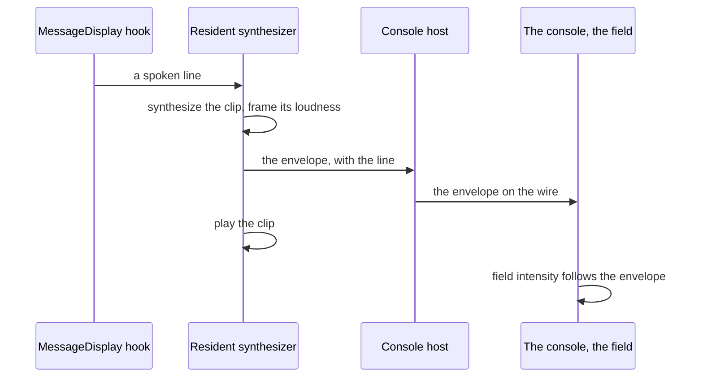

# Element ambience

The spoken replies are heard and not seen. The ambience gives them a picture on the [agent console](/docs/proposals/infra/agent-console): behind every other view, a slow field in the character's element — ripples for Hydro, drifting spores for Dendro, embers for Pyro, frost for Cryo — that swells with the loudness of the line being spoken and settles when it ends.

## Scope

**Today:** the resident synthesizer writes each line's clip and hands it to a player; nothing outside the audio knows how loud it is.

**This adds:**

1. **An envelope.** The synthesizer already holds each clip's samples; it computes their loudness in short frames — one number per frame — and posts the envelope to the console host with the line, before the clip plays.
2. **The field.** A particle preset per element on cientos's particle components — `Sparkles` for Dendro and Electro, `Precipitation` for Cryo and Hydro rain, `Smoke` for Anemo — its intensity following the envelope in time with playback. Hydro's calm state is the app's own fluid simulator, reused as it stands.
3. **Quiet by default.** With no line playing the field idles at its lowest rate, and it stops rendering entirely while the page is hidden.

## How it works



```text
packages/genshin-persona/src/services/
  getLoudnessEnvelope.ts        ← one loudness value per short frame of a clip
apps/web/app/components/AgentConsole/Theme/Genshin/
  AgentConsoleAmbience.vue              ← the seven element presets, driven by the envelope
```

**Rendering:** TresJS and cientos for every preset. **Raw Three.js:** Hydro's fluid is `useFluidSimulator`, which is written against `three/webgpu` and TSL because TresJS has no node-material or compute layer; it is reused, not rewritten, and it is the console's only direct Three.js.

## Key files

| File                                                   | Role                                                  |
| :----------------------------------------------------- | :---------------------------------------------------- |
| `apps/web/app/composables/visual/useFluidSimulator.ts` | Hydro's fluid, reused as it stands                    |
| `packages/genshin-persona/scripts/speak.ts`            | Where the synthesized clip is in hand before it plays |

## Notes

- The envelope is computed from the samples the synthesizer already has, never by listening to the device's output, so the field follows the line even when the volume is muted.
- Playback and the page share no clock; the envelope carries the clip's duration and the page starts it on arrival, so a slow page runs slightly behind the voice rather than ahead of it.
