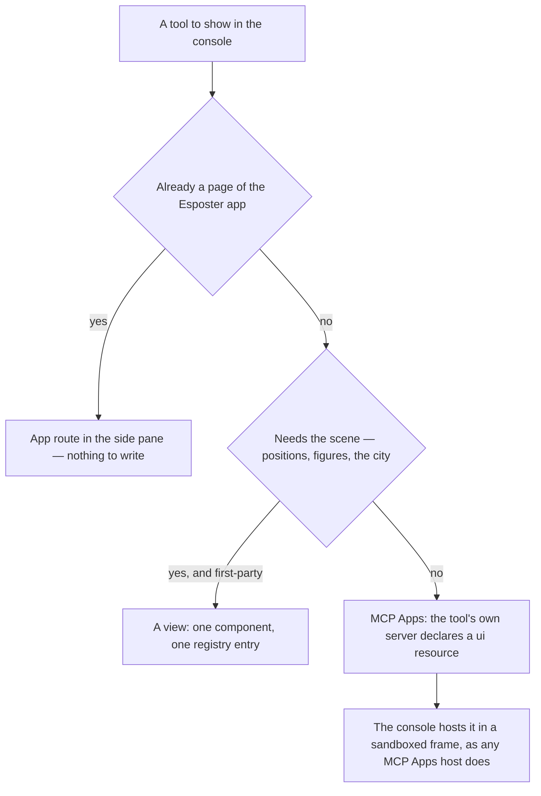
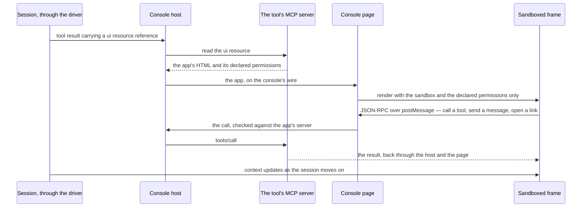

# Extensions

The [agent console](/docs/proposals/infra/agent-console) is worth more when the tooling around the work opens inside it — the resource explorer beside the session that is editing a resource, a dashboard beside the query that feeds it. The rule for how is **the least code on either side**: a tool should not have to know the console exists, and the console should not have to know any tool. Three tiers meet that, cheapest first, and a tool uses the first that fits.

## The three tiers

| Tier       | What joins                             | Code on the tool's side              | Code in the console |
| :--------- | :------------------------------------- | :----------------------------------- | :------------------ |
| App routes | any page of the Esposter app           | none                                 | none per page       |
| MCP Apps   | any tool, anywhere, with a UI          | the tool's own MCP server and its UI | none per tool       |
| Views      | first-party panels that need the scene | a Vue component in the app           | one registry entry  |

**App routes.** The console is itself a page of the app, so every other page is already reachable: the side pane opens any app route in a same-origin frame with an embed flag that drops the app's own chrome, and the session's sign-in comes with it. A link in the conversation to an app page — a resource the agent just created, a room, a sheet — opens in the pane instead of a new tab. The [resource explorer](/docs/resource/explorer) joins this way with no change: `/resource-explorer/[id]` in the pane is the whole integration.

**MCP Apps.** For tooling outside the app, the console hosts the [MCP Apps](https://modelcontextprotocol.io/seps/1865-mcp-apps-interactive-user-interfaces-for-mcp) standard: a tool of an MCP server declares a `ui://` resource, and when the session calls that tool the console renders the resource in a sandboxed frame that speaks JSON-RPC over `postMessage` — calling the server's tools, receiving the session's context — exactly as Claude Desktop does. A tool built this way works in the console and in every other MCP Apps host with no console-specific line, and the servers it rides on are the ones the session already loads from its plugins and project configuration. That is the external plugin interface: not one of ours, the one the ecosystem already agreed on.

**Views.** A first-party panel that has to live in the scene — the [codebase city](/docs/proposals/infra/agent-console/codebase-city), the [collector harbour](/docs/proposals/infra/agent-console/collector-harbour) — is a Vue component registered in the console's view map. This tier is for the app's own tools only; anything a third party writes goes through MCP Apps.

## How a tool picks its tier



## Tier one — app routes in the side pane

**The pane.** A resizable pane beside the work surface, holding one frame per open route in tabs. The frame is same-origin, so the auth cookie, the Pinia state a page builds for itself and every tRPC call behave exactly as they do in a tab of their own; nothing is proxied and nothing is passed in.

**The embed flag.** A route opened in the pane carries `?embed` in its query. The app's layouts read it once, in one place, and render the page without the app bar, the navigation drawer and the footer — the page itself is untouched, which is what makes this tier free for every page that exists and every page added later. A route that cannot be embedded — one that sets frame headers of its own, or depends on the top-level window — opens in a new tab instead, and says so in the pane's tab.

**Links.** A link in the conversation or a tool result is opened in the pane when it points at the app's own origin, and in a new tab otherwise. The agent needs no instruction for this: the resource explorer's routes, a room, a sheet already appear as links whenever the session creates or mentions one.

**The resource explorer.** `/resource-explorer/[id]` in the pane is the whole integration.

## Tier two — the MCP Apps host

The console implements the host side of the MCP Apps specification and nothing of its own. The lifecycle of one app:



- **Where the app appears.** Inline under the tool call that produced it, and poppable into the side pane, which is where an app the person keeps open lives.
- **What the app may do.** Only what the specification defines: call tools on its own server, send a message into the session, request a link be opened, and receive context. A tool call an app makes goes through the same permission card as the agent's own ([terminal parity](/docs/proposals/infra/agent-console/terminal-parity)) — an app never gets more authority than the session.
- **Isolation.** Every app renders inside a sandbox proxy frame served from an origin other than the console's, with `allow-scripts` and `allow-same-origin` as the specification requires — the separate origin, not a denied same-origin, is what isolates it — and the proxy loads the app into an inner frame under a content security policy built from the origins the app's resource declares; the frame never sees the console's cookies, storage or wire, and the console accepts only messages from the frame it created.
- **Failure.** A resource that cannot be read, or an app that throws, renders as a card naming the server and the reason; the session is untouched, since an app is a view of a tool result and never the result itself.

## Tier three — first-party views

A view is an entry in `AgentConsoleViewMap`: a name, an icon, a lazily loaded component, and optionally the command a repository declares for its data ([collector harbour](/docs/proposals/infra/agent-console/collector-harbour)). The map is the only place a view is known, so adding one is one component and one line, and a theme shows whichever views the person has open.

## Scope and order

1. **The side pane and the embed flag.** Smallest and most used: the resource explorer and every other page, at once.
2. **The MCP Apps host.** After the SDK driver is proven, since it rides on the driver's tool results.
3. **The view registry**, with the first view that needs it.

```text
apps/web/app/components/AgentConsole/Pane/
  AgentConsoleSidePane.vue       ← the tabs of app routes, each a same-origin frame with the embed flag
  AgentConsoleMcpApp.vue         ← a ui resource in a sandboxed frame, the postMessage bridge
apps/web/app/composables/
  useIsEmbedded.ts               ← the one read of the embed flag the layouts share
apps/web/app/services/agentConsole/
  AgentConsoleViewMap.ts         ← the first-party views
packages/agent-console-server/src/services/
  readMcpAppResource.ts          ← the ui resource, read from the server that declared it
```

## Key files

| File                                             | Role                                                     |
| :----------------------------------------------- | :------------------------------------------------------- |
| `apps/web/app/layouts/default.vue`               | The chrome the embed flag drops                          |
| `apps/web/app/layouts/resource.vue`              | The resource layout, which drops its chrome the same way |
| `apps/web/app/pages/resource-explorer/index.vue` | The explorer, joining through the pane unchanged         |

## Notes

- Whether the SDK passes a tool result's `_meta` through, and whether the host can read a `ui://` resource from a server the session itself started, are the two probes the MCP Apps tier rests on; if the host cannot, it connects to the same server from the session's own configuration.
- The same-origin frame is the cheapest tier only because the console lives in the app; a tool that must work outside Esposter is an MCP App even when a route would do, so it is written once for every host.
