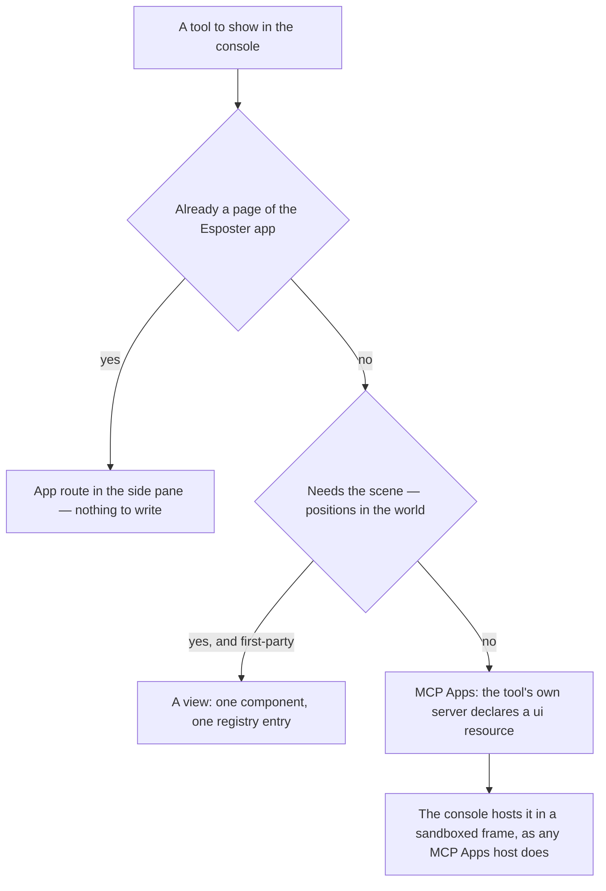
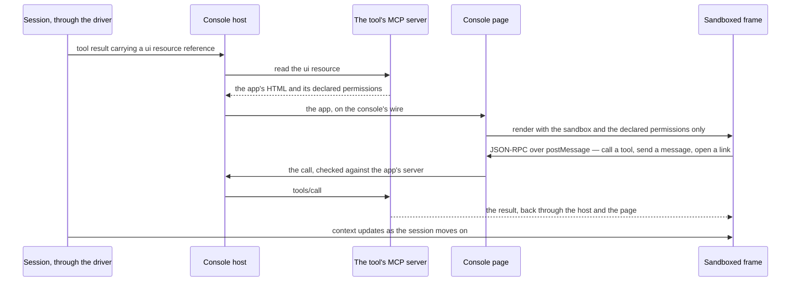

# Extensions

Opening tooling inside the [agent console](/docs/infra/claude-interface/agent-console) adds more again. The rule for how is **the least code on either side**: a tool should not have to know the console exists, and the console should not have to know any tool. Three tiers meet that, cheapest first, and a tool uses the first that fits.

The first tier has shipped: any page of the app opens in the console's [side pane](/docs/infra/claude-interface/agent-console/side-pane), and the [resource explorer](/docs/resource/explorer) joins with no change. What is left is the tier for tooling outside the app and the tier for first-party panels that need the scene.

## The three tiers

| Tier       | What joins                             | Code on the tool's side              | Code in the console | State                                                                              |
| :--------- | :------------------------------------- | :----------------------------------- | :------------------ | :--------------------------------------------------------------------------------- |
| App routes | any page of the Esposter app           | none                                 | none per page       | shipped, see the [side pane](/docs/infra/claude-interface/agent-console/side-pane) |
| MCP Apps   | any tool, anywhere, with a UI          | the tool's own MCP server and its UI | none per tool       | proposed below                                                                     |
| Views      | first-party panels that need the scene | a Vue component in the app           | one registry entry  | proposed below                                                                     |

## How a tool picks its tier


```mermaid
flowchart TD
  T[A tool to show in the console] --> A{Already a page of the Esposter app}
  A -->|yes| R[App route in the side pane — nothing to write]
  A -->|no| S{Needs the scene — positions in the world}
  S -->|yes, and first-party| V[A view: one component, one registry entry]
  S -->|no| M[MCP Apps: the tool's own server declares a ui resource]
  M --> H[The console hosts it in a sandboxed frame, as any MCP Apps host does]
```

## MCP Apps

For tooling outside the app, the console hosts the [MCP Apps](https://modelcontextprotocol.io/seps/1865-mcp-apps-interactive-user-interfaces-for-mcp) standard: a tool of an MCP server declares a `ui://` resource, and when the session calls that tool the console renders the resource in a sandboxed frame that speaks JSON-RPC over `postMessage` — calling the server's tools, receiving the session's context — exactly as Claude Desktop does. A tool built this way works in the console and in every other MCP Apps host with no console-specific line, and the servers it rides on are the ones the session already loads from its plugins and project configuration. That is the external plugin interface: not one of ours, the one the ecosystem already agreed on.

The console implements the host side of the specification and nothing of its own. The lifecycle of one app:


```mermaid
sequenceDiagram
    participant Session as Session, through the driver
    participant Host as Console host
    participant Server as The tool's MCP server
    participant Page as Console page
    participant Frame as Sandboxed frame

    Session->>Host: tool result carrying a ui resource reference
    Host->>Server: read the ui resource
    Server-->>Host: the app's HTML and its declared permissions
    Host->>Page: the app, on the console's wire
    Page->>Frame: render with the sandbox and the declared permissions only
    Frame->>Page: JSON-RPC over postMessage — call a tool, send a message, open a link
    Page->>Host: the call, checked against the app's server
    Host->>Server: tools/call
    Server-->>Frame: the result, back through the host and the page
    Session->>Frame: context updates as the session moves on
```

- **Where the app appears.** Inline under the tool call that produced it, and poppable into the side pane, which is where an app the person keeps open lives.
- **What the app may do.** Only what the specification defines: call tools on its own server, send a message into the session, request a link be opened, and receive context. A tool call an app makes goes through the same permission card as the agent's own ([terminal parity](/docs/infra/claude-interface/agent-console/terminal-parity)) — an app never gets more authority than the session.
- **Isolation.** Every app renders inside a sandbox proxy frame served from an origin other than the console's, with `allow-scripts` and `allow-same-origin` as the specification requires — the separate origin, not a denied same-origin, is what isolates it — and the proxy loads the app into an inner frame under a content security policy built from the origins the app's resource declares; the frame never sees the console's cookies, storage or wire, and the console accepts only messages from the frame it created.
- **Failure.** A resource that cannot be read, or an app that throws, renders as a card naming the server and the reason; the session is untouched, since an app is a view of a tool result and never the result itself.

## Views

A view is an entry in `AgentConsoleViewMap`: a name, an icon, a lazily loaded component, and optionally the command a repository declares for its data ([collector harbour](/docs/proposals/infra/agent-console/collector-harbour)). The map is the only place a view is known, so adding one is one component and one line, and a theme shows whichever views the person has open. This tier is for the app's own panels that have to live in the scene; anything a third party writes goes through MCP Apps.

## Scope and order

1. **The side pane and the embed flag.** Shipped.
2. **The MCP Apps host.** After the SDK driver is proven, since it rides on the driver's tool results.
3. **The view registry**, with the first view that needs it — the collector harbour, which builds it.

```text
apps/web/app/components/AgentConsole/Pane/
  McpApp.vue                     ← a ui resource in a sandboxed frame, the postMessage bridge
apps/web/app/services/agentConsole/
  AgentConsoleViewMap.ts         ← the first-party views
packages/agent-console-server/src/services/
  readMcpAppResource.ts          ← the ui resource, read from the server that declared it
```

## Notes

- Whether the SDK passes a tool result's `_meta` through, and whether the host can read a `ui://` resource from a server the session itself started, are the two probes the MCP Apps tier rests on; if the host cannot, it connects to the same server from the session's own configuration.
- The same-origin frame is the cheapest tier only because the console lives in the app; a tool that must work outside Esposter is an MCP App even when a route would do, so it is written once for every host.
- The sandbox proxy needs an origin of its own. Serving it from the host's loopback on a second port keeps it off the app's origin, and is the open part of the tier's design.

## Sources

- [MCP Apps (SEP-1865)](https://modelcontextprotocol.io/seps/1865-mcp-apps-interactive-user-interfaces-for-mcp) — interactive interfaces an MCP server declares, the tier external tools arrive through.
