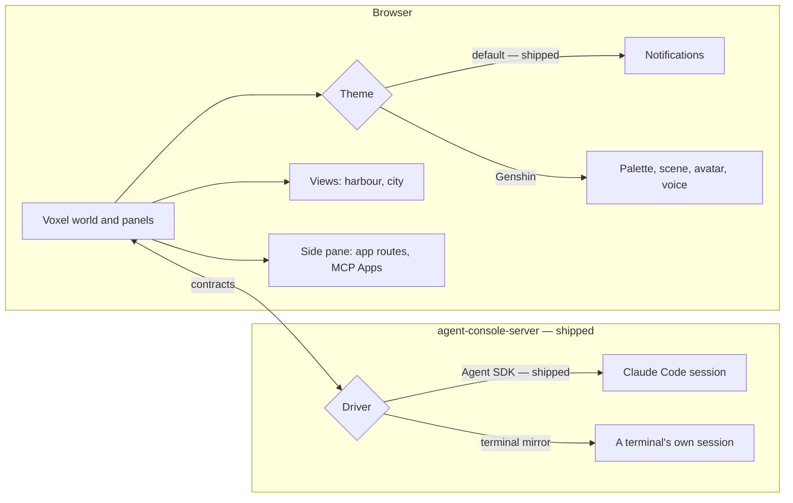

# Agent console

The [agent console](/docs/infra/claude-interface/agent-console) has shipped its first two phases: the `agent-console-server` host, the Claude Agent SDK driver, the default theme, and a full-screen [voxel world](/docs/infra/claude-interface/agent-console/voxel-world) at [terminal parity](/docs/infra/claude-interface/agent-console/terminal-parity). One page of the app now works every Claude Code session on a machine in place of the terminal. This proposal is what comes after those phases. It is judged by the [workflow comparison](/docs/proposals/infra/agent-console/workflow-comparison): nothing here is built while the console still sends the person back to a terminal during a day's work.

## Decisions

- **Every view keeps the world's budget.** A view or themed room builds only what is on screen and within reach, and rebuilds only what a change touched, so no cost grows with the repository behind it ([runtime budget](/docs/proposals/infra/agent-console/runtime-budget)).
- **The look is behind a theme.** The default theme is the voxel world with no character. A theme may add a palette, rooms and props in the world, an avatar, reactions and a voice, and Genshin is the first to add them ([themes](/docs/proposals/infra/agent-console/themes)).
- **Views are separate from themes.** A view is a panel any theme can show, such as the codebase city or the collector harbour, so a repository's tooling is visualised whatever the console is dressed as.
- **Other tooling joins through tiers, cheapest first.** App routes open in a side pane with no code, external tools arrive through MCP Apps, and a first-party view is written only when a tool needs the scene ([extensions](/docs/proposals/infra/agent-console/extensions)).
- **A second driver, for sessions the SDK cannot hold.** A session a terminal already runs is attached to from the outside ([terminal-mirror driver](/docs/proposals/infra/agent-console/terminal-mirror-driver)).
- **TresJS first; raw Three.js only where TresJS and cientos have nothing,** said on the page of the view that reaches for it, with the reason.

## How it works

## The pages of this proposal

| Page                                                                                 | What it settles                                                              |
| :----------------------------------------------------------------------------------- | :--------------------------------------------------------------------------- |
| [Workflow comparison](/docs/proposals/infra/agent-console/workflow-comparison)       | today's terminal workflow against the console's, task by task, and the costs |
| [Runtime budget](/docs/proposals/infra/agent-console/runtime-budget)                 | what the views and themed rooms may cost, and the techniques that hold them  |
| [Terminal-mirror driver](/docs/proposals/infra/agent-console/terminal-mirror-driver) | attaching to a session a terminal runs, through its transcript and a channel |
| [Extensions](/docs/proposals/infra/agent-console/extensions)                         | how other tooling joins — app routes, MCP Apps, first-party views            |
| [Themes](/docs/proposals/infra/agent-console/themes)                                 | the parts a theme adds past the default, and the Genshin theme               |
| [Wish banner](/docs/proposals/infra/agent-console/wish-banner)                       | Genshin theme — the session's character arriving through a wish              |
| [Voxel atelier](/docs/proposals/infra/agent-console/voxel-atelier)                   | Genshin theme — a room the character stands in, changed by the session       |
| [Element ambience](/docs/proposals/infra/agent-console/element-ambience)             | Genshin theme — a backdrop in the element, moved by the spoken line          |
| [Spatial chat](/docs/proposals/infra/agent-console/spatial-chat)                     | a theme option — the conversation placed in the scene                        |
| [Codebase city](/docs/proposals/infra/agent-console/codebase-city)                   | view — the repository as a city, the agent walking to the file in hand       |
| [Collector harbour](/docs/proposals/infra/agent-console/collector-harbour)           | view — the review collector's branches as a river                            |

## Scope and order

1. **Close the parity gaps** the [terminal parity](/docs/infra/claude-interface/agent-console/terminal-parity) page names: a merged diff per file, non-image attachments, and a rewind that restores files. Then do one day's work in the console alone, with every return to the terminal written into the [workflow comparison](/docs/proposals/infra/agent-console/workflow-comparison).
2. **The Genshin theme**: persona, voice, wish banner, then the atelier and ambience, all inside the world.
3. **Views**: the collector harbour first, the city after.
4. **The terminal-mirror driver**, when a session started in a terminal needs to be picked up.

## What this does not propose

- **Agents hosted by Esposter.** A hosted agent needs a sandboxed checkout, the user's key held server-side and compute the app would pay for. Every console surveyed runs the agent where the code already is, and so does this one.
- **A renderer of the character's Live2D model.** The desktop viewer draws it ([own Live2D renderer](/docs/infra/deferred/own-live2d-renderer), deferred).
- **A new chat product.** The console works the session the code is in; it is not a chatbot beside it.

## Key files

| File                                                                | Role                                                                      |
| :------------------------------------------------------------------ | :------------------------------------------------------------------------ |
| `apps/web/app/components/AgentConsole/World/Index.vue`              | The world's canvas, which every theme dresses and every view opens beside |
| `apps/web/app/services/agentConsole/themes/AgentConsoleThemeMap.ts` | The theme registry every new theme is added to                            |
| `packages/genshin-persona/hooks/hooks.json`                         | The persona's hooks, which the Genshin theme reads through the driver     |

## Notes

- The trade is stated rather than hidden. The terminal costs nothing to keep, while the console is a host, a page and a theme layer to maintain. It is taken because the terminal cannot show a diff, a context gauge, parallel sessions or a scene, and because the console can be played. The [codebase city](/docs/proposals/infra/agent-console/codebase-city) is the repository as a place the person walks their character through, pointing the agent at a building and watching it work.
- This supersedes the page half of [chat into the session](/docs/proposals/infra/channel-chat): with a driver holding the session, a line typed at the character is simply a prompt. The channel stays only as the terminal-mirror driver's input.
