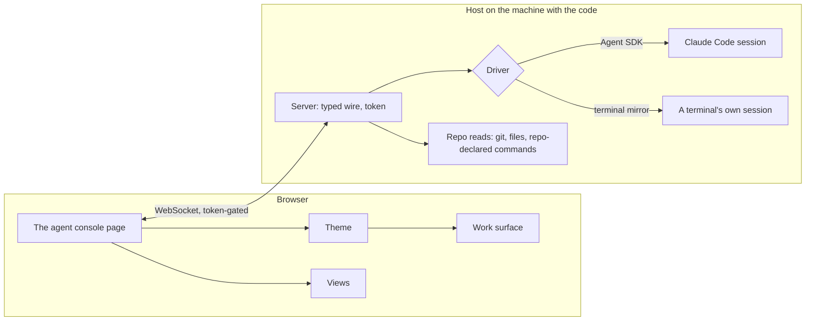

# Agent console

The terminal is where a Claude Code session is driven today, and every stage of the [Claude interface](/docs/infra/claude-interface) so far has decorated it. The agent console replaces it: **one page from which every session on a machine is worked** — the conversation, tool calls, diffs, permission prompts, context and cost, subagents, parallel sessions — laid out better than a scrollback can, and dressed by a theme. It is an upgrade or it is nothing: [terminal parity](/docs/proposals/infra/agent-console/terminal-parity) is its acceptance test, and the [workflow comparison](/docs/proposals/infra/agent-console/workflow-comparison) grounds each claimed gain in the steps it removes, and says plainly what it costs.

The shape is the one the open-source consoles for coding agents converged on — T3 Code, opcode, CloudCLI, Happy: **a host process on the machine that holds the code, a typed wire, and a thin client**. What this adds to that shape is Esposter's own: the client is a page of the app everyone already reaches, the look is a theme rather than a fork, and the first theme is the Genshin persona.

## Decisions

- **The page is a Nuxt page, not a package.** A Vue component package would leave every user to install it, host a Nuxt or Vite app and wire it themselves, for one consumer; the page in `apps/web` is reached at `/agent-console` on the deployed site and on a local `pnpm dev` alike, and ships with the app. What must run on the user's machine is the host, and the host is the package ([connection](/docs/proposals/infra/agent-console/connection)).
- **The agent is behind a driver.** A driver turns one provider's session into the console's events and takes the console's commands back. The first is the Claude Agent SDK, which gives interrupt, permission callbacks, slash commands, model and mode switches and resume — everything parity needs; the second attaches to a session a terminal already runs. Codex and the rest are later drivers, never a change to the page ([drivers](/docs/proposals/infra/agent-console/drivers)).
- **The look is behind a theme.** The default theme is plain Vuetify: the work surface and nothing else. A theme may restyle it, add a TresJS scene behind it, react to session events and speak; Genshin is the first ([themes](/docs/proposals/infra/agent-console/themes)).
- **Views are separate from themes.** A view is a panel any theme can show — the codebase city, the collector harbour — so a repository's tooling is visualised whatever the console is dressed as.
- **TresJS first; raw Three.js only where TresJS and cientos have nothing,** said on the page of the view that reaches for it, with the reason.
- **Everything runs on the user's machine or a host they run.** The app serves the page and never an agent: no key, repository or session ever reaches Esposter's servers.

## How it works



## The pages of this proposal

| Page                                                                           | What it settles                                                              |
| :----------------------------------------------------------------------------- | :--------------------------------------------------------------------------- |
| [Workflow comparison](/docs/proposals/infra/agent-console/workflow-comparison) | today's terminal workflow against the console's, task by task, and the costs |
| [Terminal parity](/docs/proposals/infra/agent-console/terminal-parity)         | every terminal surface, where the console reads it, and what it adds         |
| [Connection](/docs/proposals/infra/agent-console/connection)                   | the host package, local and remote hosts, pairing                            |
| [Drivers](/docs/proposals/infra/agent-console/drivers)                         | the driver interface, the SDK and terminal-mirror drivers                    |
| [Themes](/docs/proposals/infra/agent-console/themes)                           | the theme interface, the default theme, the Genshin theme                    |
| [Wish banner](/docs/proposals/infra/agent-console/wish-banner)                 | Genshin theme — the session's character arriving through a wish              |
| [Voxel atelier](/docs/proposals/infra/agent-console/voxel-atelier)             | Genshin theme — a room the character stands in, changed by the session       |
| [Element ambience](/docs/proposals/infra/agent-console/element-ambience)       | Genshin theme — a backdrop in the element, moved by the spoken line          |
| [Spatial chat](/docs/proposals/infra/agent-console/spatial-chat)               | a theme option — the conversation placed in the scene                        |
| [Codebase city](/docs/proposals/infra/agent-console/codebase-city)             | view — the repository as a city, the agent walking to the file in hand       |
| [Collector harbour](/docs/proposals/infra/agent-console/collector-harbour)     | view — the review collector's branches as a river                            |

## Scope and order

1. **The host and the SDK driver, the default theme, terminal parity.** Nothing else ships until the console can replace the terminal for a full day's work without the terminal being opened.
2. **The Genshin theme** — persona, voice, wish banner, then the atelier and ambience.
3. **Views** — the collector harbour first, the city after.
4. **The terminal-mirror driver**, when a session started in a terminal needs to be picked up.

```text
packages/agent-console-server/     ← the host: server, drivers, repo reads, the wire contracts as a subpath export
apps/web/app/
  pages/agent-console.vue          ← the route
  components/AgentConsole/         ← work surface, themes, views
  store/agentConsole/              ← connection, sessions, the event log per session
```

## What this does not propose

- **Agents hosted by Esposter.** A hosted agent needs a sandboxed checkout, the user's key held server-side and compute the app would pay for; every console surveyed runs the agent where the code already is, and so does this one.
- **A renderer of the character's Live2D model.** The desktop viewer draws it ([own Live2D renderer](/docs/infra/deferred/own-live2d-renderer), deferred).
- **A new chat product.** The console works the session the code is in; it is not a chatbot beside it.

## Key files

| File                                           | Role                                                                   |
| :--------------------------------------------- | :--------------------------------------------------------------------- |
| `apps/web/app/components/Visual/Gem/Index.vue` | The app's existing TresJS scene, the pattern every theme scene follows |
| `packages/genshin-persona/hooks/hooks.json`    | The persona's hooks, which the Genshin theme reads through the driver  |

## Notes

- The trade is stated rather than hidden: the terminal costs nothing to keep and the console is a host, a page and a theme layer to maintain. It is taken because the terminal cannot show a diff, a context gauge, parallel sessions or a scene — and because the console can be played: the [codebase city](/docs/proposals/infra/agent-console/codebase-city) is the repository as a place the person walks their character through, opening files, pointing the agent at a building and watching it work, with the session's model, context and cost on a HUD the whole time. The [workflow comparison](/docs/proposals/infra/agent-console/workflow-comparison) counts what the terminal costs every day; the city is what the console gives back beyond parity.
- This supersedes the page half of [chat into the session](/docs/proposals/infra/channel-chat): with a driver holding the session, a line typed at the character is simply a prompt. The channel stays only as the terminal-mirror driver's input.
