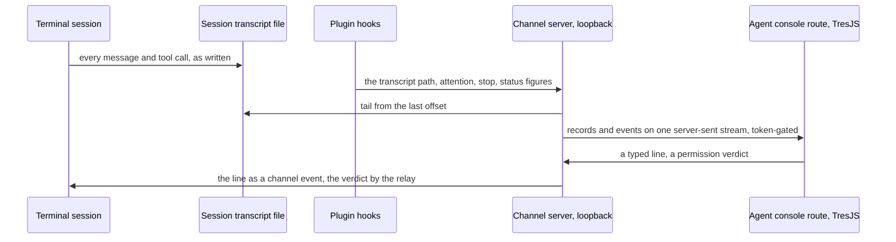

# Agent console

The terminal is where a session is driven today, and every stage of the [Claude interface](/docs/infra/claude-interface) so far has decorated it rather than replaced it. The agent console is the step past that: **one page from which a person works a session without looking at the terminal** — every message, tool call, diff, permission prompt, status figure and spoken line the terminal shows, laid out better than a scrollback can, with a scene around it that makes the session's state visible at a glance. It is an upgrade or it is nothing: any fact the terminal shows and the console does not is a defect, listed in [terminal parity](/docs/proposals/infra/agent-console/terminal-parity) until it is closed.

It stays free because it never runs a session of its own. The session is the terminal's, started as usual; the console reads what that session writes and pushes typed lines into it through a [channel](/docs/proposals/infra/channel-chat) — the same rule that [rejected the SDK-driven companion](/docs/infra/rejected/sdk-driven-companion).

## Decisions

- **A route in the web app, not a page in the plugin.** The app already carries Vue, Vuetify, TresJS with cientos, the fluid simulator and a build; a page served from the plugin would need a second build of all of it inside the plugin cache, which copies files and runs no build. The route connects to the plugin's channel server on the loopback with the token the server prints, so nothing about the session ever reaches the app's own server.
- **TresJS first; raw Three.js only where TresJS and cientos have nothing.** Every scene is declared as TresJS components, and cientos covers the parts the views need — `Html` for DOM placed in the scene, `Instances` for thousands of boxes in one draw, `Sparkles`, `Stars` and `Precipitation` for particles, `Billboard` for labels, `Levioso` for idle motion. A view that reaches for `three` directly says so in a note on its own page with the reason; today the only such reach is the fluid simulator the app already owns.
- **The transcript is the source of truth.** Every hook is handed the session's transcript path; the channel server tails that file, so the console renders the same record the terminal renders from rather than a subset reconstructed from events. Hooks add only what the transcript does not carry live — attention wanted, a turn stopping — and the status line's own input supplies the figures it prints.

## Scope

**Today:** the terminal, the persona plugin's session-start and message-display hooks, and the proposed chat page.

**This adds** a channel server that serves a loopback API rather than markup, the app route that renders it, and the views below — each its own sub-spec, each switched on independently:

| Page                                                                       | What it is                                                                                |
| :------------------------------------------------------------------------- | :---------------------------------------------------------------------------------------- |
| [Terminal parity](/docs/proposals/infra/agent-console/terminal-parity)     | the work surface: each thing the terminal shows, its source for the console, and the gaps |
| [Spatial chat](/docs/proposals/infra/agent-console/spatial-chat)           | the conversation placed in the scene — bubbles for spoken lines, panels for answers       |
| [Wish banner](/docs/proposals/infra/agent-console/wish-banner)             | the session's character arriving through a wish, the lore odds as its rates, pity         |
| [Voxel atelier](/docs/proposals/infra/agent-console/voxel-atelier)         | a room the character stands in, changed by what the session does                          |
| [Codebase city](/docs/proposals/infra/agent-console/codebase-city)         | the repository as a city, the character walking to the file in hand                       |
| [Collector harbour](/docs/proposals/infra/agent-console/collector-harbour) | the review collector's branches as a river, its commits as boats                          |
| [Element ambience](/docs/proposals/infra/agent-console/element-ambience)   | a backdrop in the character's element, moved by the spoken line's voice                   |

## How it works



The console keeps nothing the session needs: close the tab and nothing is lost, reopen it and the stream replays the transcript from the start. A view that is switched off loads no code.

```text
packages/genshin-persona/
  scripts/
    event.ts                         ← the hook every event runs: one line to the loopback
  src/services/agentConsole/
    tailTranscript.ts                ← records from the transcript, resumed by byte offset
    createAgentConsoleServer.ts              ← the token-gated stream and the input and verdict endpoints
apps/web/app/
  pages/agent-console.vue                    ← the route: connect with the token, lay out the work surface and the scene
  components/AgentConsole/           ← one folder per view
```

## The gate

The console rides on the channel, which sits behind two weeks of daily use of the voice ([roadmap](/docs/infra/roadmap)). Inside it, terminal parity comes first and alone — a console that loses information is a downgrade, whatever the scene looks like — then spatial chat, the wish banner and the collector harbour, then the rest. A view nobody opens after two weeks is deleted, not kept switched off.

## What this does not propose

- **A session of the console's own.** The reply is the terminal session's, or the console is a chatbot beside the work.
- **A renderer of the character's Live2D model.** The desktop viewer draws the model ([own Live2D renderer](/docs/infra/deferred/own-live2d-renderer), deferred); the scene's figure is a voxel token in the element's colour.
- **Reaching the session from anywhere but this machine.** The channel server listens on the loopback alone; the route is a static client of it.

## Key files

| File                                           | Role                                                                     |
| :--------------------------------------------- | :----------------------------------------------------------------------- |
| `packages/genshin-persona/hooks/hooks.json`    | The event hooks join the session-start hook                              |
| `packages/genshin-persona/scripts/status.ts`   | The status figures and the element colour the console shows              |
| `apps/web/app/components/Visual/Gem/Index.vue` | The app's existing TresJS scene, the pattern the console's scenes follow |

## Notes

- A browser on an `https` page reaching `http://127.0.0.1` passes the private-network checks only when the server answers their preflight and, in current Chrome, once the person allows local network access for the site. That is the first probe; if the browser refuses, the same route runs from the app's local dev server instead, which is loopback to loopback.
- Maintenance is the cost this accepts: TresJS and cientos move, and the console moves with them. It is accepted because the app already carries both and every other TresJS page moves with them too.
- The console supersedes the chat's own page: once parity ships, the channel server serves the stream and the endpoints, and the plugin-served markup the chat proposes is deleted rather than kept as a second client.
