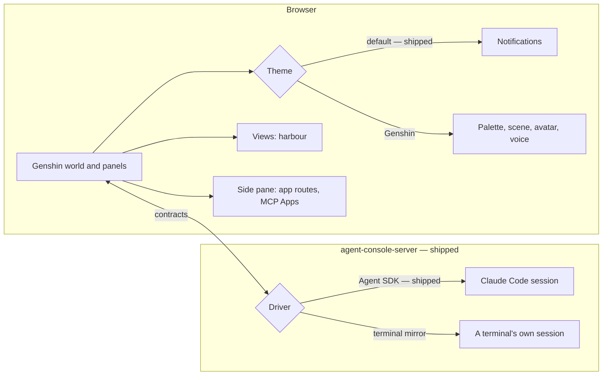
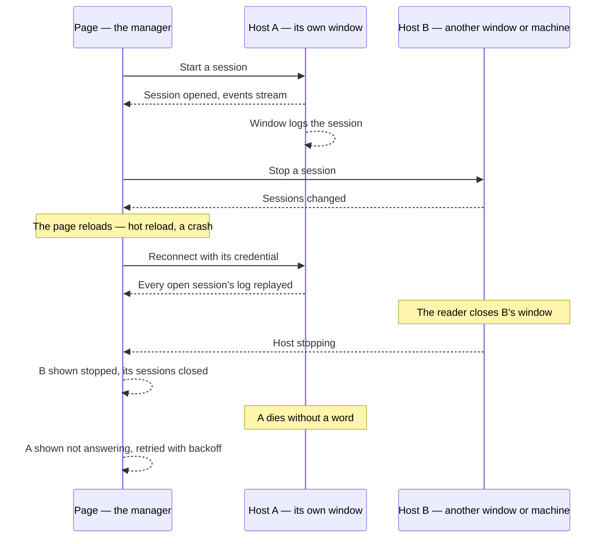

# Agent console

The [agent console](/docs/infra/claude-interface/agent-console) has shipped its first two phases: the `agent-console-server` host, the Claude Agent SDK driver, the default theme, and a full-screen world under its [console overlay](/docs/infra/claude-interface/agent-console/console-overlay) at [terminal parity](/docs/infra/claude-interface/agent-console/terminal-parity). One page of the app now works every Claude Code session on a machine in place of the terminal. This proposal is what comes after those phases. It is judged by the [workflow comparison](/docs/infra/claude-interface/agent-console/workflow-comparison): nothing here is built while the console still sends the person back to a terminal during a day's work.

## Decisions

- **Every view keeps the world's budget.** A view builds only what is in view and rebuilds only what a change touched, the rules the [Genshin engine](/docs/proposals/genshin/engine-architecture) keeps, so no cost grows with the repository behind it.
- **The look is behind a theme.** The default theme is the world with no character. A theme may add a palette, a scene in the world, an avatar, reactions and a voice, and Genshin is the first to add them ([themes](/docs/proposals/infra/agent-console/themes)).
- **Views are separate from themes.** A view is a panel any theme can show, such as the collector harbour, so a repository's tooling is visualised whatever the console is dressed as.
- **Other tooling joins through tiers, cheapest first.** App routes open in a side pane with no code, external tools arrive through MCP Apps, and a first-party view is written only when a tool needs the scene ([extensions](/docs/proposals/infra/agent-console/extensions)).
- **The world is Genshin's.** The console's world is the [Genshin](/docs/proposals/genshin) recreation, built by its own program; the voxel world's open world, building, map, day, sound, atelier and codebase city are [rejected](/docs/infra/rejected) with it.
- **A second driver, for sessions the SDK cannot hold.** A session a terminal already runs is attached to from the outside ([terminal-mirror driver](/docs/proposals/infra/agent-console/terminal-mirror-driver)).
- **The page manages; each host runs.** The page is the manager of every session on every host it has paired — this computer's, and each [remote connection](/docs/infra/claude-interface/agent-console/remote-connections) — and runs nothing itself. A host holds its sessions, its Claude Code login and its repositories, and a page reloading, a hot reload in development, or a closed tab never ends a turn, since the page reconnects and is replayed what it missed.
- **Both ends are live, and either can act.** A session started, stopped or answered in the page shows in the host's window at once, and a host stopped from its own window tells every page before it exits ([host installer](/docs/infra/claude-interface/agent-console/host-installer)). A host that dies without a word is the one case the page shows as not answering and retries.
- **Nothing runs hidden.** This computer's host and each of its sessions run in windows the reader can see and close ([host installer](/docs/infra/claude-interface/agent-console/host-installer), [session windows](/docs/infra/claude-interface/agent-console/session-windows)): no login item, no tray, no background service. Stopping a session is closing its window, stopping the host is closing its own, and nothing is left running after either. A [remote connection](/docs/infra/claude-interface/agent-console/remote-connections)'s sessions stay inside their host, since there is no desktop there to see them on, and are stopped from the page.
- **Nothing that costs money, Windows first.** The installer ships for Windows alone and unsigned, and every secret the app keeps is encrypted with a key the app already holds rather than a paid vault. Signing and the other platforms wait on [signed host installers](/docs/infra/deferred/signed-host-installers).
- **TresJS first; raw Three.js only where TresJS and cientos have nothing,** said on the page of the view that reaches for it, with the reason.

## How it works

```mermaid
flowchart LR
  subgraph Browser
    W[Genshin world and panels] --> T{Theme}
    T -->|default — shipped| N[Notifications]
    T -->|Genshin| G[Palette, scene, avatar, voice]
    W --> V[Views: harbour]
    W --> X[Side pane: app routes, MCP Apps]
  end
  subgraph Host[agent-console-server — shipped]
    D{Driver} -->|Agent SDK — shipped| C[Claude Code session]
    D -->|terminal mirror| M[A terminal's own session]
  end
  W <-->|contracts| D
```

How the page and its hosts stay in step — the principle every connection sub-spec builds to:

```mermaid
sequenceDiagram
  participant P as Page — the manager
  participant A as Host A — its own window
  participant B as Host B — another window or machine
  P->>A: Start a session
  A-->>P: Session opened, events stream
  A-->>A: Window logs the session
  P->>B: Stop a session
  B-->>P: Sessions changed
  Note over P: The page reloads — hot reload, a crash
  P->>A: Reconnect with its credential
  A-->>P: Every open session's log replayed
  Note over B: The reader closes B's window
  B-->>P: Host stopping
  P-->>P: B shown stopped, its sessions closed
  Note over A: A dies without a word
  P-->>P: A shown not answering, retried with backoff
```

## The pages of this proposal

| Page                                                                                       | What it settles                                                               |
| :----------------------------------------------------------------------------------------- | :---------------------------------------------------------------------------- |
| [Anthropic-hosted sessions](/docs/proposals/infra/agent-console/anthropic-hosted-sessions) | sessions Anthropic runs on the reader's API key, as one more connection       |
| [Repository files](/docs/proposals/infra/agent-console/repository-files)                   | @ to mention a file in the composer, and any named path opened read-only      |
| [Diff comments](/docs/proposals/infra/agent-console/diff-comments)                         | a comment on any diff line, sent together as one prompt                       |
| [Side chat](/docs/proposals/infra/agent-console/side-chat)                                 | a question beside the session on a discarded fork, adding nothing back        |
| [Effort level](/docs/proposals/infra/agent-console/effort-level)                           | an effort select beside the model select, showing the level the session is at |
| [Session titles](/docs/proposals/infra/agent-console/session-titles)                       | renaming a session by its title, saved in its own transcript                  |
| [Terminal-mirror driver](/docs/proposals/infra/agent-console/terminal-mirror-driver)       | attaching to a session a terminal runs, through its transcript and a channel  |
| [Extensions](/docs/proposals/infra/agent-console/extensions)                               | how other tooling joins — app routes, MCP Apps, first-party views             |
| [Themes](/docs/proposals/infra/agent-console/themes)                                       | the parts a theme adds past the default, and the Genshin theme                |
| [Wish banner](/docs/proposals/infra/agent-console/wish-banner)                             | Genshin theme — the session's character arriving through a wish               |
| [Element ambience](/docs/proposals/infra/agent-console/element-ambience)                   | Genshin theme — a backdrop in the element, moved by the spoken line           |
| [Spatial chat](/docs/proposals/infra/agent-console/spatial-chat)                           | a theme option — the conversation placed in the scene                         |
| [Collector harbour](/docs/proposals/infra/agent-console/collector-harbour)                 | view — the review collector's branches as a river                             |

## Scope and order

1. **One day's work in the console alone**, now that [terminal parity](/docs/infra/claude-interface/agent-console/terminal-parity) has no gap left, with every return to the terminal written into the [workflow comparison](/docs/infra/claude-interface/agent-console/workflow-comparison). Connecting comes first, since it is the first thing every reader does: the [host installer](/docs/infra/claude-interface/agent-console/host-installer), [session windows](/docs/infra/claude-interface/agent-console/session-windows), [device pairing](/docs/infra/claude-interface/agent-console/device-pairing) and [remote connections](/docs/infra/claude-interface/agent-console/remote-connections) to a machine of the reader's own have shipped, and [Anthropic-hosted sessions](/docs/proposals/infra/agent-console/anthropic-hosted-sessions) come later. The Code tab's lean core then closes the returns that comparison already predicts: the [shell pane](/docs/infra/claude-interface/agent-console/shell-pane) has shipped, and [repository files](/docs/proposals/infra/agent-console/repository-files), [diff comments](/docs/proposals/infra/agent-console/diff-comments) and [side chat](/docs/proposals/infra/agent-console/side-chat) come next, with [effort level](/docs/proposals/infra/agent-console/effort-level) and [session titles](/docs/proposals/infra/agent-console/session-titles) as small changes to the composer and the sessions tab.
2. **The Genshin theme**: persona, voice, wish banner, then the ambience, all inside the world.
3. **Views**: the collector harbour.
4. **The terminal-mirror driver**, when a session started in a terminal needs to be picked up.

## What this does not propose

- **Agents hosted by Esposter.** A hosted agent needs a sandboxed checkout, the user's key held server-side and compute the app would pay for. Every console surveyed runs the agent where the code already is, and so does this one.
- **A renderer of the character's Live2D model.** The desktop viewer draws it ([own Live2D renderer](/docs/infra/deferred/own-live2d-renderer), deferred).
- **A new chat product.** The console works the session the code is in; it is not a chatbot beside it.
- **The rest of the Code tab.** Worktree sessions, remote sessions, split sessions, cross-session messages and the session archive are [deferred](/docs/infra/deferred) behind their triggers. A browser pane and its other previews, a pull request bar, view modes, computer use, scheduled tasks, a customize panel, an environment editor and a pane layout are [rejected](/docs/infra/rejected).

## Key files

| File                                                                | Role                                                                      |
| :------------------------------------------------------------------ | :------------------------------------------------------------------------ |
| `apps/web/app/components/Genshin/Index.vue`                         | The world's canvas, which every theme dresses and every view opens beside |
| `apps/web/app/services/agentConsole/themes/AgentConsoleThemeMap.ts` | The theme registry every new theme is added to                            |
| `packages/genshin-persona/hooks/hooks.json`                         | The persona's hooks, which the Genshin theme reads through the driver     |

## Notes

- The trade is stated rather than hidden. The terminal costs nothing to keep, while the console is a host, a page and a theme layer to maintain. It is taken because the terminal cannot show a diff, a context gauge, parallel sessions or a scene, and because the console can be played.
- This supersedes the page half of [chat into the session](/docs/proposals/infra/channel-chat): with a driver holding the session, a line typed at the character is simply a prompt. The channel stays only as the terminal-mirror driver's input.
