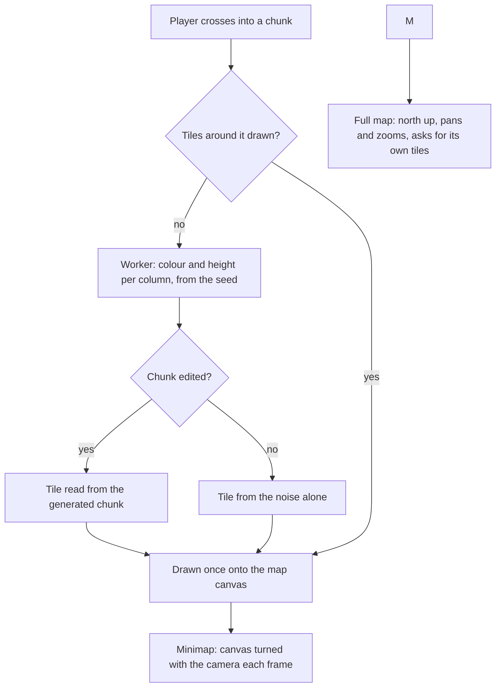

# Map

The [voxel world](/docs/infra/claude-interface/agent-console/voxel-world) is small enough today to walk without one: the room, its door, and the ground around it. The [open world](/docs/proposals/infra/agent-console/open-world) makes it a realm — biomes, a river, the views set down as places — and a player who walks off to the collector harbour needs to know where they are and where the room is. Minecraft's own answer is a map item and the coordinates on its debug screen, and the players who walk far install a minimap mod for the rest. This proposal is that minimap, and the full map behind it.

## Decisions

- **A minimap in the corner, turned with the camera.** A round map sits in the world's top corner, clear of the heads-up display along the foot, the player an arrow at its centre. It turns as the camera turns, so up on the map is the way W walks, the way a Minecraft minimap mod draws it by default; a mark on its rim points north, and another points home to the room when the room is off its edge. It shows the ground's colour a column at a time, shaded by height so hills read, and the room drawn as its roof. The agents are left off it: they are inside the room, which it already marks.
- **A full map on M.** M opens the map over the world the way T opens the console, through the same gate, and Escape closes it. It shows the ground around the player at a larger scale, north up, with the room marked home and the player's coordinates written in a corner, as the debug screen's are the one coordinate readout Minecraft players rely on. A drag pans it and the wheel zooms it, between one pixel a column and a view a few times the view distance across. It pauses nothing, because the world never pauses.
- **Drawn from the seed, not from what was explored.** The ground's colour and height at a column come from the same noise the chunks are generated from, so the worker draws a map tile — a chunk's columns, one colour and one height each — without generating the chunk's voxels. The map shows any ground in range whether or not the player has walked it, so nothing is kept for the places they have been and nothing grows with the walk. A map that reveals only what was explored is the survival game's, and it would hold a tile for every chunk ever visited.
- **One tile per chunk, drawn once.** A tile is two small arrays, handed back from the worker as transferable buffers like a chunk's mesh, and drawn once onto a 2D canvas. The minimap turns by a transform on that canvas each frame, so turning the camera redraws nothing, and it draws new tiles only when the player crosses into another chunk. The full map asks for the tiles of what it shows as it pans and zooms, and drops them when it closes.
- **A setting hides the minimap.** It is shown by default, and [world settings](/docs/proposals/infra/agent-console/world-settings) gains the one entry that hides it; the full map is on M either way.
- **Once building ships, a tile carries the edits.** The worker already applies a chunk's deltas after generating it ([building](/docs/proposals/infra/agent-console/building)), and a tile of edited ground is drawn from the chunk instead of the noise, so a tower the player built shows on the map.

## How it works

## Scope and order

1. **The minimap and the full map,** after the open world's biomes ship, since a map of one kind of ground everywhere shows nothing a player needs.
2. **Markers for the views,** the harbour and the city drawn on both maps with their names, when those places are set down in the realm.

## What this does not propose

- **Waypoints the player sets, or travel by the map.** The room is the one place a player needs to find again, and it is always marked; a waypoint list is a second thing to keep and save.
- **A map item held in the hand.** It belongs to a survival loop the world does not have.

## Key files

| File                                                               | Role after the change                                               |
| :----------------------------------------------------------------- | :------------------------------------------------------------------ |
| `apps/web/app/workers/agentConsole/chunk.worker.ts`                | Also draws a map tile: a chunk's colour and height per column       |
| `apps/web/app/services/agentConsole/world/getTerrainHeight.ts`     | The height a tile reads without generating the chunk's voxels       |
| `apps/web/app/components/AgentConsole/World/Chunks.vue`            | Asks for the tiles around the player when it crosses a chunk        |
| `apps/web/app/components/AgentConsole/Index.vue`                   | Holds the minimap in the world's top corner, and the full map       |
| `apps/web/app/composables/agentConsole/useAgentConsoleCommands.ts` | Gains M, live only while the world holds the keyboard, like E and T |

## Sources

- [Map](https://minecraft.wiki/w/Map), Minecraft Wiki: a top-down view shaded by height, a colour per column.
- [Debug screen](https://minecraft.wiki/w/Debug_screen), Minecraft Wiki: the coordinates players navigate by.
