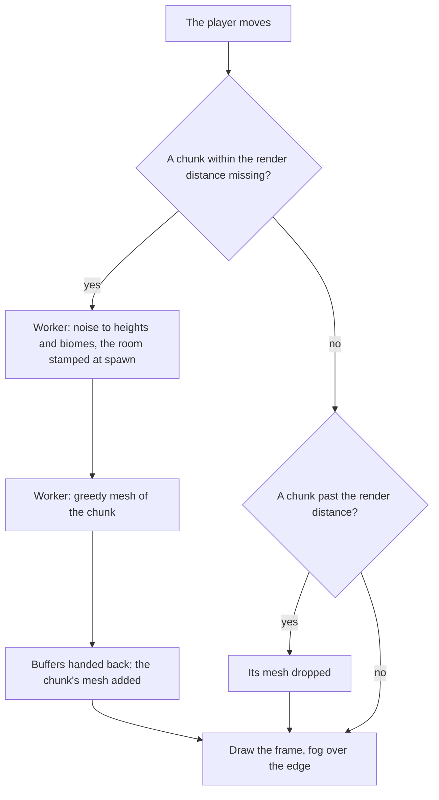

# Open world

The [voxel world](/docs/infra/claude-interface/agent-console/voxel-world) is one room. The player walks it with Minecraft's movement, but the room is small enough that a few steps reach any wall, and the door only leads back to the app. This proposal makes the room a building standing in a world: the door opens onto terrain the player can walk out over, and the world goes on as far as they walk.

## Decisions

- **The world is generated, not authored.** Terrain comes from a seed through layered noise, so no voxel of it is stored and every load of the same seed is the same world. Height is several octaves of simplex noise summed, and two slower noises — temperature and moisture — choose the biome at each column: plains, forest, hills, mountains, a river valley, lakes and snow on the peaks.
- **The room is a building in it.** The room's grid, as `createRoomGrid` builds it today, is stamped into the world at spawn as a structure on flattened ground, its open sides closed by walls, and its door opens onto the world instead of leading to the app. The agents keep to their stations inside, so the session's picture of itself stays where it is. Leaving to the app stays in the pause menu.
- **The world streams in chunks.** Space is split into columns of sixteen by sixteen voxels, Minecraft's chunk. Chunks within a render distance of the player are generated and meshed; chunks beyond it are dropped, and fog hides the edge. Generating and meshing run in a Web Worker, which hands each chunk's buffers back as transferables, so neither a frame nor the composer ever waits on the terrain ([runtime budget](/docs/proposals/infra/agent-console/runtime-budget)).
- **Movement and the camera read the world, not the room.** `getVoxel` looks a voxel up through the chunk holding it, so `moveThroughGrid` and the spring arm's `castThroughGrid` work unchanged across chunk borders. The per-axis resolution stays exact at walking and sprinting speed.
- **The realm is our own.** It takes the feel of classic high fantasy — green rolling hills, an old forest, a great river, a range of dark mountains — but every name, map and piece of lore is original. No place, name or story from a published setting is used: those are someone else's to license, and a world generated from a seed is ours alone.
- **The code is our own.** The noise, the chunking and the streaming are written here, beside the mesher the room already has. A demo whose licence the repository does not hold is read for ideas and never copied. A dependency is allowed where its licence is permissive and it does one job, such as a simplex noise package.

## How it works



## Scope and order

1. **Terrain.** The seed, the height noise, chunk streaming in a worker, fog, and the room stamped in at spawn with its door opening outward.
2. **Biomes and features.** Temperature and moisture choosing the biome, trees in the forest, water in the rivers and lakes, snow on the peaks.
3. **Places for the views.** The [collector harbour](/docs/proposals/infra/agent-console/collector-harbour) on the river and the [codebase city](/docs/proposals/infra/agent-console/codebase-city) on the plain, each a place the player walks to rather than a separate scene.

## What this does not propose

- **Building or mining.** The world is walked, not changed, so nothing about it needs saving.
- **Other players.** The world is the person's own.
- **A published setting.** The realm borrows a genre's feel and nothing of any one work.

## Key files

| File                                                          | Role after the change                                        |
| :------------------------------------------------------------ | :----------------------------------------------------------- |
| `apps/web/app/services/agentConsole/world/createRoomGrid.ts`  | The room as a structure stamped into the world at spawn      |
| `apps/web/app/services/agentConsole/world/greedyMesh.ts`      | Meshes a chunk in the worker as it meshes the room today     |
| `apps/web/app/services/agentConsole/world/getVoxel.ts`        | Looks a voxel up through the chunk that holds it             |
| `apps/web/app/services/agentConsole/world/moveThroughGrid.ts` | Unchanged: collision reads the world through `getVoxel`      |
| `apps/web/app/services/agentConsole/world/castThroughGrid.ts` | Unchanged: the spring arm reads the world through `getVoxel` |
| `apps/web/app/components/AgentConsole/World/Room.vue`         | Replaced by the chunks around the player                     |

```text
apps/web/app/
  components/AgentConsole/World/Chunks.vue           ← the meshes of the chunks in range, added and dropped
  services/agentConsole/world/generateChunk.ts       ← a seed and a chunk's position to its voxels
  services/agentConsole/world/generateChunk.test.ts
  workers/agentConsole/chunk.worker.ts               ← generation and meshing off the main thread
```

## Notes

- The world's cost is its render distance, never its size: a player who walks for an hour holds the same number of chunks as one who stands at the door, and the bench beside the generator holds that a chunk's time does not grow with how far out it is.
- Generation being deterministic is what makes the world free to keep: the seed is the whole save, and a reload rebuilds exactly what was there.

## Sources

- [Chunk](https://minecraft.wiki/w/Chunk) and [World generation](https://minecraft.wiki/w/World_generation), Minecraft Wiki: sixteen-by-sixteen columns generated and loaded around the player, and terrain from layered noise with biomes chosen by climate.
- [Making maps with noise functions](https://www.redblobgames.com/maps/terrain-from-noise/), Red Blob Games: octaves of noise summed into height, and a second noise for moisture that picks the biome with the height.
- [Simplex noise demystified](https://weber.itn.liu.se/~stegu/simplexnoise/simplexnoise.pdf), Stefan Gustavson: the noise the terrain is built from.
- [Meshing in a Minecraft game](https://0fps.net/2012/06/30/meshing-in-a-minecraft-game/), Mikola Lysenko: the greedy meshing each chunk takes, as the room does.
