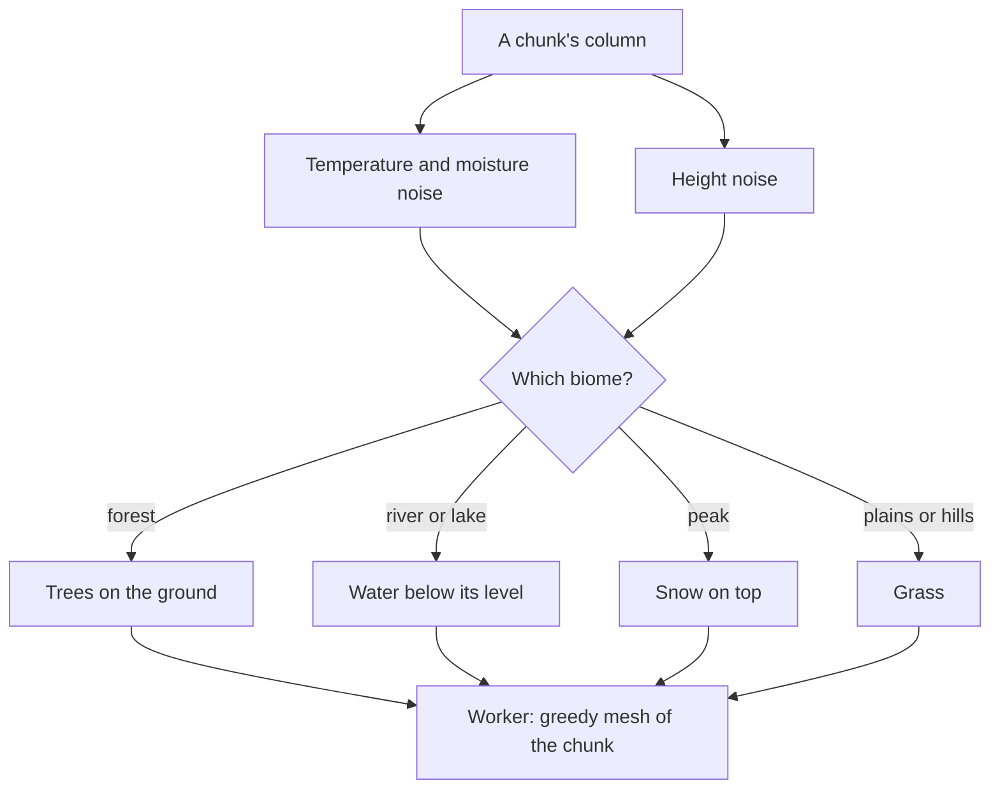

# Open world

The [voxel world](/docs/infra/claude-interface/agent-console/voxel-world) already stands the room in terrain: the door opens onto ground generated from a seed, streamed in chunks around the player and meshed in a worker. That ground is one kind everywhere, rolling grass over dirt over stone. This proposal gives it the variety a place to walk needs, and puts the views in it.

## Decisions

- **Climate chooses the biome.** Two slower noises beside the height — temperature and moisture — choose the biome at each column: plains, forest, hills, mountains, a river valley, lakes and snow on the peaks. They are read in `getTerrainHeight`'s place by the same generator, from the same seed, so a biome costs a chunk nothing it does not already pay.
- **The realm is our own.** It takes the feel of classic high fantasy — green rolling hills, an old forest, a great river, a range of dark mountains — but every name, map and piece of lore is original. No place, name or story from a published setting is used: those are someone else's to license, and a world generated from a seed is ours alone.
- **The code is our own.** The biomes and their features are written here, beside the noise and the chunking the terrain already has. A demo whose licence the repository does not hold is read for ideas and never copied.

## How it works

## Scope and order

1. **Biomes and features.** Temperature and moisture choosing the biome, trees in the forest, water in the rivers and lakes, snow on the peaks.
2. **Places for the views.** The [collector harbour](/docs/proposals/infra/agent-console/collector-harbour) on the river and the [codebase city](/docs/proposals/infra/agent-console/codebase-city) on the plain, each a place the player walks to rather than a separate scene.

## What this does not propose

- **Building or mining.** The world is walked, not changed, so nothing about it needs saving.
- **Other players.** The world is the person's own.
- **A published setting.** The realm borrows a genre's feel and nothing of any one work.

## Key files

| File                                                           | Role after the change                                        |
| :------------------------------------------------------------- | :----------------------------------------------------------- |
| `apps/web/app/services/agentConsole/world/getTerrainHeight.ts` | Joined by the climate noises that choose each column's biome |
| `apps/web/app/services/agentConsole/world/generateChunk.ts`    | Fills each column by its biome, and sets its features down   |
| `apps/web/app/models/agentConsole/PaletteColor.ts`             | Gains the colours of water, snow, leaves and the new grounds |

## Notes

- A feature that crosses a chunk's border, such as a tree's crown, is generated from its trunk's column in every chunk it reaches, so each chunk still needs nothing but its own position and the seed.

## Sources

- [World generation](https://minecraft.wiki/w/World_generation), Minecraft Wiki: biomes chosen by climate noise, and features placed over the ground they suit.
- [Making maps with noise functions](https://www.redblobgames.com/maps/terrain-from-noise/), Red Blob Games: a second noise for moisture that picks the biome with the height.
