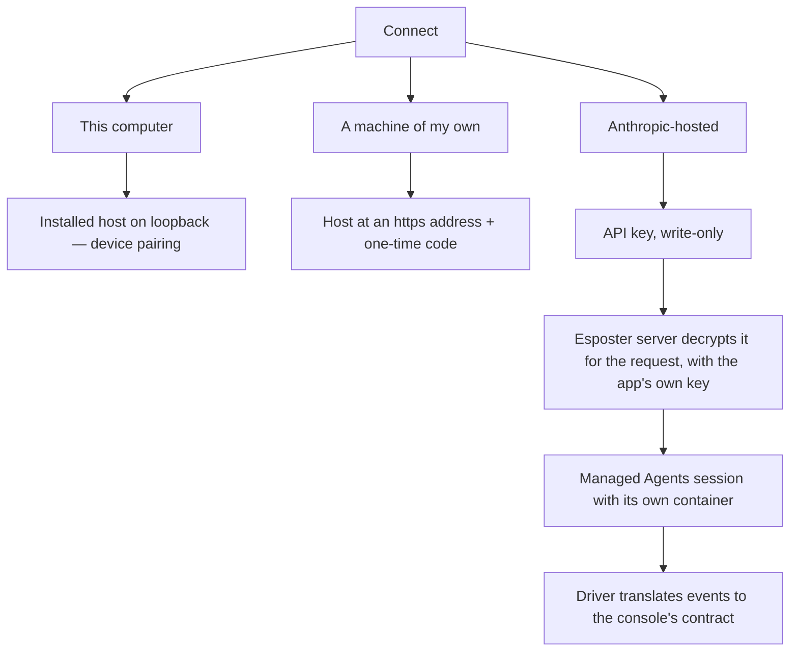

# Remote Connections

A sub-spec of the [agent console](/docs/proposals/infra/agent-console), after [device pairing](/docs/proposals/infra/agent-console/device-pairing), whose Local or remote choice this fills in. Today a session runs only on a machine where the reader started a host by hand. Both reference products keep the agent where the code is and differ in how the page reaches it. T3 Code's apps connect straight to a machine's HTTPS endpoint, usually a Tailscale address, and pair it with a one-time link ([T3 Code remote access](https://github.com/pingdotgg/t3code/blob/main/docs/user/remote-access.md)). Claude Code's Remote Control relays through Anthropic's API and has the machine make only outbound requests ([Remote Control](https://code.claude.com/docs/en/remote-control)). For a reader with no machine to leave running, Anthropic's Managed Agents runs the agent loop and a sandbox per session itself, paid with the reader's own API key ([Managed Agents](https://platform.claude.com/docs/en/managed-agents/overview)).

## What it changes

- **Connections are a list.** The connect screen holds This computer and any remote connections the reader adds, each with a name and a state. The sessions tab shows each session under the connection it runs on. A page holds one credential per connection, as it holds one for this computer.
- **A machine of the reader's own.** The reader installs the host there, from the [host installer](/docs/proposals/infra/agent-console/host-installer) or the command, and gives the page two details: the host's `https://` address and the one-time code the host prints. The address has to be encrypted end to end, since a page on `https` may reach nothing else. A Tailscale machine's `ts.net` address has a certificate of its own, and an SSH forward makes the host loopback again. The code pairs the page as device pairing's printed link does, so the reader never copies a token.
- **Anthropic-hosted, with the reader's API key.** The reader pastes an Anthropic API key once. Each session is a Managed Agents session in a container of its own, working on a public repository the reader names, which the session clones as its first step. A driver on Esposter's server speaks Managed Agents' event stream on one side and the console's contract on the other, so the page draws a hosted session exactly as it draws a local one.
- **The key is write-only.** It crosses to Esposter's server once, over TLS, and never comes back. The page shows only its last four characters, with **Replace** and **Remove**. The server encrypts it with AES-256-GCM under a key held only in the app's own environment, beside the secrets it already keeps, so a database copy alone opens nothing and no paid vault is needed. Managed Agents usage is billed to the reader's key, never to Esposter. It is decrypted only in the request that starts or drives a session. It is never logged, and never sent to the page or into the sandbox.
- **A claude.ai subscription stays with Claude Code.** A subscription signs in through Claude Code, so it runs on This computer or a machine of the reader's own. The hosted option takes an API key, which is what Managed Agents is billed to.

## What is deliberately not in it

- **No relay of Esposter's own.** Remote Control's outbound-only relay would reach a machine behind any firewall, but it is a service Esposter would run and answer for. An encrypted address or a forward reaches the same machines without one.
- **No private repositories on the hosted option.** Cloning one needs a repository credential beside the API key, stored and scoped as the key is. A private repository runs on This computer or a machine of the reader's own, where the host already has the reader's own access.
- **No team keys.** One reader, one key; an organisation's shared key belongs to an admin surface this proposal does not add.

## Key files

| File                                                                            | Role after the change                                                               |
| ------------------------------------------------------------------------------- | ----------------------------------------------------------------------------------- |
| `apps/web/app/components/AgentConsole/Panel/Pairing.vue`                        | the connections list, and the fields each remote option asks for                    |
| `apps/web/app/components/AgentConsole/Panel/Sessions.vue`                       | each session under the connection it runs on                                        |
| `apps/web/app/store/agentConsole/connection.ts`                                 | one socket and credential per connection, in place of a single host                 |
| `packages/agent-console-server/src/models/driver/Driver.ts`                     | the contract the Managed Agents driver implements beside the Agent SDK driver       |
| `packages/agent-console-server/src/services/server/createAgentConsoleServer.ts` | the code exchange a remote host shares with device pairing                          |
| `apps/web/server/trpc/routers/user.ts`                                          | the write-only key procedures: set, replace, remove, and read the last four         |
| `packages/db-schema/src/schema/users.ts`                                        | the encrypted key and its last four characters, beside the user they belong to      |
| `apps/web/configuration/runtimeConfig.ts`                                       | the key-encryption secret, read from the app's environment beside its other secrets |

## Sources

- [T3 Code — remote access](https://github.com/pingdotgg/t3code/blob/main/docs/user/remote-access.md) — an HTTPS endpoint the hosted app connects to directly, Tailscale HTTPS for it, SSH-managed forwards, and provider credentials that stay on the remote machine.
- [Claude Code — Remote Control](https://code.claude.com/docs/en/remote-control) — outbound HTTPS only with no inbound ports, traffic relayed through Anthropic's API, and "API keys are not supported".
- [Claude — Managed Agents overview](https://platform.claude.com/docs/en/managed-agents/overview) — agents, environments and sessions, with a container per session in which the agent's tools run.
