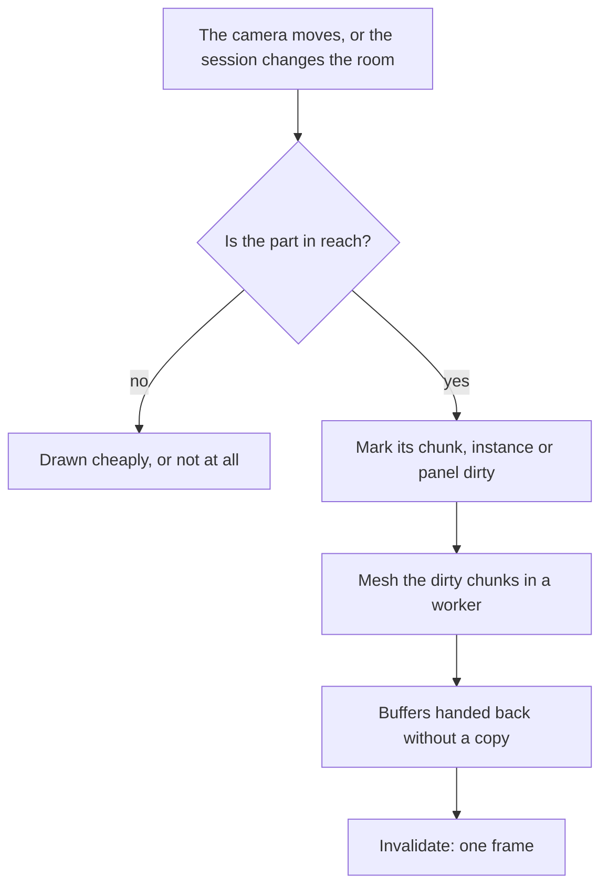

# Runtime budget

The [voxel world](/docs/infra/claude-interface/agent-console/voxel-world) already keeps each frame cheap. It renders every frame so the room stays live, but an event costs the event rather than the log, a frame allocates nothing, and the room is a handful of draw calls. That holds because the room is small and fixed. The views and themed rooms still proposed are neither. The [codebase city](/docs/proposals/infra/agent-console/codebase-city) is a whole repository, and the Genshin theme's [atelier](/docs/proposals/infra/agent-console/voxel-atelier) changes as the session runs. This page is the rule each of them follows so that their cost grows with what the person can see, never with what is behind it. The world's own budget is not restated here: every view inherits it.

## Decisions

- **Build only what the view can show.** A room or view generates geometry for what the camera can see and the person can reach. It never builds the whole model behind the room. The codebase city is where this matters most: a repository of tens of thousands of files is still a city of a few nearby districts in full detail, with everything else drawn cheaply or not at all.
- **A change rebuilds only what it touched.** A change marks the chunk, instance or panel it affects as dirty, and only dirty parts are rebuilt before the next frame. The scene graph is never regenerated from the store.
- **Heavy work stays off the main thread.** Meshing a changing chunk and parsing a large diff run in a Web Worker, which hands its results back as transferable buffers. Neither typing in the composer nor a frame ever waits on them. Whatever the host can do before the page sees it, the host does: the city's layout runs there, cached by head commit.
- **Each room's models load when it is entered.** Only the room the person is in is fetched, so opening the console never pays for a room it does not show.
- **Benches are the gate, not a screenshot suite.** The city layout and the culling are benched under the `bench` skill's conventions, as the fold and the mesher already are. A screenshot suite stays rejected, as the `run-app` skill records.

## How it works

## Techniques

### Drawing many things

- **Instancing.** Repeated objects, such as buildings, props and figures of one kind, are instanced with cientos `Instances` or three's `InstancedMesh`, or batched with `BatchedMesh` when their shapes differ. That is one draw call per kind of object, however many of it there are.
- **Adaptive quality.** If frames stay over budget while something animates, the view lowers the pixel ratio further, and restores it when frames recover. Cientos has no performance monitor, so this is a small watcher over frame times.
- **Ambient motion is a shader or nothing.** An idle breath, drifting leaves or an element backdrop is a shader driven by a time uniform at a capped low frame rate. It stops completely when the tab is hidden or the person has asked for reduced motion.

### Building only what is seen

- **Chunks.** Space is split into fixed-size chunks. Three culls each object against its bounding sphere, so a chunk-sized object is what makes that culling pay: whole chunks outside the view are skipped at once.
- **Level of detail.** A far chunk draws in lower detail through three's `LOD`: a whole district can be one box. The city generates a building's detail, such as its doorway and label, only for districts within the player's reach, and drops that detail when the player leaves.
- **Flat layouts.** The city's layout reaches the page as flat typed arrays of rectangles, one entry per file, with no object per file. It is instanced per district. Labels are made only for what is nearby.
- **Picking against a hierarchy.** Raycasting runs on a pointer event, never every frame. A city too large to look up voxel by voxel is picked against a BVH through cientos `BVH` on three-mesh-bvh, or by Amanatides and Woo's walk along the ray from voxel to voxel, whose cost depends on the ray's length and not on the size of the scene.
- **A spatial hash for proximity.** Doorways and gates are found by looking up the player's grid cell in a spatial hash, in constant time, instead of scanning every building.
- **Paths on the street graph.** The agent's figure finds its way along the treemap's street graph, district gate to district gate, with A\* over that graph, and never over a grid of every voxel.

### The DOM panels

- **A virtual list once rows are too many to skip.** A diff's rows are already skipped by layout and paint while scrolled past. A list long enough that even skipped rows cost layout, such as a city's file list, renders through VueUse's `useVirtualList`.
- **Only a panel that follows the world moves with it.** The heads-up display and the panels are fixed DOM. A label that must follow a point in a view goes through cientos `Html`, which is positioned on frames that are drawn anyway.

## Measuring

- **Benches.** The city layout is benched at two file counts, and the culling at two camera distances. The same time at both is the proof that a view's cost follows what it shows.
- **Targets are magnitudes.** A view is tens of draw calls, never thousands, and neither an event's cost nor a frame's grows with the repository's size.

## Notes

- **Rendering in a worker is not chosen.** Rendering the canvas from a worker through an offscreen canvas would take drawing off the main thread entirely. TresJS renders on the main thread, and a handful of draw calls a frame leaves it very little to do. Revisit this only if drawn frames are seen competing with typing.
- **The trade has limits.** Every technique here keeps a view's behaviour and changes only its cost. None of them may take away a capability the [terminal parity](/docs/infra/claude-interface/agent-console/terminal-parity) page names, such as selectable text, search or a screen reader.

## Sources

- [A fast voxel traversal algorithm for ray tracing](https://www.eecs.yorku.ca/~amana/research/grid.pdf), John Amanatides and Andrew Woo, Eurographics 1987: stepping a ray through a grid one cell at a time, the picking walk.
- [Optimized spatial hashing for collision detection of deformable objects](https://matthias-research.github.io/pages/publications/tetraederCollision.pdf), Matthias Teschner and others, Vision, Modeling and Visualization 2003: hashing grid cells into a table, so the query for a cell's neighbours takes constant time.
- [A formal basis for the heuristic determination of minimum cost paths](https://doi.org/10.1109/TSSC.1968.300136), Peter Hart, Nils Nilsson and Bertram Raphael, 1968: A\*, the search the agent's figure runs over the street graph.
- [InstancedMesh](https://threejs.org/docs/pages/InstancedMesh.html), [BatchedMesh](https://threejs.org/docs/pages/BatchedMesh.html) and [LOD](https://threejs.org/docs/pages/LOD.html), three.js: one draw call for many copies of a mesh, one for many meshes that share a material, and a level of detail chosen by distance.
- [three-mesh-bvh](https://github.com/gkjohnson/three-mesh-bvh), Garrett Johnson: the bounding volume hierarchy behind cientos `BVH`, for raycasts that do not test every triangle.
- [Transferable objects](https://developer.mozilla.org/en-US/docs/Web/API/Web_Workers_API/Transferable_objects), MDN: moving a worker's buffers to the page without copying them.
- [OffscreenCanvas](https://developer.mozilla.org/en-US/docs/Web/API/OffscreenCanvas), MDN: rendering from a worker, the option the notes leave unchosen.
