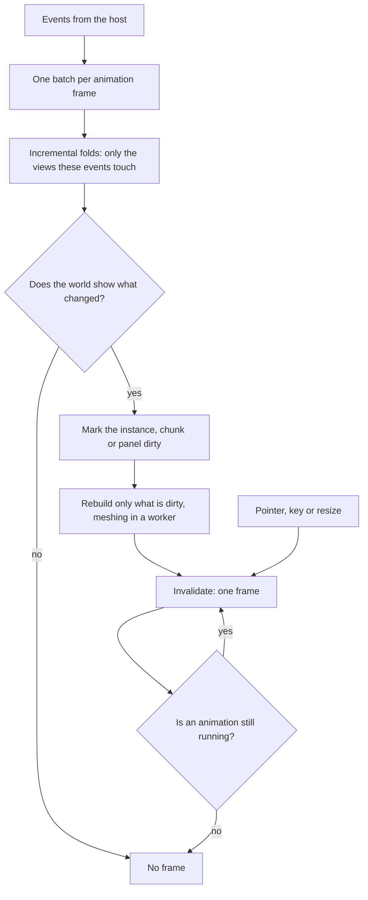

# Runtime budget

The [voxel surface](/docs/proposals/infra/agent-console/voxel-surface) turns the console into a game, but it is still a tool left open all day beside an editor, a dev server and a build. For most of that day the session is idle or waiting on the model. So the world is judged by two things: what it costs while nothing happens, and how that cost grows as the session gets longer and the repository gets bigger. A game loop that draws every frame to show a character standing still would cost more than the terminal it replaces, which fails the [workflow comparison](/docs/proposals/infra/agent-console/workflow-comparison) on its own. This page is the rule for every room, view and theme in the second phase. The voxel surface, the Genshin theme's rooms and the views link here rather than each setting a budget of its own.

## Decisions

- **Nothing happens, nothing is drawn.** The canvas renders on demand, through TresJS's `renderMode` set to on-demand, and never runs a continuous loop. A frame is drawn only when something invalidates it:
  - a store change the world shows
  - a pointer move or key press the world answers
  - a resize
  - an animation that is still running

  An idle session uses no GPU time, and no main-thread time beyond the socket.

- **Every animation ends.** A figure walks to a station and stops, and a gate opens and settles. While any motion runs, the world draws frames, and when the last one ends it goes back to drawing nothing. Ambient motion, such as an idle breath, drifting leaves or the element backdrop, is either a shader driven by a time uniform at a capped low frame rate, or it is left out. It stops completely when the tab is hidden or the person has asked for reduced motion.
- **An event costs the event, not the log.** Today each derived view in the session store is a `computed` that walks the whole of `events`, and so does the duplicate check in `storeEvents`. Every new event therefore costs more the longer the session has run, and a long session costs quadratic time overall. The world reads more of these views, and more often, so this phase turns them into incremental folds. A new event updates only the tool calls, file edits, pending permissions and latest-of-kind values it touches, and the duplicate check is a set kept alongside the log. A replay on reconnect becomes one pass over the log. This is the only change to the data layer in this phase, and the Vuetify surface benefits from it too until it is deleted.
- **Build only what the view can show.** A room or view generates geometry for what the camera can see and the person can reach. It never builds the whole model behind the room. The codebase city is where this matters most: a repository of tens of thousands of files is still a city of a few nearby districts in full detail, with everything else drawn cheaply or not at all.
- **A change rebuilds only what it touched.** A change marks the chunk, instance or panel it affects as dirty, and only dirty parts are rebuilt before the next frame. The scene graph is never regenerated from the store.
- **Heavy work stays off the main thread.** Meshing voxel chunks and parsing a large diff run in a Web Worker, which hands its results back as transferable buffers. Neither typing in the composer nor a frame ever waits on them. Whatever the host can do before the page sees it, the host does: the city's layout already runs there, cached by head commit.
- **Only this page pays for the 3D code, and only once the shell is up.** The world is an async component, so the three.js chunk loads after the page's first paint and never on any other page. Each room's voxel models are fetched when that room is entered.
- **Benches are the gate, not a screenshot suite.** The pure parts are benched under the `bench` skill's conventions: the folds, the mesher, the city layout and the culling. A screenshot suite stays rejected, as the `run-app` skill records.

## How it works

## Techniques

### Drawing

- **Greedy meshing.** Static voxels are merged into one mesh per chunk. Adjacent faces with the same material become one quad, and a face between two solid voxels is never emitted. A room becomes a handful of chunk meshes instead of one mesh per voxel, and its triangle count scales with its surface rather than its volume.
- **One material and one palette.** The whole world uses one material and colours from a palette, either a small texture or vertex colours, so chunk meshes share state. Repeated objects, such as buildings, props and figures of one kind, are instanced with cientos `Instances` or three's `InstancedMesh`, or batched with `BatchedMesh` when their shapes differ. That is one draw call per kind of object, however many of it there are.
- **Baked lighting.** Ambient occlusion goes into vertex colours at meshing time. Counting a voxel's solid neighbours gives it almost for free. The world has one directional light, and a shadow map drawn once and reused through cientos `BakeShadows`, rather than redrawn every frame. There is no post-processing pass.
- **Fewer pixels.** The world renders at a capped device pixel ratio. For the pixel look, it can render into a low-resolution target that is scaled up with nearest-neighbour filtering. Fill cost falls with the square of the scale, and the voxel style reads better for it.
- **No allocation inside a frame.** Vectors, matrices and arrays are reused, and figures and effects are pooled, so drawing a frame never feeds the garbage collector.
- **Adaptive quality.** If frames stay over budget while something animates, the world lowers the pixel ratio first, then drops the shadow, and restores both when frames recover. Cientos has no performance monitor, so this is a small watcher over frame times, and the only one the world keeps.

### Building only what is seen

- **Chunks.** Space is split into fixed-size chunks. Three culls each object against its bounding sphere, so a chunk-sized object is what makes that culling pay: whole chunks outside the view are skipped at once.
- **Level of detail.** A far chunk draws in lower detail through three's `LOD`: a whole district can be one box. The city generates a building's detail, such as its doorway and label, only for districts within the player's reach, and drops that detail when the player leaves.
- **Flat layouts.** The city's layout reaches the page as flat typed arrays of rectangles, one entry per file, with no object per file. It is instanced per district. Labels are made only for what is nearby.
- **Picking only on input.** Raycasting runs on a pointer event, never every frame. It runs against a BVH, through cientos `BVH` on three-mesh-bvh, or through the voxel grid itself: Amanatides and Woo's walk along the ray from voxel to voxel, whose cost depends on the ray's length and not on the size of the scene.
- **A spatial hash for proximity.** Doorways and gates are found by looking up the player's grid cell in a spatial hash, in constant time, instead of scanning every building.
- **Paths on the street graph.** The agent's figure finds its way along the treemap's street graph, district gate to district gate, with A\* over that graph, and never over a grid of every voxel.

### The DOM panels

- **Only visible rows render.** A long list is rendered only where it is visible: the conversation, the timeline, or a diff of a thousand lines. The cheap way is the CSS content-visibility property with an intrinsic size. When a list is long enough that even skipped rows cost layout, the panel switches to a virtual list through VueUse's `useVirtualList`.
- **Render each block once.** Markdown and syntax highlighting run once per finished block and are cached by event id. A reply that is still streaming re-renders only its last block.
- **Fixed panels stay fixed.** The HUD and composer are fixed DOM that never moves with the camera. Only a panel that must follow a point in the world goes through cientos `Html`, which is positioned on frames that are drawn anyway.

### Reactivity

- **Three.js objects are never deeply reactive.** They are held with `markRaw` or `shallowRef`. A reactive mesh makes Vue proxy every vertex array, which costs more than the scene itself.
- **One batch per frame.** Events that arrive within one frame are applied together, so a burst of streamed messages costs one fold and one invalidation, not one per message.
- **The world watches narrowly.** It watches the specific derived values it draws, never the event array.

### Hidden and backgrounded

- **A hidden tab draws nothing.** A hidden tab already gets no animation frames. The world also stops its ambient timers, and the default theme's notifications are the only thing that reacts while the tab is hidden.
- **A lost context is rebuilt from the store.** The browser can take back a WebGL context under memory pressure. When it does, the world is rebuilt from the store, which holds everything, and nothing on the host has to be asked again.

## Measuring

- **Benches.** A fold is benched at two log lengths. The same time at both is the proof that an event costs the event and not the log. The mesher is benched per chunk, and the city layout at two file counts.
- **A dev overlay.** In development, an overlay reads the renderer's info counters: draw calls, triangles and frames drawn. Proving an idle world is idle means watching the frame counter stay still.
- **Targets are magnitudes.** An idle world draws zero frames. A room is tens of draw calls, never thousands. Neither an event's cost nor a frame's cost grows with the session's length or the repository's size.

## Notes

- **Rendering in a worker is not chosen.** Rendering the canvas from a worker through an offscreen canvas would take drawing off the main thread entirely. TresJS renders on the main thread, and on-demand rendering already leaves the main thread very little to do. Revisit this only if drawn frames are seen competing with typing.
- **The trade has limits.** Every technique here keeps the world's behaviour and changes only its cost. None of them may take away a capability the [terminal parity](/docs/infra/claude-interface/agent-console/terminal-parity) page names, such as selectable text, search or a screen reader.

## Sources

- [Meshing in a Minecraft game](https://0fps.net/2012/06/30/meshing-in-a-minecraft-game/), Mikola Lysenko: greedy meshing, where adjacent faces are merged into larger quads, compared against naive and culled meshing.
- [Ambient occlusion for Minecraft-like worlds](https://0fps.net/2013/07/03/ambient-occlusion-for-minecraft-like-worlds/), Mikola Lysenko: per-vertex ambient occlusion from a vertex's two side voxels and its corner voxel, baked at meshing time.
- [A fast voxel traversal algorithm for ray tracing](https://www.eecs.yorku.ca/~amana/research/grid.pdf), John Amanatides and Andrew Woo, Eurographics 1987: stepping a ray through a grid one cell at a time, the picking walk.
- [Optimized spatial hashing for collision detection of deformable objects](https://matthias-research.github.io/pages/publications/tetraederCollision.pdf), Matthias Teschner and others, Vision, Modeling and Visualization 2003: hashing grid cells into a table, so the query for a cell's neighbours takes constant time.
- [A formal basis for the heuristic determination of minimum cost paths](https://doi.org/10.1109/TSSC.1968.300136), Peter Hart, Nils Nilsson and Bertram Raphael, 1968: A\*, the search the agent's figure runs over the street graph.
- [TresCanvas](https://docs.tresjs.org/api/components/tres-canvas), TresJS: the `renderMode` prop and its on-demand mode, which draws a frame only when something invalidates it.
- [InstancedMesh](https://threejs.org/docs/pages/InstancedMesh.html), [BatchedMesh](https://threejs.org/docs/pages/BatchedMesh.html) and [LOD](https://threejs.org/docs/pages/LOD.html), three.js: one draw call for many copies of a mesh, one for many meshes that share a material, and a level of detail chosen by distance.
- [three-mesh-bvh](https://github.com/gkjohnson/three-mesh-bvh), Garrett Johnson: the bounding volume hierarchy behind cientos `BVH`, for raycasts that do not test every triangle.
- [content-visibility](https://web.dev/articles/content-visibility), web.dev: skipping layout and paint for rows that are off screen, paired with an intrinsic size so the scrollbar does not jump.
- [Transferable objects](https://developer.mozilla.org/en-US/docs/Web/API/Web_Workers_API/Transferable_objects), MDN: moving a worker's buffers to the page without copying them.
- [The webglcontextlost event](https://developer.mozilla.org/en-US/docs/Web/API/HTMLCanvasElement/webglcontextlost_event), MDN: how the page learns the browser took its context back.
- [OffscreenCanvas](https://developer.mozilla.org/en-US/docs/Web/API/OffscreenCanvas), MDN: rendering from a worker, the option the notes leave unchosen.
