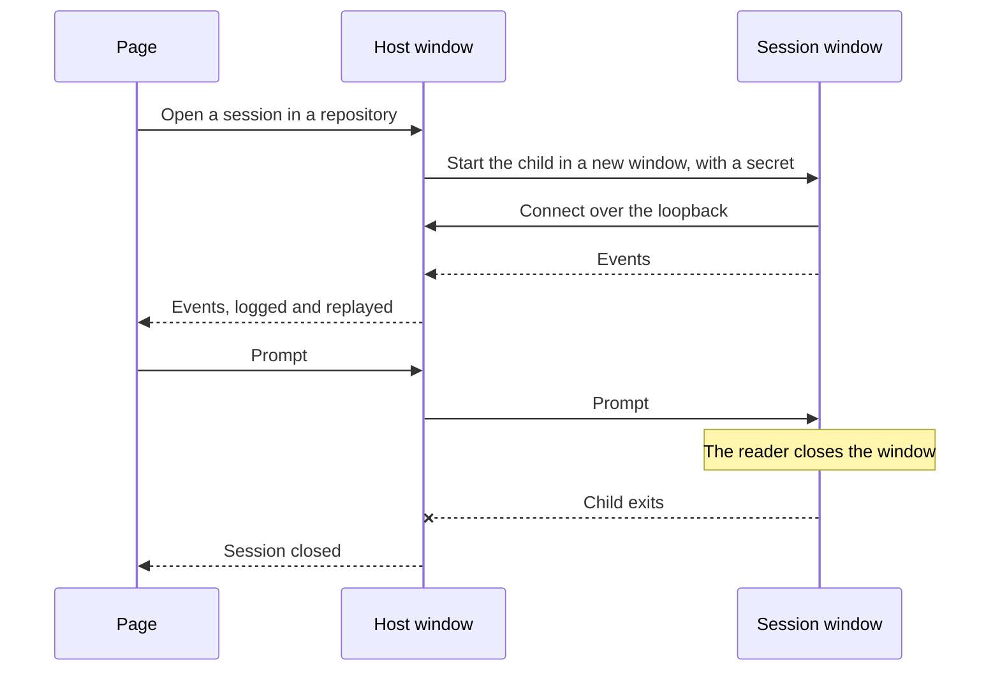

# Session Windows

A sub-spec of the [agent console](/docs/proposals/infra/agent-console), after the [host installer](/docs/infra/claude-interface/agent-console/host-installer), whose window this adds one per session to. Every session today runs inside the host's own process, so the only way to stop one outside the page is to stop the host and every session with it, and nothing on the desktop says which sessions are running. A session in a window of its own is one the reader can see, and closing that window is stopping exactly that session — as a browser gives each page a window the reader can close — while the console keeps managing all of them.

## What it changes

- **A session runs in a child process, in its own window.** Opening a session has the host start `agent-console-server session` for it in a new Windows Terminal window, or a console host window where Windows Terminal is absent. The child runs that one session's Claude Agent SDK query, where the host ran every session's until now; the host keeps the pairing, the credential gate, the event log and the replay to pages.
- **The child talks to the host over the loopback**, under a secret the host hands it at launch in its environment and never prints. The child reads the secret and deletes it from its own environment before the query starts, since the session's query passes that environment to Claude Code and every tool it runs, and a command a repository steers could otherwise read the secret and speak to the host as that session. Events flow child → host → every page as they do now, and prompts, answers to permission requests and interrupts flow page → host → child. A page never talks to a child directly, so pairing stays one credential per computer.
- **The window logs the conversation.** Each prompt, reply, tool call and permission request is printed as it happens, plainly, so the reader sees what the session is doing without the page. The window is a log and a stop control; typing into the session stays the page's, which keeps one composer rather than two that could race.
- **Either end stops a session, and both show it.** Closing a session in the page closes its window. Closing the window, or Ctrl+C in it, ends the session's Claude Code process; the host sees the child go and marks the session closed, and every page shows it closed at once. A session resumed from the page opens a new window.
- **The host's window stays the computer's log** of what runs: each session opened and closed, and which window holds it. Closing the host's window closes every session window, after telling every page that the host is stopping.

## What is deliberately not in it

- **No typing in a session window.** Two composers for one session would race each other; the window is for watching and stopping.
- **No window per session on a remote connection.** A [remote connection](/docs/proposals/infra/agent-console/remote-connections)'s sessions run where the reader cannot see a desktop, so they stay inside their host.

## Key files

| File                                                                                              | Role after the change                                                            |
| ------------------------------------------------------------------------------------------------- | -------------------------------------------------------------------------------- |
| `packages/agent-console-server/src/cli.ts`                                                        | the `session` subcommand a window runs, taking its secret out of its environment |
| `packages/agent-console-server/src/services/drivers/claudeAgentSdk/createSessionOpener.ts`        | the session's query moves into the child                                         |
| `packages/agent-console-server/src/services/drivers/claudeAgentSdk/createClaudeAgentSdkDriver.ts` | opens each session by starting its window, and forwards commands to the child    |
| `packages/agent-console-server/src/services/drivers/claudeAgentSdk/closeOpenSession.ts`           | closing a session closes its window, and a window that closed closes its session |
| `packages/agent-console-server/src/services/server/createAgentConsoleServer.ts`                   | the loopback gate a child connects through, beside the pages'                    |

## Sources

- [Claude Code desktop — work in parallel with sessions](https://code.claude.com/docs/en/desktop) — sessions side by side in one app, each stopped on its own.
- [Windows Terminal — command line arguments](https://learn.microsoft.com/en-us/windows/terminal/command-line-arguments) — `wt -w new` opening a new window, `-d` its starting directory and `--title` its title.
