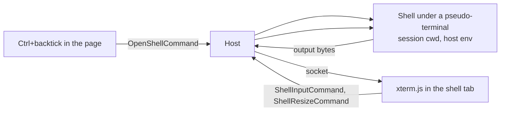

# Shell Pane

A sub-spec of the [agent console](/docs/proposals/infra/agent-console). [Terminal parity](/docs/infra/claude-interface/agent-console/terminal-parity) carries everything the Claude Code terminal shows and does, but the [workflow comparison](/docs/infra/claude-interface/agent-console/workflow-comparison) names the step it cannot remove: the quick `git` command or test run that still sends the person to a terminal. That is the first thing a day's work in the console alone runs into. The Claude desktop app's Code tab answers it with an integrated terminal that "opens in your session's working directory and shares the same environment as Claude".

## What it changes

- **A shell tab in the console**, beside the timeline, changes and usage tabs, opened by `` Ctrl+` `` as the Code tab opens its own. It starts in the open session's working directory; a **+** opens another beside it, each its own shell.
- **The host owns the process.** The page never runs anything: a new `OpenShellCommand` asks the host to spawn the platform's shell (`$SHELL`, or PowerShell on Windows) under a pseudo-terminal in the session's `cwd`, with the host's own environment, and the shell's bytes stream to the page over the same token-gated socket as the session's events. Keystrokes and a resize go back as `ShellInputCommand` and `ShellResizeCommand`.
- **The page draws it with xterm.js**, the terminal renderer VS Code and the Code tab both use, so colour, cursor movement and full-screen programs behave as they do in a terminal.
- **A shell outlives neither its session nor the host.** Closing the session or the host ends its shells; a page that reconnects reattaches to shells still running and replays their recent output, as the event log is replayed.

The shell adds no capability the session lacks: a session already runs any command through its Bash tool, behind the same token. It is the same trust boundary, and the host stays loopback-only ([host](/docs/infra/claude-interface/agent-console/host)).

## What is deliberately not in it

- **No shell on a remote host.** A shell runs where the host runs, which is where the session runs.
- **No terminal inside the voxel world.** The shell is a console tab; the world stays a place, not a second screen.

## Dependencies

A pseudo-terminal needs a native addon on the host (`node-pty`, or a maintained fork shipping prebuilt Windows binaries), and the page needs `@xterm/xterm` with its fit addon. Both go through [dependency admission](/docs/architecture/dependency-admission) in the change that adds them, and the page loads xterm with a dynamic `import()` when the tab first opens, so the console's own chunk does not grow.

## Key files

| File                                                                 | Role after the change                                     |
| -------------------------------------------------------------------- | --------------------------------------------------------- |
| `packages/agent-console-server/src/models/command/CommandType.ts`    | gains the open, input, resize and close shell commands    |
| `packages/agent-console-server/src/services/server/handleCommand.ts` | spawns and routes each shell, ended with its session      |
| `apps/web/app/components/AgentConsole/Overlay.vue`                   | the shell tab beside the timeline, changes and usage tabs |

## Sources

- [Claude Code desktop — terminal integration](https://code.claude.com/docs/en/desktop) — "The terminal opens in your session's working directory and shares the same environment as Claude", opened with `` Ctrl+` ``, with more tabs from **+**.
- [xterm.js](https://xtermjs.org/) — the terminal renderer used by VS Code, which the Code tab's pane also draws with.
