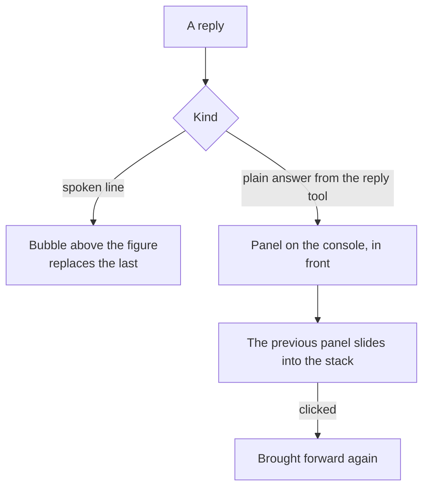

# Spatial chat

The work surface shows a reply as a message under the one that asked. On the [agent console](/docs/proposals/infra/agent-console) the same reply has somewhere to be: the character's spoken lines as speech bubbles over the figure, fading as the next one arrives, and the plain half of an answer — the code, the table, the explanation — as a panel set down on the console beside them. A panel is still text: the scene positions it, the browser renders it, so it stays selectable and copyable.

## Scope

**Today (in the default theme):** the conversation as a list of messages.

**This adds:**

1. **Bubbles.** Each spoken line arriving in a reply is a bubble anchored above the figure, one at a time, in the order the hook saw them.
2. **Panels.** Each reply the reply tool sends becomes a panel: an ordinary HTML element placed in the scene with cientos's `Html`, so code blocks keep their text and their selection. The newest panel sits in front; older ones slide back into a stack a click brings forward.
3. **The text box stays.** Typing works exactly as in the default theme; only where the answer appears changes. A toggle returns the list view.

## How it works



```text
apps/web/app/components/AgentConsole/Theme/
  AgentConsoleSpatialChat.vue        ← bubbles, panels, the stack, the list-view toggle
```

**Rendering:** TresJS, with cientos `Html` for panels and bubbles; nothing needs raw Three.js.

## Key files

| File                                        | Role                                                              |
| :------------------------------------------ | :---------------------------------------------------------------- |
| `packages/genshin-persona/scripts/speak.ts` | The spoken lines the bubbles show, as the hook already reads them |

## Notes

- Panels are DOM, not textures: a texture of text cannot be selected, searched or read by a screen reader, and the answer is something the person copies from.
- This view only changes where the chat's replies land, so it ships after the chat and is worth nothing without it.
