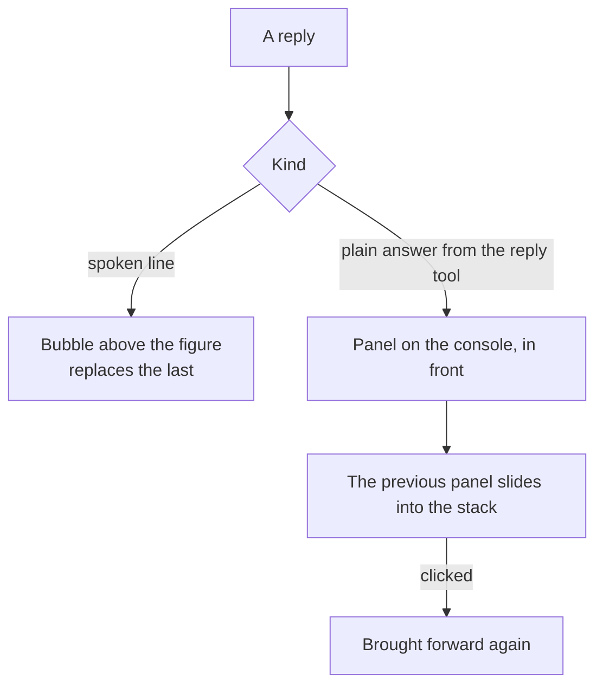

# Spatial chat

After [themes](/docs/proposals/infra/agent-console/themes), whose Genshin theme is the one place a reply's spoken lines are found. The conversation panel shows a reply as a message under the one that asked, and the world already shows new replies as chat lines over it (`ChatLines.vue`). On the [agent console](/docs/proposals/infra/agent-console) the same reply has somewhere to be: the character's spoken lines as speech bubbles over the figure, fading as the next one arrives, and the plain half of an answer — the code, the table, the explanation — as a panel set down on the console beside them. A panel is still text: the scene positions it, the browser renders it, so it stays selectable and copyable.

## Scope

**Today (in the default theme):** the conversation as a list of messages.

**This adds:**

1. **Bubbles.** Each spoken line arriving in a reply is a bubble anchored above the figure, one at a time, in the order the reply carries them.
2. **Panels.** Each reply the reply tool sends becomes a panel: an ordinary HTML element placed in the scene with cientos's `Html`, so code blocks keep their text and their selection. The newest panel sits in front; older ones slide back into a stack a click brings forward.
3. **The text box stays.** Typing works exactly as in the default theme; only where the answer appears changes. A toggle returns the list view.

## How it works


```mermaid
flowchart TD
  R[A reply] --> K{Kind}
  K -->|spoken line| B[Bubble above the figure<br/>replaces the last]
  K -->|plain answer from the reply tool| P[Panel on the console, in front]
  P --> S[The previous panel slides into the stack]
  S -->|clicked| F[Brought forward again]
```

```text
apps/web/app/components/AgentConsole/Theme/
  AgentConsoleSpatialChat.vue        ← bubbles, panels, the stack, the list-view toggle
```

**Rendering:** TresJS, with cientos `Html` for panels and bubbles; nothing needs raw Three.js.

## Key files

| File                                                    | Role                                                                           |
| :------------------------------------------------------ | :----------------------------------------------------------------------------- |
| `apps/web/app/components/AgentConsole/ChatLines.vue`    | The chat lines over the world, which the panels take the place of in this view |
| `apps/web/app/components/Genshin/Scene.vue`             | The world the character, and the bubbles over it, are drawn in                 |
| `apps/web/app/models/agentConsole/AgentConsoleTheme.ts` | The theme interface, whose spoken lines the bubbles show                       |
| `packages/genshin-persona/scripts/speak.ts`             | The spoken lines the bubbles show, as the hook already reads them              |

## Notes

- Panels are DOM, not textures: a texture of text cannot be selected, searched or read by a screen reader, and the answer is something the person copies from.
- This view only changes where the replies land, and its bubbles are the spoken lines the Genshin theme finds, so it ships after that theme's voice.

## Sources

- [Cientos — Html](https://cientos.tresjs.org/raw/api/objects/html.md) — DOM elements placed in the scene, which keeps a panel's code selectable text.
