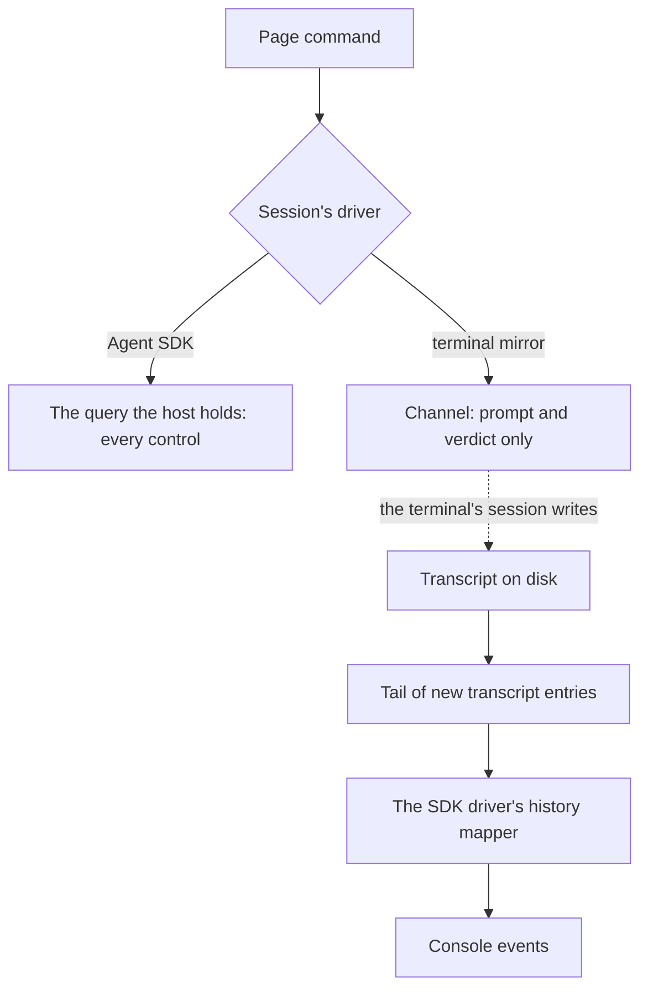

# Terminal-mirror driver

The [agent console](/docs/infra/claude-interface/agent-console) works sessions through the [Claude Agent SDK driver](/docs/infra/claude-interface/agent-console/claude-agent-sdk-driver), which opens and holds each query itself. Two cases are beyond it. One is a session a terminal started before the host was running, which the host cannot hold because the terminal already does. The other is a moment when SDK use stops being covered by the subscription. The terminal-mirror driver covers both. It attaches to a session a terminal runs, reads it from the outside, and speaks to it through a [channel](/docs/proposals/infra/channel-chat). It is one more implementation of the same `Driver` interface, so the page does not change for it.

## How it works



- **Events from the transcript.** The driver tails the session's transcript and maps each new entry with the history mapper the SDK driver already uses when it resumes, so both drivers produce the same events from the same content.
- **Commands through a channel.** A prompt and a permission verdict go into the terminal's session as channel lines. A channel cannot interrupt, switch mode or model, or run the harness's own slash commands. The page greys those controls out for a mirrored session and says why.
- **One driver per session.** The host tells the page which driver holds each session, and a session is never held by both. Resuming a mirrored session in the console once the terminal has closed it moves it to the SDK driver, with every control back.

## Key files

| File                                                                                          | Role after the change                                                  |
| :-------------------------------------------------------------------------------------------- | :--------------------------------------------------------------------- |
| `packages/agent-console-server/src/models/driver/Driver.ts`                                   | The interface this driver implements                                   |
| `packages/agent-console-server/src/services/drivers/claudeAgentSdk/createSdkMessageMapper.ts` | Its history mapping, reused for transcript entries tailed from outside |

```text
packages/agent-console-server/src/services/drivers/terminalMirror/
  createTerminalMirrorDriver.ts  ← transcript tail and channel
```

## Notes

- Whether SDK use stays inside the subscription is the fact the SDK driver's cost rests on. It is re-read at every Claude Code billing change, and if it moves, this driver keeps the console free at the price of the controls a channel cannot reach.
