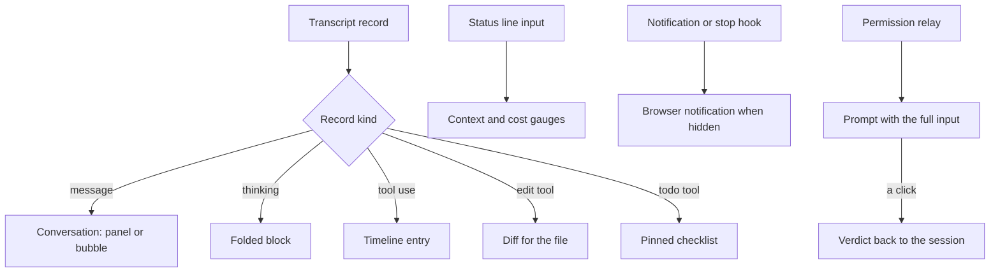

# Terminal parity

The [agent console](/docs/proposals/infra/agent-console) replaces the terminal only if nothing is lost in the move, so this page is its acceptance test: every surface the terminal shows, where the console reads it from, and what the console does with it that a scrollback cannot. A row with no source is a gap, and the console ships with its gaps stated rather than hidden.

## What the terminal shows, and where the console reads it

| Terminal surface                       | The console's source                                  | What the console adds                                                                                                                        |
| :------------------------------------- | :---------------------------------------------------- | :------------------------------------------------------------------------------------------------------------------------------------------- |
| The conversation — prompts and replies | the transcript, tailed                                | answers as panels, spoken lines as bubbles ([spatial chat](/docs/proposals/infra/agent-console/spatial-chat)), search over the whole session |
| Thinking, when shown                   | the transcript's thinking blocks                      | folded by default, one click open, never lost to a scroll                                                                                    |
| Tool calls and their results           | the transcript's tool-use and tool-result records     | a timeline, each call collapsible, its duration and exit visible                                                                             |
| File edits                             | the edit tools' inputs in the transcript              | a real side-by-side diff per edit, and one per file across the session                                                                       |
| Subagents and background tasks         | their own transcripts and the task records            | a lane per agent, running beside the main one                                                                                                |
| Permission prompts                     | the channel's permission relay                        | the tool, its full input and the choices, answered with a click                                                                              |
| The status line — model, context, cost | the status line's own input, forwarded by its hook    | always in view, the context figure as a gauge that warns before compaction                                                                   |
| Attention wanted, a turn ending        | the notification and stop hooks                       | a browser notification when the tab is hidden                                                                                                |
| The todo list                          | the todo tool's calls in the transcript               | a checklist pinned beside the conversation                                                                                                   |
| The prompt box                         | the channel                                           | a multi-line editor with paste of images left to the terminal until probed                                                                   |
| The persona's welcome and spoken lines | the session-start output and the message-display hook | the [wish banner](/docs/proposals/infra/agent-console/wish-banner) and [ambience](/docs/proposals/infra/agent-console/element-ambience)      |

## The gaps

A channel carries text into the session and verdicts back; it is not the terminal's keyboard. What that leaves out is stated here, each with the probe that would close it, and until a probe closes it the terminal stays open beside the console for that one action.

- **Interrupting a turn.** The terminal's escape key has no channel equivalent. Probe: whether the tool exposes an interrupt to an MCP server or a hook; nothing documented today does.
- **Slash commands.** Whether a channel line that starts with a slash runs as a command or arrives as text is a probe; if text, the console offers the commands the model can act on as prompts and leaves the harness's own (`/clear`, `/compact`, `/model`) to the terminal.
- **Mode switches** — plan mode, auto-accepting edits — are keystrokes, with the same probe as slash commands.
- **Launch.** The session is started in a terminal with the development-channel flag and its confirmation; the console attaches to it, it does not start it.
- **Pasted images.** The channel's content is text; an image the person pastes goes through the terminal until a probe shows a channel event can carry one.

## How it works



```text
apps/web/app/components/AgentConsole/Work/
  AgentConsoleConversation.vue         ← messages, thinking, search
  AgentConsoleTimeline.vue             ← tool calls and their results, per agent lane
  AgentConsoleDiff.vue                 ← an edit as a side-by-side diff
  AgentConsolePermission.vue           ← the relay's prompt and its two answers
  AgentConsoleStatus.vue               ← model, context gauge, cost, the todo list
```

## Key files

| File                                         | Role                                                        |
| :------------------------------------------- | :---------------------------------------------------------- |
| `packages/genshin-persona/scripts/status.ts` | Receives the status line input the console's gauges forward |
| `packages/genshin-persona/scripts/speak.ts`  | The message-display hook whose lines the console also shows |

## Notes

- The work surface is plain Vue and Vuetify, not a scene: text that is read, searched and copied belongs in the DOM. The scene sits behind it and around it.
- The transcript's record format is the tool's, not ours, and it is undocumented; the tail keeps unknown record kinds as raw rows rather than dropping them, so a format change shows up as an unrendered row instead of missing information.
