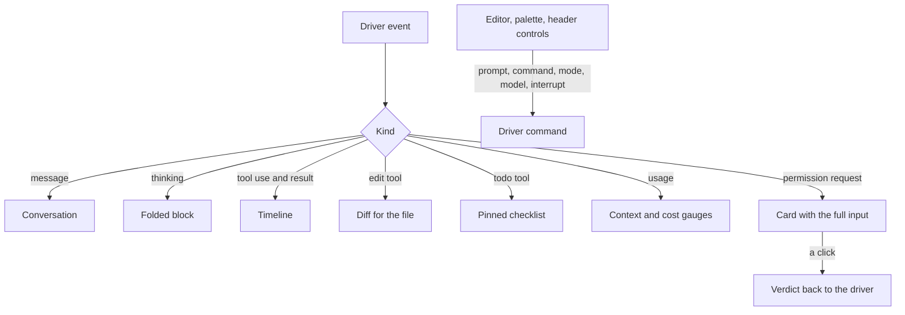

# Terminal parity

The [agent console](/docs/proposals/infra/agent-console) replaces the terminal only if nothing is lost in the move, so this page is its acceptance test. Every row is something the terminal shows or does; the middle column is where the [SDK driver](/docs/proposals/infra/agent-console/drivers) carries it; the last is what the console does better. A row with no source is a gap and blocks everything after parity.

## What the terminal shows

| Terminal surface                   | The driver's source                                | What the console adds                                                           |
| :--------------------------------- | :------------------------------------------------- | :------------------------------------------------------------------------------ |
| The conversation                   | assistant and user messages                        | answers rendered as markdown with code blocks copyable, search over the session |
| Thinking, when shown               | the assistant message's thinking blocks            | folded by default, one click open                                               |
| Tool calls and their results       | tool-use blocks and their results                  | a timeline, each call collapsible, its duration and exit visible                |
| File edits                         | the edit tools' inputs                             | a side-by-side diff per edit, and one per file across the session               |
| Subagents                          | subagent messages and task progress                | a lane per agent beside the main one                                            |
| Permission prompts                 | the permission callback                            | the tool and its whole input on a card, answered with a click                   |
| Model, context used, cost          | the session's init message and each result's usage | always in view; the context figure as a gauge that warns before compaction      |
| Todo list                          | the todo tool's calls                              | a checklist pinned beside the conversation                                      |
| Hook output                        | hook events, when included                         | shown inline where the hook fired, folded                                       |
| Session start output — the persona | the session-start hook's event                     | read by the active theme ([themes](/docs/proposals/infra/agent-console/themes)) |

## What the terminal does

| Terminal action                 | The driver's command                           | In the console                                            |
| :------------------------------ | :--------------------------------------------- | :-------------------------------------------------------- |
| Send a prompt                   | a user message on the session's input stream   | a multi-line editor; files attached by drag               |
| Interrupt a turn                | interrupt                                      | a stop button and the escape key                          |
| Slash commands                  | the prompt string, as the SDK runs them inline | a command palette listing the session's own commands      |
| Plan mode, accept edits, bypass | set the permission mode                        | a mode switch in the header                               |
| Switch model                    | set the model                                  | a model picker in the header                              |
| Resume, continue, fork, rewind  | resume, continue, fork and resume-at options   | the session list; any message can be forked or rewound to |
| Paste an image                  | an image block in the user message             | paste or drop into the editor                             |

## How it works



```text
apps/web/app/components/AgentConsole/Work/
  AgentConsoleConversation.vue   ← messages, thinking, search
  AgentConsoleTimeline.vue       ← tool calls and results, a lane per agent
  AgentConsoleDiff.vue           ← an edit as a side-by-side diff
  AgentConsolePermission.vue     ← the permission card
  AgentConsoleHeader.vue         ← model, mode, context gauge, cost, stop
  AgentConsoleEditor.vue         ← the prompt editor and the command palette
  AgentConsoleSessionList.vue    ← every session on the host, its state, resume and fork
```

## Notes

- The work surface is plain Vue and Vuetify in every theme: text that is read, searched and copied belongs in the DOM. A theme dresses it and may put a scene behind it, never replace it.
- An event kind the console does not know yet is kept and shown as a raw row, never dropped, so an SDK release that adds one shows up as an unrendered row rather than as missing information.
